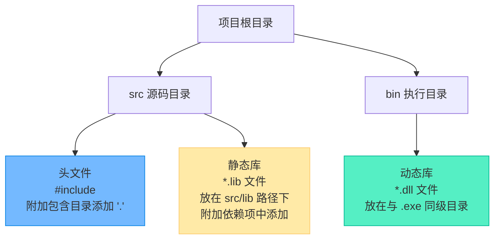
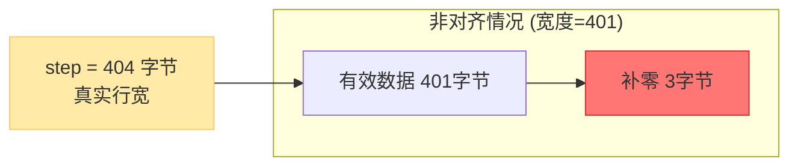

# 指针操作二维数组与OpenCV灰度图反色实战

> [!abstract] 核心导言
> 理论与实战的结合是掌握底层内存模型的关键。本节以 OpenCV 灰度图像反色为场景，将“行优先连续存储”与“指针偏移寻址”的理论直接映射到真实的图像像素矩阵操作中。同时，重点剖析图像处理中极易踩坑的**内存对齐**问题，助你打通从内存模型到工程应用的最后一公里。

---

## 一、工程环境配置：OpenCV集成要诀

在使用 OpenCV 进行图像处理前，正确的项目配置是运行的前提。

### 1. 编译平台要求
- **架构**：必须选择 **x64** 平台（OpenCV 4.x 已全面放弃 x86 支持）。
- **版本**：推荐使用 **Release** 版本，以获得最佳性能并避免调试器对底层图像内存的干扰。

### 2. 依赖文件部署地图
OpenCV 的依赖包含三个核心部分，放置路径必须严格对应：



> [!tip] 路径配置技巧
> 在 C/C++ -> 附加包含目录中添加 `.`，代表当前项目路径，这样就可以使用双引号 `#include "opencv2/..."` 直接引用，避免冗长的相对路径。[1](@context-ref?id=0)

---

## 二、图像加载与核心属性

### 1. 加载灰度图
使用 `imread` 并指定 `IMREAD_GRAYSCALE` 标志，强制以单通道灰度模式读取图像。
```cpp
#include <opencv2/opencv.hpp>
using namespace cv;

// 加载为灰度图
Mat img = imread("lena_hed.jpg", IMREAD_GRAYSCALE);
```

### 2. Mat 对象的三大核心属性
灰度图在内存中本质就是一个二维的 `unsigned char` 数组，Mat 对象封装了其维度与数据信息：

| 属性 | 含义 | 灰度图示例 |
| :--- | :--- | :--- |
| `img.rows` | 图像高度（行数） | 400 |
| `img.cols` | 图像宽度（列数） | 400 |
| `img.elemSize()` | 单个像素占用的字节数 | 1 (灰度值为 0-255) |

---

## 三、指针操作：二维数组的底层寻址

### 1. 连续内存的行优先映射
OpenCV 的 `Mat` 对象内部通过 `img.data` 指针（类型为 `uchar*`）指向这块连续的堆内存。像素数据按**行优先**规则紧密排列。

```mermaid
graph LR
    subgraph 逻辑视图 灰度矩阵
        direction TB
        R0["Row 0: [1]...[399]"]
        R1["Row 1: [1]...[399]"]
        R2["Row 2: [1]...[399]"]
    end
    
    subgraph 物理内存 img.data (一维连续)
        direction LR
        P0["R0[0]"] --> P1["R0[1]"]
        P1 --> P2["..."]
        P2 --> P3["R0[399]"]
        P3 --> P4["R1[0]"]
        P4 --> P5["R1[1]"]
        P5 --> P6["..."]
    end
    
    R0 -.-> P0
    R1 -.-> P4
```

### 2. 指针偏移寻址公式
要通过一维指针访问二维坐标 `(i, j)` 的像素，使用核心公式：
$$Address = Base + (i \times Width + j)$$

```cpp
for (int i = 0; i < height; i++) {
    for (int j = 0; j < width; j++) {
        // 1. 定位并读取像素值
        auto c = img.data[i * width + j]; 
        
        // 2. 反色计算并写回
        img.data[i * width + j] = 255 - c;
    }
}
```

> [!info] 反色原理
> 灰度值范围是 `[0, 255]`。黑(0)反色后为白(255)，白(255)反色后为黑(0)。公式 `255 - value` 实现了像素强度的完全翻转。

---

## 四、隐藏陷阱：内存对齐

这是图像处理底层开发最易引发Bug的环节。

### 1. 为什么要内存对齐？
为了最大化 CPU 读取内存的效率，许多底层库（包括 OpenCV）在分配图像行内存时，会采用**4字节对齐**策略。即：如果一行的原始字节数不是 4 的倍数，会在行末尾**补零**，直到满足 4 字节对齐。

### 2. 400x400 图像的特殊性
本例中，图像宽 400 像素，每像素 1 字节，一行占 **400 字节**。
因为 `400 % 4 == 0`，天然满足 4 字节对齐，**无需补零**，因此可以直接使用 `i * width + j`。

### 3. 通用安全寻址：`step` 机制
如果图像宽度是 401 像素，一行占 401 字节。为了对齐，底层实际分配了 **404 字节**（补了3个零）。此时如果仍用 `i * 401 + j` 寻址，从第二行开始就会错位！

<span style="color:#ff4757;">**正确的通用做法是使用 `img.step` 属性**</span>，它代表对齐后一行的**真实字节数**（包含补零）。



**通用安全遍历代码**：
```cpp
// 通用写法：使用 step 替代 cols
for (int i = 0; i < img.rows; i++) {
    for (int j = 0; j < img.cols; j++) {
        // img.step 才是真实的一行字节数，避免对齐导致的行偏移错位
        auto c = img.data[i * img.step + j]; 
        img.data[i * img.step + j] = 255 - c;
    }
}
```

---

## 五、图像显示与阻塞

处理完成后，需要将矩阵数据渲染到屏幕并保持窗口。

```cpp
imshow("test", img);   // 渲染图像到名为 "test" 的窗口
waitKey(5000);         // 阻塞程序 5000 毫秒 (5秒)，等待按键或超时
```
> [!warning] 必须有 waitKey
> 如果不调用 `waitKey`，`imshow` 创建的窗口会一闪而过，你将看不到任何图像输出。

---

## 六、知识全景小结

| 知识维度 | 核心内容 | ⚠️ 考试重点/易混淆点 | 难度 |
| :--- | :--- | :--- | :--- |
| **环境配置** | x64/Release，.h/.lib/.dll路径分离 | <span style="color:#ff4757;">.dll 必须与最终生成的 .exe 同级</span> | ⭐⭐⭐ |
| **灰度图模型** | 单通道，单字节(0-255)，`IMREAD_GRAYSCALE` | `elemSize()` 为 1，彩色图为 3 | ⭐⭐ |
| **指针寻址** | `Base + i * width + j`，行优先连续存储 | 指针偏移计算的性能极高，省去了二维寻址开销 | ⭐⭐⭐⭐ |
| **反色算法** | `255 - 原始值`，黑白颠倒 | 限于灰度图；彩色图需分离通道分别取反 | ⭐⭐ |
| **内存对齐** | 4字节对齐机制，不足补零 | <span style="color:#ff4757;">通用寻址必须用 `img.step` 代替 `img.cols`，防错位</span> | ⭐⭐⭐⭐⭐ |
| **显示阻塞** | `imshow` + `waitKey` 配合使用 | 无 `waitKey` 窗口会瞬间关闭 | ⭐⭐ |

> [!quote] 结语
> 从抽象的 `i * width + j` 到真实图像的像素翻转，指针的威力在图像处理中展露无遗。但请牢记，高性能往往伴随高风险。深刻理解底层的 **4字节对齐** 机制，在遍历时养成使用 `step` 的肌肉记忆，是你从“调包侠”蜕变为“底层图像处理工程师”的关键分水岭！
