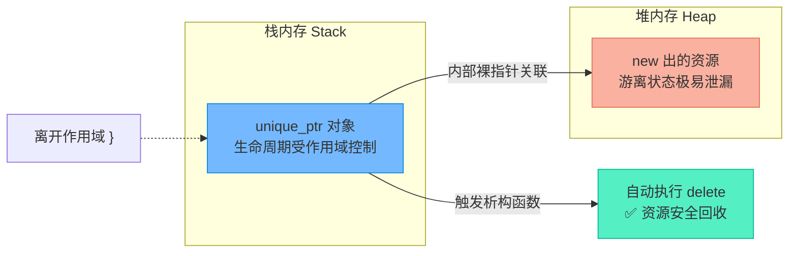
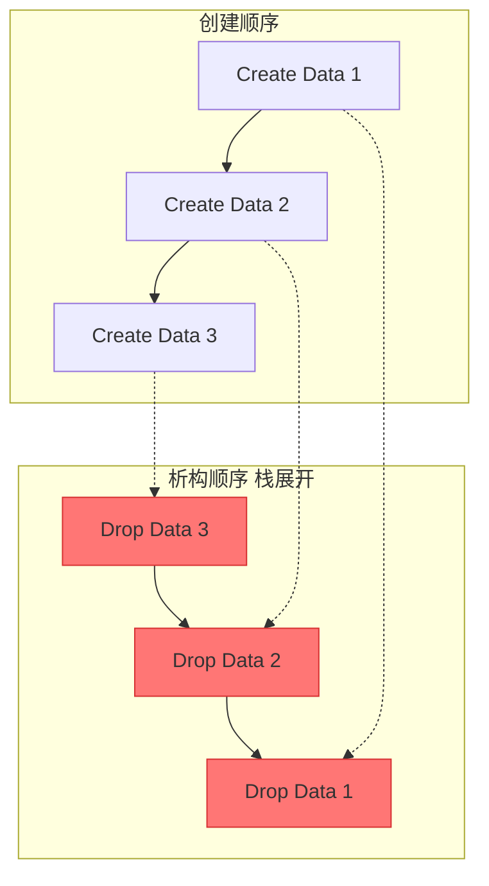

# unique_ptr智能指针：所有权机制与多维初始化实战

> [!abstract] 核心导言
> 裸指针的遗忘是内存泄漏的万恶之源。C++11引入的 `unique_ptr` 通过RAII机制和唯一所有权模型，在栈对象的掩护下实现了堆内存的自动化、安全化管理。本节将深度剖析 `unique_ptr` 的四种初始化形态，特别是数组特化版本的使用禁忌，助你彻底告别手动 `delete` 的时代。

---

## 一、RAII机制：智能指针的灵魂

### 1. 核心定义
**RAII (Resource Acquisition Is Initialization)** —— 资源获取即初始化。这是C++内存管理的基石哲学：
- **构造时申请**：在对象构造函数中获取资源（`new`）。
- **析构时释放**：在对象析构函数中释放资源（`delete`）。
- **栈对象托管**：利用栈对象离开作用域时**必然触发析构**的特性，确保堆内存被无条件回收。

### 2. 内存守护机制图解
`unique_ptr` 本身是一个栈对象，它内部持有一个堆对象的裸指针。当栈对象生命终结，它会自动执行 `delete` 收尾。



---

## 二、unique_ptr的铁律：唯一所有权

`unique_ptr` 采用严格的**独占式所有权**模型：
- **不可复制**：禁止拷贝构造和拷贝赋值（`= delete`），确保同一时刻只有一个指针拥有该资源。
- **可移动**：允许通过 `std::move` 转移所有权，交出控制权后原指针变为空（`nullptr`）。
- **零开销**：与裸指针相比，不带来额外的时间和空间成本。

> [!warning] 传递陷阱
> 由于不可复制，`unique_ptr` 不能按值传递给函数，也不能作为按值返回的非局部对象。必须使用引用或右值引用（`std::move`）转移。

---

## 三、四大初始化方式全景解析

### 1. 直接初始化（传统方式）
最直观的构造方法，直接传递 `new` 表达式的结果。
```cpp
unique_ptr<int> p1(new int(100));
```
- **缺点**：暴露了裸 `new` 操作，在复杂表达式中可能引发异常导致内存泄漏（异常安全问题）。

### 2. `make_unique` 初始化（C++14 推荐首选）
标准库提供的工厂函数，内部封装了 `new`，异常安全且代码更简洁。
```cpp
auto p2 = make_unique<int>(200);
auto p3 = make_unique<Data>(); // 自动推导类型，调用默认构造
```
- **优势**：<span style="color:#2ed573;">无 `new` 关键字</span>，消除异常下的泄漏风险，执行效率与直接初始化等同。

### 3. 空指针初始化（延迟绑定）
创建一个不指向任何资源的空智能指针，后续通过 `reset` 接管资源。[1](@context-ref?id=1)
```cpp
unique_ptr<Data> p4; // 默认为 nullptr
// ... 业务逻辑 ...
p4.reset(new Data()); // 接管新资源，若原持有资源则先释放旧的
```

### 4. 数组特化初始化（重点难点）
管理动态数组时，**必须使用模板特化版本 `[]`**，以确保析构时调用 `delete[]` 而非 `delete`。
```cpp
// C++14 make_unique 创建数组，元素默认初始化为0
unique_ptr<int[]> pa1 = make_unique<int[]>(1024); 

// 直接初始化类对象数组
unique_ptr<Data[]> pa3(new Data[3](@ref); 
```

> [!danger] 数组管理的两大天坑
> 1. **漏写 `[]`**：若声明为 `unique_ptr<Data>` 却指向数组，析构时只调用一次 `delete`，导致严重内存泄漏。
> 2. **迷失的大小**：`unique_ptr` <span style="color:#ff4757;">不提供查询数组大小的接口</span>！必须由开发者自行使用额外变量（如 `size_t size = 1024`）记录长度。[1](@context-ref?id=2)

---

## 四、生命周期与析构顺序验证（Date类案例）

通过自定义 `Date` 类，在构造和析构中打印日志，直观验证RAII的运作机理。[1](@context-ref?id=3)

### 1. 作用域触发验证
```cpp
{
    unique_ptr<Date> p1 = make_unique<Date>(); // 输出: Create Data
} // 离开作用域，自动触发析构，输出: Drop Data
```
- **结论**：智能指针无需 `delete`，大括号即为资源的坟墓。

### 2. LIFO 释放顺序验证
利用 `static int count` 追踪对象的创建序号，验证析构遵循**后进先出（LIFO）**原则。[1](@context-ref?id=4)



### 3. 数组的批量释放
```cpp
unique_ptr<Data[]> pa3(new Data[3](@ref);
// 析构时：依次调用 Data[2]、Data[1]、Data[0] 的析构函数
// 然后一次性 delete[] 回收内存
```

> [!tip] 调试小技巧
> 在 `main` 函数末尾使用 `getchar();` 暂停控制台，可以避免程序过快退出导致看不清析构日志。[1](@context-ref?id=5)

---

## 五、知识全景小结

| 知识维度 | 核心内容 | ⚠️ 考试重点/易混淆点 | 难度系数 |
| :--- | :--- | :--- | :--- |
| **RAII机制** | 构造获取资源，析构释放资源，栈对象管理堆生命周期 [1](@context-ref?id=6)| <span style="color:#ff4757;">智能指针本身必须分配在栈上才能生效</span> | ⭐⭐⭐ |
| **唯一所有权** | 不可复制，防多指针同时释放同一内存 [1](@context-ref?id=7)| 不能按值传参，需用 `std::move` 转移 | ⭐⭐⭐ |
| **直接初始化** | `unique_ptr<T> p(new T)` | 模板类型必须与 `new` 类型严格匹配 | ⭐⭐ |
| **make_unique** | `auto p = make_unique<T>()` | <span style="color:#2ed573;">C++14推荐，异常安全，消除裸new</span> | ⭐⭐⭐ |
| **空指针与reset** | 默认构造为空，`reset()` 重置资源 | `reset(new T)` 会先释放原有资源再接管新资源 | ⭐⭐⭐ |
| **数组特化** | `unique_ptr<T[]> p(new T[n])` | <span style="color:#ff4757;">漏写 `[]` 导致只析构首个元素，严重泄漏</span> | ⭐⭐⭐⭐ |
| **数组大小** | 智能指针不记录数组长度 [1](@context-ref?id=8)| <span style="color:#ff4757;">必须额外定义变量维护数组大小</span> | ⭐⭐⭐⭐⭐ |
| **析构顺序** | 遵循栈展开的LIFO（后进先出）规则 | 逆序析构是保证依赖关系正确释放的基础 | ⭐⭐⭐ |

> [!quote] 结语
> `unique_ptr` 是现代C++的默认首选智能指针。牢记“`make_unique` 优先，数组加 `[]`，大小自己记”，你便能在享受自动化内存管理红利的同时，避开那些潜伏在暗处的致命陷阱。[1](@context-ref?id=9)
