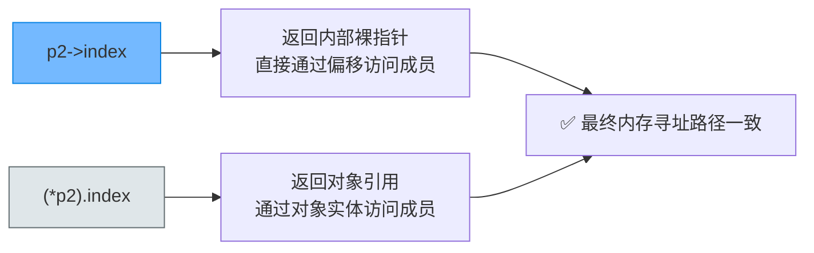
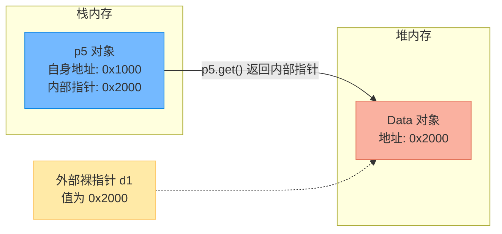

# unique_ptr智能指针的访问方式与操作符重载深度解析

> [!abstract] 核心导言
> 智能指针的终极设计目标是：**在行为上与裸指针无限趋近，在安全性上与裸指针彻底决裂**。`unique_ptr` 之所以能用起来像普通指针，全赖其内部精妙的操作符重载机制。本节将深度拆解 `*`、`->`、`[]` 及 `get()` 的底层映射，助你彻底打通智能指针从“自动回收”到“透明访问”的逻辑闭环。

---

## 一、普通数据访问：解引用重载

对于指向单个基础类型（如 `int`）的 `unique_ptr`，其访问方式与裸指针完全一致。

### 1. 语法表现
```cpp
unique_ptr<int> p1(new int);
*p1 = 10;                     // 写入：通过 * 解引用
cout << "p1 value = " << *p1; // 读取：通过 * 解引用
```

### 2. 底层映射机制
`unique_ptr` 内部重载了 `operator*()`，它的行为等价于：
```cpp
// 伪代码：unique_ptr 内部实现
T& operator*() const noexcept {
    return *(this->_Mypair._Myval2); // 取出内部保存的裸指针，再对其解引用
}
```
> [!info] 零开销抽象
> 这个重载函数在编译期会被内联展开，最终生成的机器码与你直接使用裸指针 `*(raw_ptr)` 是一模一样的，没有额外的函数调用开销。

---

## 二、对象成员访问：箭头与点操作符的博弈

当 `unique_ptr` 指向自定义类对象时，需要访问其成员（如 `index`），存在两种等价写法。[1](@context-ref?id=1)

### 1. 箭头操作符（首选）
这是最自然、最常用的访问方式：
```cpp
unique_ptr<Data> p2(new Data);
p2->index = 1; // 等价于 raw_ptr->index
```

**底层映射**：`unique_ptr` 重载了 `operator->()`，返回内部的裸指针。
```cpp
// 伪代码：内部实现
T* operator->() const noexcept {
    return this->_Mypair._Myval2; // 直接返回内部裸指针
}
```

### 2. 解引用 + 点操作符（等价替代）
先通过 `*` 获取对象引用，再用 `.` 访问成员：
```cpp
(*p2).index = 1; // 效果与 p2->index 完全相同
```



> [!tip] 编码规范
> 尽管 `(*p2).index` 在逻辑上无误，但由于括号繁多且违背直觉，工程中**强烈推荐统一使用 `->` 操作符**。

---

## 三、数组特化访问：下标运算符重载

当使用 `unique_ptr<T[]>` 管理动态数组时，必须通过下标访问元素，这依赖于 `operator[]` 的重载。

### 1. 基础类型数组
```cpp
unique_ptr<int[]> pa2(new int[1024](@ref);
pa2[1] = 100; // 修改第二个元素
```

### 2. 对象数组
对于对象数组，下标访问后往往还需要配合 `.` 访问成员：
```cpp
unique_ptr<Data[]> pa3(new Data[3](@ref);
pa3[1].index = 2; // 访问第二个元素的 index 成员
```

### 3. 替代方案：`get()` 后下标（不推荐）
通过 `get()` 获取内部裸指针后再用下标访问，语法上行得通，但牺牲了可读性：
```cpp
pa3.get()[2].index = 3; // 可以工作，但代码意图不够清晰
```

> [!danger] 数组越界的深渊
> 无论是 `pa2[1]` 还是裸指针的 `get()[1]`，`unique_ptr` **绝不进行边界检查**！如果越界访问，属于未定义行为，与裸指针越界一样会导致内存撕裂或段错误。

---

## 四、原始指针提取：get() 方法验证

### 1. 核心作用
`get()` 是 `unique_ptr` 提供的唯一安全获取内部原始指针的接口，它**不会**转移所有权，也**不会**改变引用计数（因为没有引用计数）。[1](@context-ref?id=2)[](@image-ref?id=2)

```cpp
auto d1 = new Data();
unique_ptr<Data> p5(d1);

cout << "p5 address: " << &p5 << endl;       // p5变量本身的栈地址
cout << "dl address: " << d1 << endl;        // 原始裸指针的值（堆地址）
cout << "p5.get(): " << p5.get() << endl;    // 智能指针内部管理的堆地址
```

### 2. 地址一致性验证图解
上述代码的输出结果将验证：`d1` 与 `p5.get()` 打印的地址**完全相同**。[1](@context-ref?id=3)



> [!warning] get() 的使用红线
> 1. **禁止 `delete p5.get()`**：这会导致同一块内存被释放两次（`p5` 析构时还会再释放一次）。
> 2. **禁止长期持有**：不要将 `get()` 的返回值保存到其他长期使用的裸指针中，一旦 `p5` 被销毁，该裸指针将变成悬垂指针。

---

## 五、操作符重载映射全景表

| 用户代码调用 | 编译器内部替换机制 | 返回值类型 | 适用模板特化 |
| :--- | :--- | :--- | :--- |
| `*p1` | `p1.operator*()` | `T&` (对象引用) | `unique_ptr<T>` |
| `p2->index` | `p2.operator->()->index` | `T*` (裸指针) | `unique_ptr<T>` |
| `pa2[1]` | `pa2.operator[](1)` | `T&` (元素引用) | `unique_ptr<T[]>` |

---

## 六、知识全景小结

| 知识点 | 核心内容 | ⚠️ 考试重点/易混淆点 | 难度系数 |
| :--- | :--- | :--- | :--- |
| **解引用访问** | `*p1 = 10`，重载了 `operator*` | 返回对象引用，可直接作为左值修改 | ⭐⭐ |
| **箭头访问** | `p2->index`，重载了 `operator->` | <span style="color:#2ed573;">与 `(*p2).index` 完全等价，推荐前者</span> | ⭐⭐⭐ |
| **数组下标访问** | `pa2[1]=100`，重载了 `operator[]` | <span style="color:#ff4757;">仅限 `unique_ptr<T[]>` 特化版本使用</span> | ⭐⭐⭐ |
| **get()后下标** [1](@context-ref?id=4)| `pa3.get()[2].index` | 语法合法但可读性差，不推荐常规使用 | ⭐⭐ |
| **get()方法** | 返回内部原始裸指针，不转移所有权 | <span style="color:#ff4757;">严禁对 get() 返回值执行 delete</span> | ⭐⭐⭐⭐ |
| **地址一致性** | `p5.get()` 与初始裸指针地址相同 [1](@context-ref?id=5)| 验证了智能指针确实直接管理原始堆内存 | ⭐⭐⭐ |
| **零开销原则** | 所有重载操作符均在编译期内联展开 | 智能指针的访问效率等同于裸指针 | ⭐⭐⭐⭐ |

> [!quote] 结语
> `unique_ptr` 的巧妙之处在于“隐身术”：它在后台默默接管了内存的生杀大权（RAII），但在前台却通过操作符重载伪装成普通的裸指针，让你的代码迁移成本降到最低。牢记这些访问等价规则，你就能在享受绝对安全的同时，保持代码的极致流畅。[1](@context-ref?id=6)
