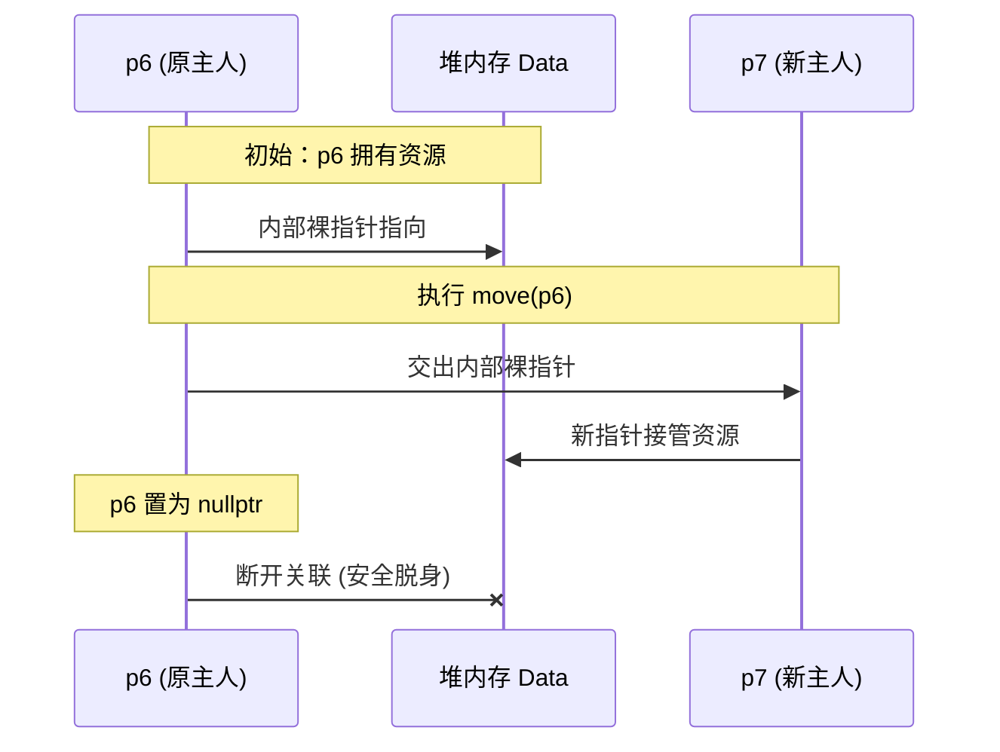
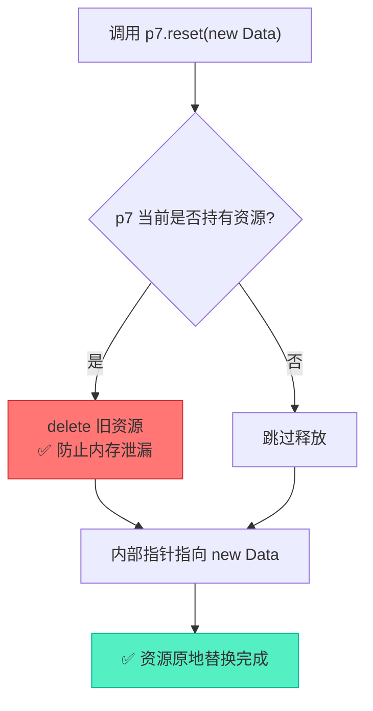

# unique_ptr的资源重置与移动语义深度解析

> [!abstract] 核心导言
> `unique_ptr` 的“唯一所有权”绝非一句空谈，它是通过编译期的强制拦截与运行期的精准交接共同实现的。禁止拷贝斩断了多重释放的祸根，而移动语义与 `reset` 机制则为资源的合法流转与动态更换提供了安全通道。本节将深入源码层级，剖析 `unique_ptr` 如何在不违背独占原则的前提下，优雅地完成所有权的乾坤大挪移。

---

## 一、唯一所有权的铁律：封杀拷贝

`unique_ptr` 最为人熟知的特性便是其严格的独占性：同一个堆对象，同一时刻只能被一个 `unique_ptr` 掌控。

### 1. 编译期防线
为了杜绝隐式的资源共享，`unique_ptr` 在其源码中将拷贝构造与拷贝赋值显式删除：
```cpp
// 标准库源码声明
unique_ptr(const unique_ptr&) = delete;
unique_ptr& operator=(const unique_ptr&) = delete;
```

### 2. 违规操作演示
任何试图复制所有权的操作，都会在编译阶段直接毙命：
```cpp
unique_ptr<Data> p6(new Data());

// ❌ 错误：不可复制构造（企图让 p7 和 p6 共享同一资源）
// unique_ptr<Data> p7 = p6; 

// ❌ 错误：不可赋值
// p7 = p6;
```

> [!info] 为什么必须禁掉？
> 如果允许拷贝，当 `p6` 和 `p7` 分别析构时，同一块内存会被 `delete` 两次，引发经典的 **Double Free** 崩溃。

---

## 二、移动语义：所有权的合法交接

既然不能复制，当函数传参或容器存储时需要转移控制权怎么办？答案是通过**移动语义**。

### 1. 移动构造：接管与放空
通过 `std::move` 将左值转化为右值，触发移动构造函数。
```cpp
unique_ptr<Data> p6(new Data());
unique_ptr<Data> p7 = move(p6); // p6 的所有权转移给 p7
```

**源码剖析**：
```cpp
// 移动构造函数签名
unique_ptr(unique_ptr&& _Right) noexcept { ... }
```
移动发生后：
- **p7**：接管了原来 `p6` 内部的裸指针。
- **p6**：被强制置空（`nullptr`），彻底丧失对资源的控制权，防止后续误操作。



### 2. 移动赋值：先毁后建
如果目标指针已经持有了资源，移动赋值必须先妥善处理旧资源，再接管新资源。[1](@context-ref?id=1)
```cpp
unique_ptr<Data> p7(new Data());
unique_ptr<Data> p8(new Data());
p7 = move(p8); // p7 被重新赋值
```

**源码剖析（核心逻辑）**：
```cpp
unique_ptr& operator=(unique_ptr&& _Right) noexcept {
    if (this != _STD addressof(_Right)) { // 防范自我赋值
        reset(_Right.release());          // 核心：释放旧资源，接管新资源
        // ... 删除器相关逻辑 ...
    }
    return *this;
}
```

> [!warning] 旧资源的命运
> 执行 `p7 = move(p8)` 时，`p7` 原本指向的旧 `Data` 会被**立即析构释放**。这不是简单的指针覆盖，而是安全的资源置换！[1](@context-ref?id=2)

---

## 三、reset方法：原地重生的手术刀

当需要保持智能指针变量本身存活，仅更换其指向的内存资源时，`reset` 是唯一的正规手段。[1](@context-ref?id=3)[](@image-ref?id=3)

### 1. 核心机制
`reset()` 的执行逻辑严密而清晰：
1. **检测**：判断当前是否持有资源。
2. **释放**：若持有，调用 `delete` 析构并回收当前资源。
3. **重置**：将内部指针指向新的地址（若无参数，则置为 `nullptr`）。

```cpp
unique_ptr<Data> p7(new Data());
// 场景：需要丢弃旧数据，让 p7 指向一块全新的内存
p7.reset(new Data()); 
```

### 2. 典型应用场景：类成员动态更新
在长期存活的类对象中，常遇到“变量寿命长，资源需频繁换”的情况。由于 `unique_ptr` 禁止普通赋值，`reset` 便成了唯一出路。

```cpp
class Player {
private:
    unique_ptr<Weapon> weapon; // 初始可能为空
public:
    void Equip(const string& name) {
        // 无法使用 weapon = new Weapon(name); ❌
        // 必须使用 reset，自动清理旧武器，装备新武器
        weapon.reset(new Weapon(name)); 
    }
};
```



---

## 四、核心API对比解析

| API | 功能描述 | 原指针状态 | 对旧资源的影响 |
| :--- | :--- | :--- | :--- |
| **`move(p)`** | 转移所有权（配合构造/赋值） | 变为 `nullptr` | 无（资源仍在，只是换了主人） |
| **`reset(q)`** | 重新设定指向的内存 | 指向 `q`（或 `nullptr`） | <span style="color:#ff4757;">自动析构释放旧资源</span> |
| **`release()`** | 放弃所有权，返回裸指针 | 变为 `nullptr` | 无（资源未释放，责任交还给调用者） |

> [!danger] release() 的认知误区
> 初学者常以为 `release()` 会释放内存，实则不然！它只是断开了智能指针的管理，返回裸指针，此时**必须由开发者手动接管并 `delete`**，否则必泄漏。

---

## 五、知识全景小结

| 知识点 | 核心内容 | ⚠️ 考试重点/易混淆点 | 难度系数 |
| :--- | :--- | :--- | :--- |
| **拷贝封杀** | 删除拷贝构造与赋值运算符 [1](@context-ref?id=4)| <span style="color:#ff4757;">`p7 = p6` 编译报错，杜绝 Double Free</span> [1](@context-ref?id=5)| ⭐⭐ |
| **移动构造** | 右值引用实现，转移所有权 | 移动后原指针变为 `nullptr`，不可再解引用 | ⭐⭐⭐ |
| **移动赋值** | `p7 = move(p8)` | <span style="color:#ff4757;">赋值前会自动析构 p7 原有的旧资源</span> | ⭐⭐⭐⭐ |
| **reset机制** | 释放当前资源，接管新资源 [1](@context-ref?id=6)| 类成员变量更换资源时的唯一合法途径 | ⭐⭐⭐⭐ |
| **release机制** | 放弃管理权，返回裸指针 | <span style="color:#ff4757;">不释放内存！必须手动 delete 返回的裸指针</span> | ⭐⭐⭐⭐⭐ |
| **底层源码** | `reset(_Right.release())` | 移动赋值的本质是“先释放自己的，再接管对方的” [1](@context-ref?id=7)| ⭐⭐⭐⭐⭐ |

> [!quote] 结语
> `unique_ptr` 的设计充满了防卫性：它用 `=delete` 挡住了粗心者的复制企图，用 `reset` 给需要变换资源的人留出了安全通道，用 `move` 让资源在不同作用域间得以流转。理解这套严丝合缝的“交权”与“换防”机制，你就真正掌握了现代C++资源管理的权杖。[1](@context-ref?id=8)
