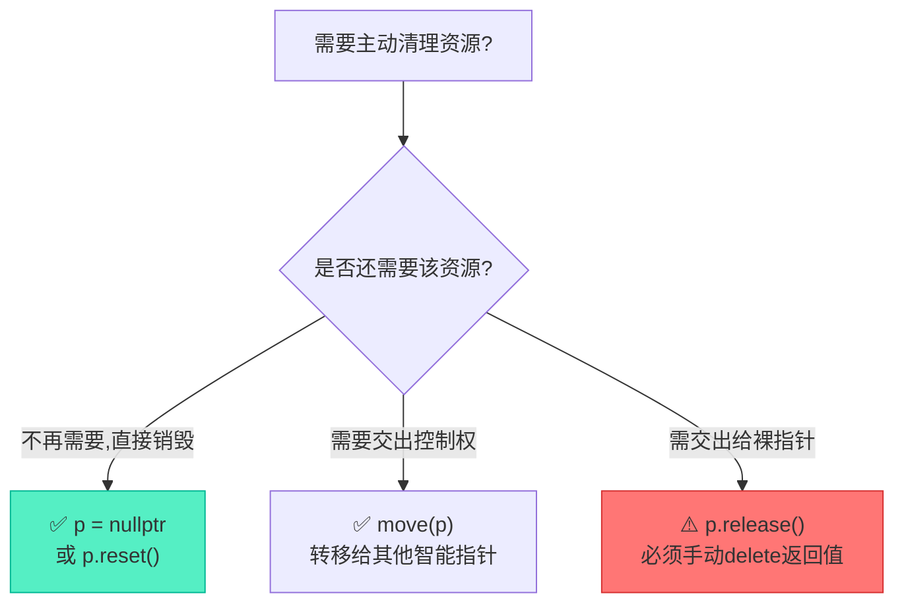
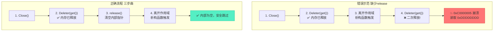

# unique_ptr所有权释放与自定义删除器实战

> [!abstract] 核心导言
> 默认的 `delete` 往往不足以应对现实工程中的复杂资源（如C语言遗留的音视频包、数据库连接）。此时，我们需要掌控 `unique_ptr` 的释放时机与释放行为。本节将深度拆解主动释放策略、自定义删除器的实现规范，以及如何通过“预处理+释放+弃权”的三步曲，安全操控底层资源的生命周期。

---

## 一、主动释放策略：三种路径的抉择

当资源不再需要时，不必苦等作用域结束，`unique_ptr` 提供了多种主动清理手段。

### 1. 赋值 `nullptr`：最直观的销毁
```cpp
unique_ptr<Data> p7(new Data());
p7 = nullptr; // 立即触发析构，释放资源
```
- **底层机制**：等价于调用了 `reset()`，会立即调用删除器销毁内部对象。
- **推荐理由**：语义极其清晰，明确表达了“清空并销毁”的意图。

### 2. `reset()`：销毁与重绑定的双面手
```cpp
p7.reset(new Data()); // 先销毁旧资源，再接管新资源
p7.reset();           // 等价于 p7 = nullptr，仅销毁旧资源
```

### 3. `release()`：放弃管理权（极其危险）
```cpp
unique_ptr<Data> p9(new Data());
Data* ptr9 = p9.release(); // p9变为nullptr，丧失管理权
delete ptr9;               // ⚠️ 必须手动接管并delete！
```
- **核心差异**：`release()` <span style="color:#ff4757;">**绝不触发析构**</span>，它只是交出了裸指针的所有权。



---

## 二、自定义删除器：驯服C风格资源

当 `unique_ptr` 管理的不是单纯的 `new` 出来的内存，而是 `malloc`、文件句柄或音视频编解码结构体时，默认的 `delete` 将导致严重的未定义行为。[1](@context-ref?id=1)

### 1. 删除器类设计规范
自定义删除器是一个重载了 `operator()` 的结构体或类，作为 `unique_ptr` 的第二个模板参数注入。[1](@context-ref?id=2)

```cpp
// 针对 C 风格音视频包的自定义删除器
struct PacketDelete {
    // 预处理方法（可选）：用于业务级的清理逻辑
    void Close() {
        cout << "Call PacketDelete Close!" << endl;
    }

    // 核心：必须重载 operator()，且建议为 const 方法
    void operator()(XPacket* p) const {
        if (!p) return;
        cout << "call PacketDelete()" << endl;
        delete p->data;  // ⚠️ 必须处理内部嵌套的资源！
        delete p;        // 释放外层对象
    }
};
```

### 2. 声明与使用
```cpp
// 模板参数指定删除器类型
unique_ptr<XPacket, PacketDelete> pd2(new XPacket());
```

> [!warning] `operator()` 为何必须是 `const`？
> `unique_ptr` 内部存储删除器对象时，通过 `get_deleter()` 返回的是常量引用。如果 `operator()` 不是 `const` 修饰，将导致编译错误，无法修改被删除对象的状态。[1](@context-ref?id=3)

---

## 三、业务级分步释放：控制流转的艺术

在音视频处理等复杂场景中，资源的释放往往不是一锤子买卖，而是需要“先关闭编码器，再释放内存”的流程。[1](@context-ref?id=4)

### 1. 三步释放法
利用 `get_deleter()` 和 `get()`，我们可以将RAII的“黑盒”过程拆解为手动控制的步骤：

```cpp
// 第一步：调用删除器的预处理方法
pd2.get_deleter().Close();  

// 第二步：调用删除器的核心清理逻辑
pd2.get_deleter()(pd2.get()); 

// 第三步：放弃所有权，防止智能指针析构时二次释放
pd2.release();               
```

### 2. 致命陷阱：0xC0000005 访问冲突
如果只执行了前两步，而<span style="color:#ff4757;">**遗漏了第三步 `release()`**</span>，当 `pd2` 离开作用域时，它的析构函数会再次调用删除器！



> [!info] 0xDDDDDDDD 的秘密
> Visual Studio 在 `delete` 内存后，会将该内存区域填充为 `0xDDDDDDDD`（Dead Data）。当你尝试再次 `delete` 或访问时，触发 `0xC0000005` 读取违例，这是经典的二次释放特征。

---

## 四、典型错误与避坑指南

| 错误类型 | 场景描述 | 后果与表现 | 修复方案 |
| :--- | :--- | :--- | :--- |
| **二次释放** | 手动 `delete` 后，未 `release()` 就让智能指针析构 [1](@context-ref?id=5)| 运行时崩溃 (`0xC0000005`) | 手动干预后务必调用 `release()` |
| **嵌套泄漏** | 删除器只 `delete p`，未 `delete p->data` | 外层对象释放，内层指针泄漏 | 在 `operator()` 中完整释放所有嵌套资源 |
| **悬挂删除器** | 在 `operator()` 中修改了类成员状态，却未加 `const` | 编译报错，无法修改状态 | 将 `operator()` 声明为 `const`，或使用 `mutable` |

---

## 五、知识全景小结

| 知识维度 | 核心内容 | ⚠️ 考试重点/易混淆点 | 难度系数 |
| :--- | :--- | :--- | :--- |
| **主动释放** | `= nullptr` 销毁资源，`release()` 放弃管理 | <span style="color:#ff4757;">`release()` 不调用析构，必须手动接管</span> | ⭐⭐⭐ |
| **删除器规范** | 重载 `operator()`，作为第二模板参数 | <span style="color:#2ed573;">`operator()` 必须加 `const` 修饰符</span> | ⭐⭐⭐⭐ |
| **嵌套资源清理** | 在删除器中处理 `p->data` 等内部指针 [1](@context-ref?id=6)| 只删外壳不删内容，导致隐蔽的内存泄漏 | ⭐⭐⭐⭐ |
| **分步释放流程** | 预处理 `Close` -> 执行 `Deleter` -> `release` [1](@context-ref?id=7)| <span style="color:#ff4757;">缺少 `release` 必触发二次释放崩溃</span> | ⭐⭐⭐⭐⭐ |
| **崩溃识别** | `0xC0000005` 读取 `0xDDDDDDDD` | VS 调试器的 Dead Data 标记，二次释放的铁证 | ⭐⭐⭐⭐ |
| **多线程交互** | 通过 `release()` 安全将资源跨线程传递 | 传递后原指针置空，避免跨线程共享所有权 | ⭐⭐⭐⭐⭐ |

> [!quote] 结语
> 自定义删除器让 `unique_ptr` 跨越了 C++ `new/delete` 的边界，成为了统帅一切资源（文件句柄、网络连接、C结构体）的万能守卫。而掌握手动分步释放的“三步曲”，则是从自动化的 RAII 迈向精细化业务流控的成人礼。牢记：手动干预的终点，必须是 `release()` 的放手。[1](@context-ref?id=8)[](@image-ref?id=8)
