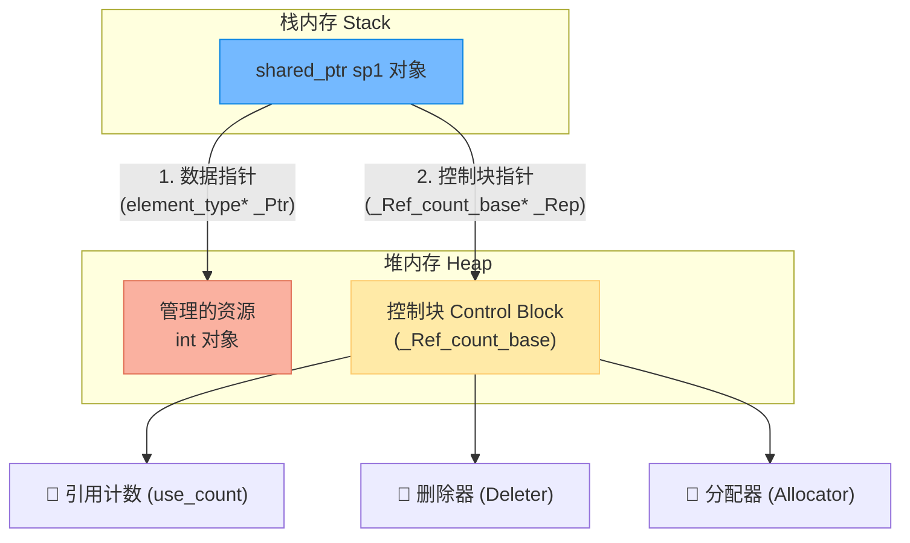
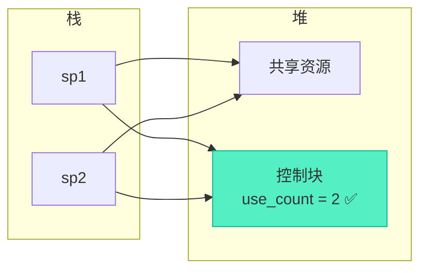
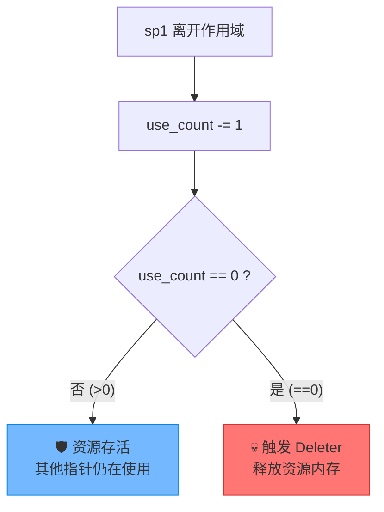
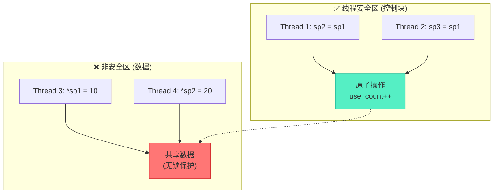

# 图解shared_ptr共享智能指针原理深度解析

> [!abstract] 核心导言
> 如果说 `unique_ptr` 是孤傲的独裁者，那么 `shared_ptr` 就是民主的共享者。它通过引入“引用计数”机制，打破了单一所有权的限制，允许多个指针共同拥有同一块资源。本节将深入其底层“双指针”架构，透视控制块的运作机理，并重点厘清一个极其重要的工程迷思：`shared_ptr` 到底是不是线程安全的？

---

## 一、核心哲学：共享所有权的范式转移

与 `unique_ptr` 的排他性不同，`shared_ptr` 的设计初衷是为了解决资源在复杂系统（尤其是多线程、图结构）中流转与共享的生命周期难题。

| 特性维度 | unique_ptr (独占) | shared_ptr (共享) |
| :--- | :--- | :--- |
| **所有权模型** | 唯一、排他 | 共享、民主 |
| **复制语义** | ❌ 禁止拷贝 (编译拦截) | ✅ 允许拷贝 (计数递增) |
| **释放时机** | 析构即释放 | 引用计数归零时释放 |
| **额外开销** | 零开销 | 控制块分配 + 原子操作开销 |

---

## 二、底层架构：双指针与控制块模型

`shared_ptr` 绝不仅仅是一个包装了裸指针的对象，其内部采用了**双指针结构**，这是理解其行为的钥匙。

### 1. 内存布局剖析
当我们执行 `shared_ptr<int> sp1(new int);` 时，内存中实际上创建了两个独立的实体：



### 2. 拷贝时的联动效应
当发生拷贝构造或赋值（`auto sp2 = sp1;`）时，**数据指针不变，控制块指针共享，计数器递增**。[1](@context-ref?id=0)[](@image-ref?id=0)



> [!info] 为什么需要双指针？
> 数据指针与控制块分离，使得 `shared_ptr` 既能支持面向对象的切片与多态，又能让多个指针实例共享同一套生命周期管理逻辑。

---

## 三、生命周期引擎：引用计数机制

资源的生杀大权，完全系于控制块中的那个小小的整数。

### 1. 递增与递减规则
- **构造/拷贝**：每当产生一个新的 `shared_ptr` 指向该资源，`use_count++`。
- **析构/重置**：每当一个 `shared_ptr` 被销毁（离开作用域）或调用 `reset()`，`use_count--`。
- **归零释放**：一旦 `use_count` 降至 `0`，触发删除器（默认是 `delete`），回收资源内存。



---

## 四、并发迷局：抽丝剥茧的线程安全性

“`shared_ptr` 是线程安全的吗？”——这是C++面试中最高频的陷阱题。答案是：<span style="color:#ff4757;">**控制块是安全的，但数据不是。**</span>[1](@context-ref?id=1)

### 1. 控制块操作：原子性保障
引用计数的递增（`++`）和递减（`--`）操作，底层采用了**原子操作**（Atomics，如 CAS 指令）或加锁机制。[1](@context-ref?id=2)
- **保证**：即使多个线程同时拷贝或析构 `shared_ptr`，计数器的变化也是精准无误的，绝不会出现数据竞争导致内存泄漏或二次释放。

### 2. 数据访问：危险的无人区
`shared_ptr` 仅仅是个管理者，它**不负责为被管理的资源加锁**。
- **隐患**：如果多个线程同时通过 `get()` 或 `->` 去读写同一个 `int` 或 `vector`，依然会产生数据竞争。



> [!warning] 开发者的职责
> 如果你的业务逻辑涉及多线程并发读写 `shared_ptr` 管理的**对象本身**，你必须自己使用 `std::mutex` 进行同步保护！

---

## 五、暗礁与避坑

### 1. 循环引用（致命泄漏）
当两个对象互相持有对方的 `shared_ptr`，形成闭环时，引用计数永远无法归零。
```cpp
struct B;
struct A { shared_ptr<B> pb; };
struct B { shared_ptr<A> pa; }; // ❌ 闭环形成

auto a = make_shared<A>();
auto b = make_shared<B>();
a->pb = b;
b->pa = a; // a, b 离开作用域后计数仍为1，内存泄漏！
```
**解药**：将其中一方改为 `weak_ptr`，它不增加引用计数，打破闭环。

### 2. 管理对象成员的悬垂风险
避免用 `shared_ptr` 直接管理对象的 `this` 指针，这会导致控制块分裂（创建出多个互不相干的引用计数）。必须使用 `enable_shared_from_this` 惯用法。

---

## 六、知识全景小结

| 知识维度 | 核心内容 | ⚠️ 考试重点/易混淆点 | 难度系数 |
| :--- | :--- | :--- | :--- |
| **共享所有权** | 多指针共管一资源，支持拷贝赋值 | <span style="color:#ff4757;">与 unique_ptr 区分：允许复制，非独占</span> [1](@context-ref?id=3)| ⭐⭐ |
| **双指针架构** | 数据指针 + 控制块指针分离 | 控制块在堆上动态分配，存储计数/删除器 | ⭐⭐⭐ |
| **引用计数** | 构造+1，析构-1，归零释放 [1](@context-ref?id=4)| 保证了资源生命周期的自动、延迟管理 | ⭐⭐⭐ |
| **线程安全性** | **控制块原子安全，数据访问非安全** | <span style="color:#ff4757;">高频陷阱：误以为 shared_ptr 托管了数据的并发安全</span> | ⭐⭐⭐⭐⭐ |
| **循环引用** | 对象间互相持有 shared_ptr 导致泄漏 | <span style="color:#ff4757;">解决方案：将一方改为 weak_ptr</span> | ⭐⭐⭐⭐ |
| **删除器支持** [1](@context-ref?id=5)| 可自定义释放逻辑，默认 `delete` | 通过 `get_deleter()` 访问，与 unique_ptr 类似 [1](@context-ref?id=6)| ⭐⭐⭐ |

> [!quote] 结语
> `shared_ptr` 以微小的性能代价，换来了极其强大的自动化共享能力。但切记，它并非万能银弹。深刻理解其“控制块安全 ≠ 数据安全”的二分法，警惕“循环引用”的暗礁，你才能真正驾驭这把现代C++的双刃剑。
