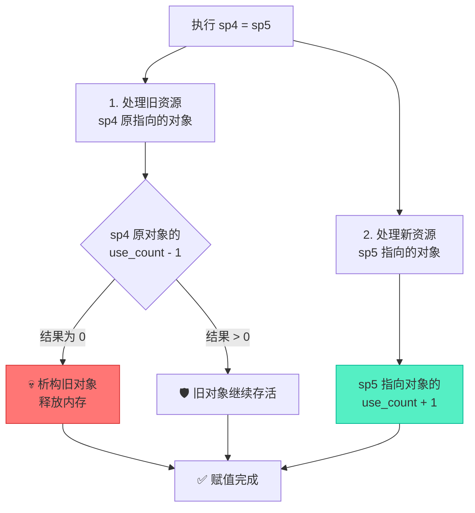
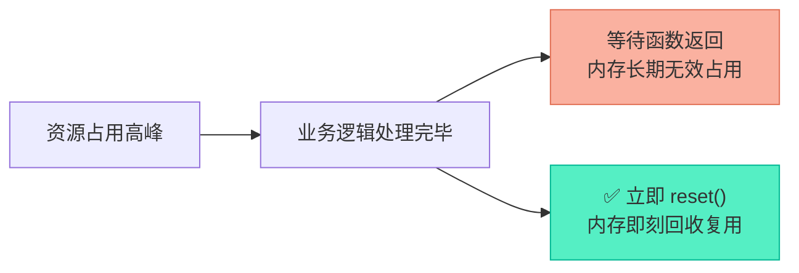

# shared_ptr实战：初始化、作用域与引用计数全解

> [!abstract] 核心导言
> `shared_ptr` 通过引用计数实现了堆内存的共享式所有权，是现代C++资源管理的主力军。然而，计数器的涨落并非简单的加减，赋值操作背后隐藏着“弃旧迎新”的双重逻辑。本节将全景演示 `shared_ptr` 从诞生到消亡的各类操作，重点剖析 `make_shared` 的性能优势与 `reset` 的精准控场，助你彻底掌控共享资源的生命周期。

---

## 一、四大初始化形态与访问方式

`shared_ptr` 的初始化路径与 `unique_ptr` 有诸多相似，但在底层的内存分配策略上存在关键差异。

### 1. 直接初始化（裸 new）
最基础的构造方式，在堆上分别分配控制块与数据对象。
```cpp
shared_ptr<int> sp1(new int);
```

### 2. `make_shared` 初始化（工程首选）
工厂函数创建，强烈推荐。
```cpp
auto sp3 = make_shared<XData>();
```
> [!info] 为什么 make_shared 更好？
> 1. **异常安全**：避免了 `doSomething(shared_ptr<int>(new int), g())` 中因执行顺序不确定导致的泄漏。
> 2. **性能飞跃**：<span style="color:#2ed573;">单次分配</span>！`make_shared` 将**控制块**和**数据对象**分配在同一块连续堆内存中，减少了内存碎片，提高了缓存命中率。

### 3. 数组特化初始化（C++17 支持）
```cpp
shared_ptr<int[]> sp2(new int[1024](@ref); // C++17 引入
sp2[0] = 100; // 直接通过下标访问
```
> [!warning] 版本兼容性
> 在 C++14 及以前的标准中，`shared_ptr` 不支持 `T[]` 语法，必须指定为 `shared_ptr<int>` 并配合自定义删除器 `delete[]` 来管理数组。[1](@context-ref?id=1)

### 4. 常用访问方式
- **解引用**：`*sp1 = 10;`
- **获取原始指针**：`auto p = sp1.get();` （谨慎使用，勿 `delete` 该指针）[1](@context-ref?id=2)

---

## 二、引用计数引擎：use_count 的涨落

引用计数是 `shared_ptr` 的心脏，通过 `use_count()` 可实时监控其跳动。

### 1. 递增：复制构造
当发生拷贝构造时，新指针与原指针共享所有权，引用计数 +1。
```cpp
auto sp4 = sp3; // sp3 的 use_count 从 1 变为 2
```

### 2. 减增与递增：赋值操作（重点难点）
赋值操作 `sp4 = sp5` 是最复杂的逻辑，它同时涉及**旧资源的脱钩**与**新资源的绑定**。



---

## 三、作用域与生命周期监控

利用大括号 `{}` 限定局部作用域，是观察智能指针生命周期的最佳手段。

### 1. 局部作用域测试
```cpp
auto sp3 = make_shared<XData>(); // use_count = 1
{
    auto sp6 = sp3; // use_count = 2
} // sp6 离开作用域析构，use_count 降回 1
```

### 2. 自动释放时机
当最后一个指向该对象的 `shared_ptr` 被销毁（离开作用域）或被重置时，引用计数归零，触发对象的析构函数自动释放内存。[1](@context-ref?id=3)

---

## 四、主动资源回收：reset() 精准控场

不需要等待作用域结束，`reset()` 允许我们在业务逻辑的任意节点提前释放资源。

### 1. 核心机制
调用 `sp3.reset()` 会立即断开与当前资源的关联：
- 当前资源的 `use_count` 立即 -1。
- 如果降为 0，**立即触发析构函数**，回收内存。
- `sp3` 本身变为空指针（`nullptr`）。

```cpp
sp3.reset(); 
cout << "after reset, count = " << sp3.use_count(); // 输出 0
```

### 2. 工程价值
在处理大图像、音视频缓冲区等占用大量内存的资源时，尽早 `reset()` 可以显著降低程序的峰值内存占用，而不必苦等函数结束。



---

## 五、知识全景小结

| 知识维度 | 核心内容 | ⚠️ 考试重点/易混淆点 | 难度系数 |
| :--- | :--- | :--- | :--- |
| **初始化方式** | `new` 直接构造 vs `make_shared` | <span style="color:#2ed573;">`make_shared` 性能更优（单次分配，异常安全）</span> | ⭐⭐⭐ |
| **数组支持** | `shared_ptr<T[]>` 支持数组 [1](@context-ref?id=4)| 老标准需自定义删除器管理数组 | ⭐⭐⭐ |
| **访问方式** | `*` 解引用，`get()` 取裸指针，`[]` 下标 | `get()` 裸指针禁止外部 `delete` | ⭐⭐ |
| **复制构造** | 引用计数 +1 | `auto sp4 = sp3`，两者指向同一控制块 [1](@context-ref?id=5)| ⭐⭐ |
| **赋值操作** | 旧对象计数 -1，新对象计数 +1 | <span style="color:#ff4757;">旧对象计数归零时会触发析构！</span> | ⭐⭐⭐⭐ |
| **作用域机制** | 离开作用域自动 -1 | 最后一个持有者离开，资源才死亡 | ⭐⭐⭐ |
| **reset机制** | 主动断开关联，计数 -1 | <span style="color:#ff4757;">不等到作用域结束，提前精准释放内存</span> | ⭐⭐⭐⭐ |

> [!quote] 结语
> `shared_ptr` 的强大源于其精准的引用计数协同机制。理解赋值时的“弃旧迎新”，掌握 `make_shared` 的内存优化原理，并在大资源场景下善用 `reset()` 主动控场，你便能在复杂的工程环境中游刃有余地驾驭共享智能指针。
