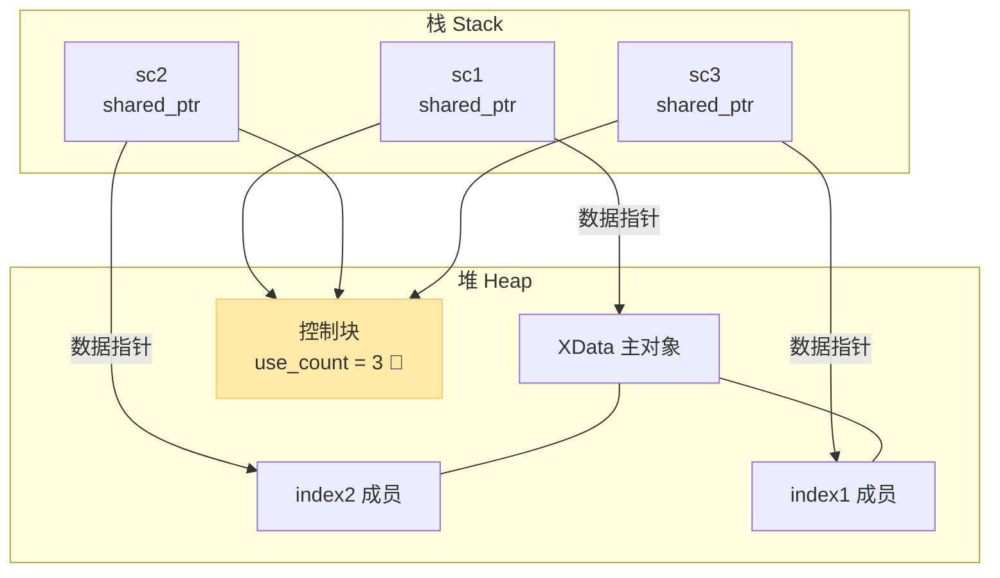

# shared_ptr高级玩法：定制删除器与别名指针深度解析

> [!abstract] 核心导言
> 默认的 `delete` 远非资源释放的终点。当 `shared_ptr` 遭遇 C 风格接口、文件句柄或需特殊关闭逻辑的资源时，定制删除器便是破局的利刃。而更精妙的“别名构造”则允许我们在暴露对象内部成员的同时，牢牢绑定主对象的生命周期。本节将揭开这两种高级机制的底层运作面纱。

---

## 一、定制删除器：突破默认 delete 的边界

与 `unique_ptr` 类似，`shared_ptr` 支持自定义清理逻辑，但在语法细节上存在差异。

### 1. 函数指针方法（传统严谨）
通过全局函数或静态函数指定删除逻辑。

**核心约束**：
- 必须是**全局函数**或**静态成员函数**，绝不能是普通的类成员函数（因为成员函数隐含 `this` 指针，签名不匹配）。
- 必须接收被管理对象的指针作为参数。
- 函数内部**必须显式调用 `delete`**（若针对堆对象），否则内存泄漏。

**代码范式**：
```cpp
// 全局删除函数
void DelData(XData* p) {
    cout << "Call global delete function" << endl;
    delete p; // 必须显式释放
}

// 传入函数指针作为第二个构造参数
shared_ptr<XData> sp7(new XData, DelData);
```

### 2. Lambda 表达式方法（现代推荐）
使用闭包实现就地、简洁的清理逻辑。

**核心优势**：
- **代码极简**：适合 2-3 行即可描述的简单清理逻辑。
- **类型自动推导**：参数可直接使用 `auto`，免去手写复杂类型。

**代码范式**：
```cpp
shared_ptr<XData> sp8(new XData, [](auto p) {
    cout << "Call delete lambda" << endl;
    delete p;
});
```

> [!tip] 第三方库对接
> Lambda 删除器极其适合对接 C 风格的第三方库。例如管理 FFmpeg 的 `AVPacket`：
> `shared_ptr<AVPacket> pkt(av_packet_alloc(), [](auto p){ av_packet_free(&p); });`

---

## 二、别名构造：成员指针的安全宿主

这是 `shared_ptr` 最具颠覆性的高级特性：允许一个 `shared_ptr` 指向对象内部的某个成员，但其生命周期却与整个对象绑定！

### 1. 语法揭秘
别名构造函数接收两个参数：`shared_ptr(主对象指针, 成员地址)`
```cpp
shared_ptr<XData> sc1(new XData);

// sc2 指向 sc1 内部的 index2 成员
shared_ptr<int> sc2(sc1, &sc1->index2);

// sc3 指向 sc1 内部的 index1 成员
shared_ptr<int> sc3(sc1, &sc1->index1);
```

### 2. 引用计数机制：一荣俱荣
成员指针 `sc2`、`sc3` 与主对象指针 `sc1` 共享**同一个控制块**！



**结果验证**：此时 `sc1.use_count()` 输出为 **3**（1个主指针 + 2个别名指针）。

### 3. 生命周期绑定：坚如磐石
这是别名构造最伟大的工程价值：<span style="color:#2ed573;">**只要还有任何一个成员指针在使用，主对象就绝对不会被析构！**</span>

- 传统做法中，若直接返回 `&obj->index1` 的裸指针，一旦 `obj` 被释放，该裸指针立刻变为**悬挂指针**。
- 使用别名构造后，即使 `sc1` 被重置或离开作用域，只要 `sc3` 还活着，主对象 `XData` 就依然存活，`sc3` 的访问绝对安全。

> [!warning] 注意事项
> 1. 必须使用**原始智能指针**来构造成员指针，确保控制块正确关联。
> 2. 取地址必须是 `&obj->member`，确保地址是对象内部的真实偏移量。

---

## 三、知识全景小结

| 知识维度 | 核心内容 | ⚠️ 考试重点/易混淆点 | 难度系数 |
| :--- | :--- | :--- | :--- |
| **函数指针删除器** | 全局/静态函数作为第二构造参数 | <span style="color:#ff4757;">不能是类成员函数！内部必须显式 delete</span> | ⭐⭐⭐ |
| **Lambda删除器** | 闭包就地定义删除逻辑 | 参数支持 `auto` 自动推导，极简优雅 | ⭐⭐ |
| **删除触发时机** | 当引用计数归零时自动调用 [1](@context-ref?id=0)| 即使是定制删除器，依然遵循计数归零原则 | ⭐⭐⭐ |
| **别名构造** | 指向对象内部成员，共享主对象生命周期 | <span style="color:#2ed573;">成员指针会让主对象 use_count 递增</span> | ⭐⭐⭐⭐ |
| **释放条件** | 所有关联指针（含成员指针）全归零 | <span style="color:#ff4757;">释放时机取决于最晚消亡的那个成员指针</span> | ⭐⭐⭐⭐⭐ |
| **防悬挂机制** | 成员指针管理的是对象整体生命周期 [1](@context-ref?id=1)| 解决了返回对象内部裸指针极易悬挂的痛点 | ⭐⭐⭐⭐ |

> [!quote] 结语
> 定制删除器拓宽了智能指针的管理疆域，使其能驯服任何奇葩的 C 风格资源；而别名构造则犹如四两拨千斤，仅凭一个成员地址和一份共享的控制块，便完美化解了内部成员访问的生命周期危机。熟练驾驭这两把利器，标志着你已迈入现代 C++ 资源管理的深水区。
