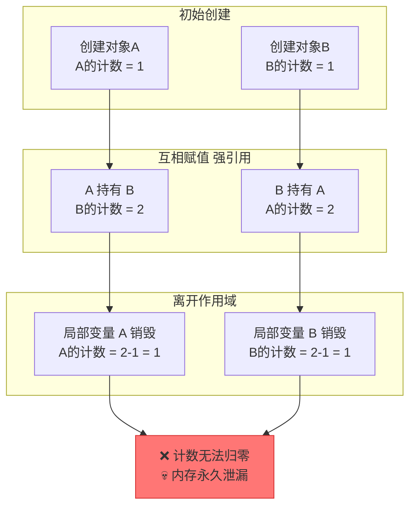
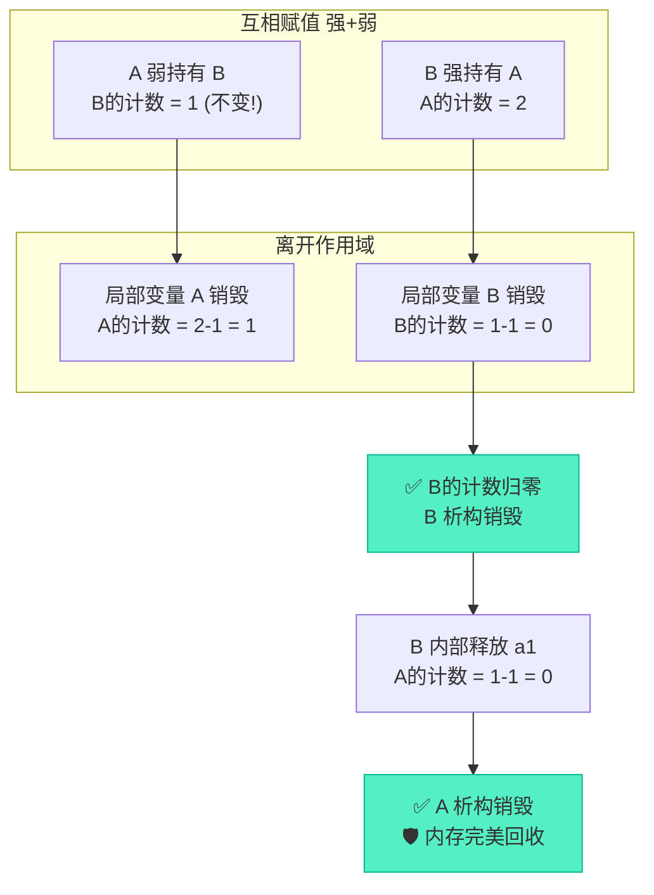
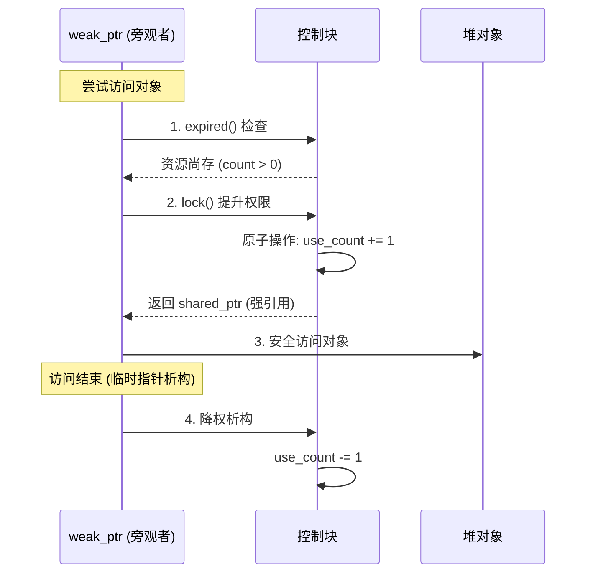

# weak_ptr破局：shared_ptr循环引用与弱引用机制深度解析

> [!abstract] 核心导言
> 当共享的民主走向极端，便成了谁也离不开谁的死锁。`shared_ptr` 的循环引用是现代C++中最隐蔽的内存泄漏源，它让引以为傲的引用计数彻底失效。本节将深度剖析循环引用的“死锁”机制，揭示 `weak_ptr` 如何以“旁观者”的姿态打破僵局，并详解 `lock()` 操作背后的线程安全魔法。

---

## 一、死锁困局：循环引用的陷阱

当两个对象互相持有对方的 `shared_ptr` 时，会形成一个无法解开的死结。

### 1. 互持现象
- 对象 A 内部持有 `shared_ptr<B> b1`
- 对象 B 内部持有 `shared_ptr<A> a1`

### 2. 析构死锁机制
当 A 和 B 离开作用域时，它们的析构函数互相依赖：
- A 想析构 $\rightarrow$ 必须先释放成员 `b1` $\rightarrow$ 触发 B 的析构
- B 想析构 $\rightarrow$ 必须先释放成员 `a1` $\rightarrow$ 触发 A 的析构
结果：互相等待，谁也无法先销毁，形成**析构死锁**。

### 3. 引用计数的失效过程



> [!danger] 泄漏特征
> 代码正常运行，无任何报错，但 `Drop A` 和 `Drop B` 的析构日志永远不会打印。这是一种**静默泄漏**，在复杂工程中极难排查。

---

## 二、破局利器：weak_ptr 弱引用

`weak_ptr` 是为解决循环引用而生的“观察者”智能指针。

### 1. 核心定位
`weak_ptr` 不能独立管理资源，它必须绑定到 `shared_ptr` 上，但从**不增加或减少引用计数**。[1](@context-ref?id=0)

| 特性 | shared_ptr (强引用) | weak_ptr (弱引用) |
| :--- | :--- | :--- |
| **引用计数影响** | +1 | +0 (不参与生命周期管理) |
| **对象生命周期** | 决定生死 | 仅作旁观，不阻止死亡 |
| **访问方式** | 直接使用 `*` / `->` | 必须通过 `lock()` 提升为 `shared_ptr` |
| **判空方式** | `if (sp)` | `if (wp.expired())` |

### 2. 代码重构：打破死锁
只需将 A 或 B 其中一方的 `shared_ptr` 替换为 `weak_ptr` 即可打破闭环。

```cpp
class B;

class A {
public:
    // shared_ptr<B> b1; // ❌ 旧版：强引用，死锁
    weak_ptr<B> b2;      // ✅ 新版：弱引用，破局
};

class B {
public:
    shared_ptr<A> a1;    // 保持强引用
};
```

### 3. 引用计数的重生



---

## 三、安全访问：lock() 的原子魔法

`weak_ptr` 不直接访问对象，这是为了防止在多线程环境下，对象刚被访问就被其他线程析构的竞态条件。

### 1. 访问三步曲
1. **检查资源**：调用 `expired()` 判断资源是否已失效（等价于 `use_count() == 0`）。
2. **提升权限**：调用 `lock()` 获取一个临时的 `shared_ptr`。
3. **安全使用**：通过临时指针访问对象，离开作用域后临时指针析构，计数恢复。

### 2. lock() 的底层保障
`lock()` 内部执行的是**原子操作**：它在创建临时 `shared_ptr` 的同时，将引用计数 +1。这确保了在当前线程使用对象期间，对象绝对不会被其他线程释放。

```cpp
if (!wp.expired()) {
    // lock() 返回一个管理该对象的 shared_ptr，引用计数临时+1
    shared_ptr<B> temp_sp = wp.lock(); 
    if (temp_sp) {
        // 绝对安全：temp_sp 存活期间，对象必不毁
        temp_sp->DoSomething();
    }
} // temp_sp 离开作用域，计数-1，恢复原状
```



---

## 四、知识全景小结

| 知识维度 | 核心内容 | ⚠️ 考试重点/易混淆点 | 难度系数 |
| :--- | :--- | :--- | :--- |
| **循环引用原理** | 互持 `shared_ptr`，析构互相等待 | <span style="color:#ff4757;">静默泄漏，无崩溃但内存永不释放</span> | ⭐⭐⭐⭐ |
| **智能指针分类** | 强引用(`shared_ptr`) vs 弱引用(`weak_ptr`) [1](@context-ref?id=1)| 弱引用不拥有资源，不改变引用计数 | ⭐⭐⭐ |
| **破局方案** | 将闭环中的一方改为 `weak_ptr` | <span style="color:#2ed573;">一方弱引用，打破析构死锁的链条</span> | ⭐⭐⭐⭐ |
| **资源检查** | `expired()` 判断资源是否已死 | `expired()` 等价于 `use_count() == 0` | ⭐⭐ |
| **安全访问** | 通过 `lock()` 获取临时 `shared_ptr` [1](@context-ref?id=2)| <span style="color:#ff4757;">`lock()` 是原子操作，保证多线程下访问期间对象不被销毁</span> | ⭐⭐⭐⭐⭐ |
| **生命周期** | 临时 `shared_ptr` 控制 | 临时指针作用域结束即释放，计数恢复 [1](@context-ref?id=3)| ⭐⭐⭐ |

> [!quote] 结语
> `weak_ptr` 诠释了管理的最高境界：**不拥有，故不执着；能观察，故能护法**。它用“弱引用”斩断了循环引用的死结，用 `lock()` 的原子提升守护了并发访问的底线。在构建图结构、观察者模式等复杂对象网络时，`weak_ptr` 是你不可或缺的安全阀。[1](@context-ref?id=4)[](@image-ref?id=4)
