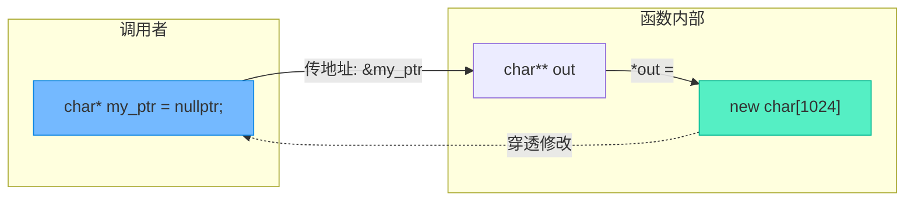

# 指针传参陷阱与模板破局：从退化到内存安全

> [!abstract] 核心导言
> 指针作为函数参数传递，绝不仅是传递一个地址那么简单，它是一场关于内存大小知情权、修改权限控制与生命周期权责交接的博弈。数组传参时的“退化现象”剥夺了尺寸信息，而函数内部分配内存则暗藏悬垂指针与泄漏的深渊。本节将深度剖析指针传参的设计铁律，并祭出模板与二级指针两大破局利器。

---

## 一、指针传参设计铁律

在函数接口设计中，明确内存的“输入/输出”属性是安全的第一道防线。

### 1. 输入内存：只读与知情
- **标识不可变**：<span style="color:#2ed573;">必须使用 `const` 修饰</span>，从语法层面杜绝内部误修改。
- **附带尺寸**：数组作为参数传递时会丢失长度信息，因此必须额外提供大小参数（如 `size_t size`）。

```cpp
void PtrFunction(const char* in_data, size_t size);
```

### 2. 输出内存：防溢出与预分配
- **提供容量**：调用者预先分配内存，函数内部写入时必须依据提供的大小防溢出。
- **优先原则**：<span style="color:#2ed573;">优先由调用者分配内存</span>，避免跨越函数边界的堆内存管理。

### 3. 函数内建内存：权责的交接
若函数内部 `new` 了内存并交由外部使用，必须通过**指针引用**或**指向指针的指针**传出，且**必须注释说明释放责任**。

---

## 二、数组退化的幽灵与const的护盾

### 1. 数组到指针的退化
当数组名传递给函数时，它会悄然退化为指向首元素的指针。

```cpp
char data[] = "test men ptr"; // 外部：大小为13字节
PtrFunction(data);
```

在函数内部执行 `sizeof(data)`，得到的不再是 13，而是 **4（32位系统）或 8（64位系统）**——即指针本身的大小。这就是所谓的“退化”。[1](@context-ref?id=0)

> [!danger] 致命后果
> 退化的指针彻底失去了对原始数组边界的感知，如果函数内部试图遍历或写入，极易造成越界访问。

### 2. const 的安全承诺
对于输入参数，`const char*` 明确宣告：这块内存对于该函数而言是只读的，任何试图修改 `in_data[i]` 的行为都会被编译器无情拦截。

---

## 三、模板破局：编译期捕获数组尺寸

如何让函数既接受数组参数，又不丢失其尺寸信息？答案是**模板引用传参**。[1](@context-ref?id=1)

### 1. 非类型模板参数语法
利用数组引用作为参数，结合 `size_t` 推导：
```cpp
template <class Ty, size_t Size>
void TestMemArr(Ty (&data)[Size]) {
    cout << "sizeof(data) = " << sizeof(data) << endl; // ✅ 输出真实的 13
}
```

### 2. 编译期推导机制


> [!tip] 核心优势
> 这种写法没有任何运行时开销，所有推导都在编译期完成。它不仅适用于字符数组，也完美适用于任何类型的数组，是现代C++中处理数组传参的最佳实践之一。

---

## 四、函数内建内存：深渊与救赎

当函数需要在内部创建堆内存并返回给调用者时，踩坑率极高。

### 1. 绝对禁忌：返回栈内存
```cpp
char* TestMk() {
    char buf[1024] = "test";
    return buf; // ❌ 致命错误：返回局部变量的地址
}
```
**后果**：栈空间在函数返回后被立即回收，返回的指针成为**悬垂指针**，解引用属未定义行为。

### 2. 形同虚设：直接修改指针参数
如果想在函数内分配堆内存并赋值给外部指针，直接传值是无效的：
```cpp
void TestMem(char* out) { // ❌ 此处传递的是指针的副本
    out = new char[1024]; // 修改的仅仅是局部副本
}
// 外部指针依然为空，且造成了内存泄漏！
```

### 3. 唯一正解：二级指针穿透
要修改外部指针本身（而非其指向的数据），必须传递指针的地址（即指向指针的指针）。

```cpp
// 参数为二级指针
int TestMemAlloc(char** out, int size = 1024) {
    *out = new char[size]; // 解引用后修改外部指针的指向
    return size;
}
```



> [!warning] 权责声明
> 使用 `new` 在函数内分配内存后，必须通过注释明确宣告：<span style="color:#ff4757;">“由调用者负责释放内存”</span>。调用者在使用完毕后必须执行 `delete[] out; out = nullptr;`。[1](@context-ref?id=2)

---

## 五、知识全景小结

| 知识维度 | 核心内容 | ⚠️ 考试重点/易混淆点 | 难度系数 |
| :--- | :--- | :--- | :--- |
| **传参设计原则** | 输入加 `const` 传大小，输出传容量防溢出 | <span style="color:#2ed573;">优先由调用者分配内存，降低权责混乱</span> | ⭐⭐⭐ |
| **数组退化机制** | 数组名传参退化为首元素指针 | <span style="color:#ff4757;">函数内 `sizeof` 得到是指针大小(4/8)而非数组长度</span> [1](@context-ref?id=3)| ⭐⭐⭐⭐ |
| **模板引用传参** | `Ty (&data)[Size]` 保留数组信息 [1](@context-ref?id=4)| 编译期推导，零运行期开销，完美替代显式传长度 | ⭐⭐⭐ |
| **栈内存返回** | 返回局部变量地址 | <span style="color:#ff4757;">绝对禁忌！导致悬垂指针与未定义行为</span> | ⭐⭐⭐⭐⭐ |
| **二级指针修改** | 传递 `&ptr` 以修改指针指向 | 修改一级指针形参无效（仅改副本），必须解引用二级指针 [1](@context-ref?id=5)| ⭐⭐⭐⭐⭐ |
| **谁申请谁释放** | 函数内 `new` 必须由外部 `delete` | 返回堆空间必须注释说明，防范内存泄漏 [1](@context-ref?id=6)| ⭐⭐⭐⭐ |

> [!quote] 结语
> 指针传参的本质是内存管辖权的流转。`const` 划定了权力的边界，模板保留了情报的完整，而二级指针则打破了函数栈帧的隔离，实现了所有权的真正转移。敬畏每一次指针的传递，在脑海中时刻推演内存的归属，你才能在C++的深水区立于不败之地。
