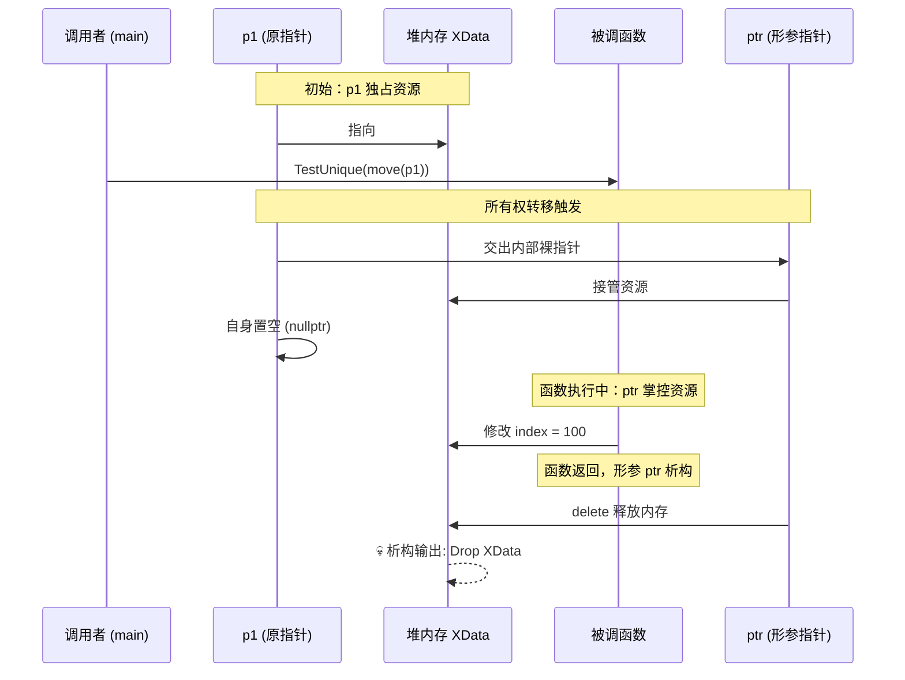
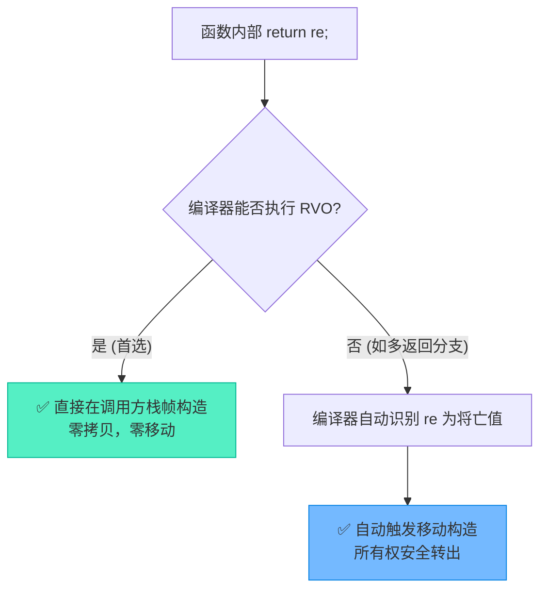

# unique_ptr跨作用域流转：函数参数与返回值深度解析

> [!abstract] 核心导言
> 智能指针的生命周期管理，绝非仅限于单一作用域内的自生自灭。当 `unique_ptr` 跨越函数边界（作为参数传入或作为返回值传出）时，其背后的“唯一所有权”原则将面临严峻考验。本节将深度剖析 `unique_ptr` 在函数调用链中的所有权交接机制，揭示移动语义如何取代拷贝成为跨域流转的唯一合法通道，并探秘编译器在返回值场景下的极致优化。

---

## 一、生命周期追踪：XData 哨兵

为了直观洞察所有权流转引发的生命周期变化，我们构建一个包含明晰日志的追踪类：

```cpp
class XData {
public:
    int index;
    XData() { cout << "Create XData" << endl; }
    ~XData() { cout << "Drop XData" << endl; }
};
```
> [!info] 观测锚点
> 构造与析构的日志输出，是我们判断资源何时被创建、何地被销毁的唯一“显影液”。

---

## 二、作为函数参数：所有权的强制交割

将 `unique_ptr` 作为参数传递时，涉及所有权的跨作用域转移。由于 `unique_ptr` 禁止拷贝，这里存在一条不可逾越的铁律。[1](@context-ref?id=0)

### 1. 移动语义：唯一的合法通道
值传递 `unique_ptr` 意味着形参将获取资源的所有权。此时必须使用 `std::move` 将左值强转为右值，触发移动构造。[1](@context-ref?id=1)

```cpp
// 函数声明：按值传递，意图接管所有权
void TestUnique(unique_ptr<XData> ptr) {
    if (ptr) {
        ptr->index = 100; // 内部完全掌控资源
        cout << "ptr->index = " << ptr->index << endl;
    }
} // 离开作用域，若所有权在此，则资源自动销毁

// 调用方
unique_ptr<XData> p1(new XData());
TestUnique(move(p1)); // ✅ 必须使用 move 转移所有权

if (!p1) {
    cout << "p1 empty" << endl; // 必然输出：原指针已交出控制权
}
```

### 2. 所有权流转拓扑



> [!danger] 典型错误
> 若省略 `std::move` 直接传参 `TestUnique(p1)`，编译器将尝试调用拷贝构造，而该函数已被 `= delete`，导致**编译错误**。这是 C++ 编译器防止多重释放的最后一道防线。

---

## 三、作为函数返回值：所有权的逆向诞生

从函数内部返回 `unique_ptr`，是工厂模式创建对象的常见手段。此时所有权从临时作用域向调用者转移。

### 1. 编译器的魔法：RVO 与 隐式移动
在 C++11 之前，返回局部对象的智能指针是个麻烦事。但在现代 C++ 中，编译器提供了双重保险：

```cpp
unique_ptr<XData> TestUnique() {
    unique_ptr<XData> re(new XData());
    re->index = 222;
    return re; // ✅ 直接返回，无需显式 move
}
```

**底层优化机制**：
1. **RVO/NRVO（返回值优化）**：编译器直接在调用方的栈帧上构造 `re` 对象，彻底省去了一次移动操作。
2. **隐式移动**：若 RVO 未生效，编译器发现 `re` 即将销毁，会自动将其视作右值，调用**移动构造**返回。



> [!warning] 画蛇添足的警告
> 切勿在 `return re;` 时手动加上 `move`（即 `return move(re);`）。这会**强制关闭 RVO 优化**，强制调用移动构造，反而可能降低性能！

### 2. 生命周期归宿
接收返回值的 `unique_ptr` 接管了所有权，资源的生命周期从此由接收方的作用域决定：
```cpp
auto p2 = TestUnique(); // p2 接管资源
cout << p2->index << endl; // 正常访问：222
// p2 离开作用域时，资源自动销毁
```

---

## 四、知识全景小结

| 知识维度 | 核心内容 | ⚠️ 考试重点/易混淆点 | 难度系数 |
| :--- | :--- | :--- | :--- |
| **作为参数传入** | 必须使用 `std::move` 转移所有权 | <span style="color:#ff4757;">传递后原指针必然失效（变为 nullptr）</span> [1](@context-ref?id=2)| ⭐⭐⭐⭐ |
| **参数传递目的** | 将内存管理权交由被调函数 | 适用于“函数内部消费并销毁”的场景 | ⭐⭐⭐ |
| **作为返回值传出** | 直接返回局部 `unique_ptr` 对象 | <span style="color:#2ed573;">编译器自动优化（RVO/隐式移动），无需显式 move</span> | ⭐⭐⭐⭐ |
| **返回值生命周期** | 由接收方的作用域控制 | 工厂模式的标准写法，安全创建对象 | ⭐⭐⭐ |
| **编译错误拦截** | 禁止拷贝构造/赋值 | 未加 `move` 的参数传递会直接导致编译失败 | ⭐⭐⭐ |
| **RVO干扰** | `return move(re)` 会阻止优化 | <span style="color:#ff4757;">千万不要在 return 语句中画蛇添足加 move</span> | ⭐⭐⭐⭐⭐ |

> [!quote] 结语
> `unique_ptr` 跨越函数边界的过程，就是所有权“交出”与“接收”的流转史。作为参数，它是决绝的割舍（`move` 交权，原指针成空）；作为返回值，它是新生的赐予（RVO 护航，安全降临）。理解并顺应这套编译器的流转法则，你便能构建出既无内存泄漏，又兼具极致性能的现代 C++ 应用。[1](@context-ref?id=3)[](@image-ref?id=3)
