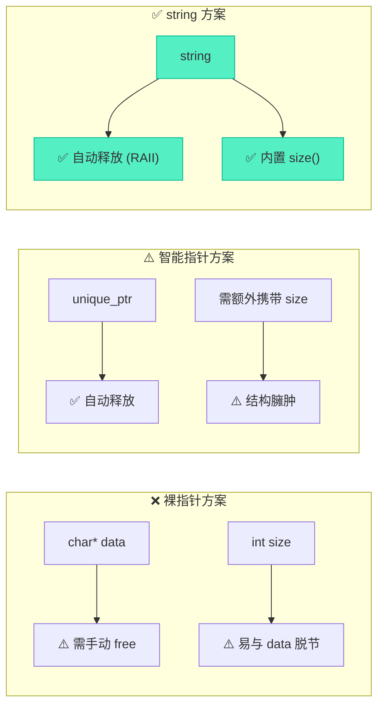
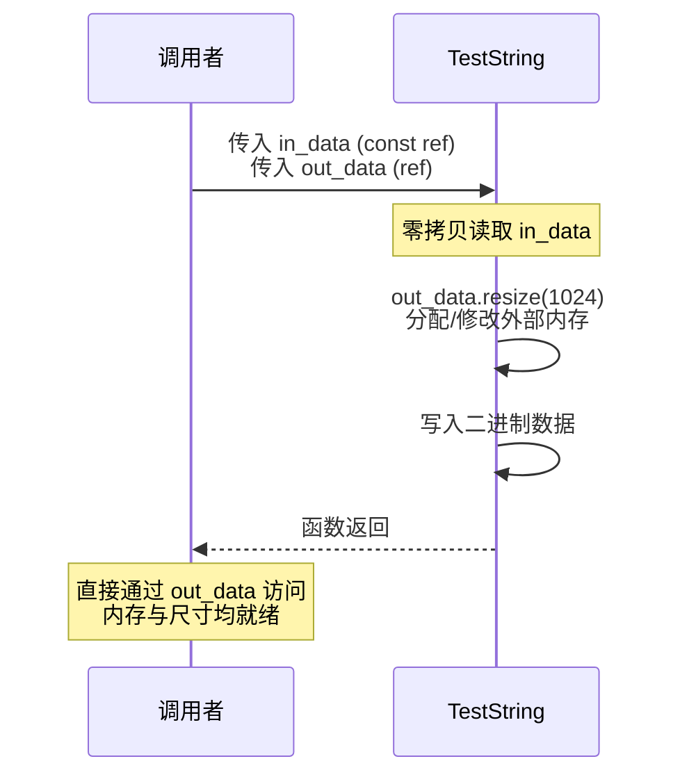

# 深度解析：使用string作为函数参数的内存输入与输出

> [!abstract] 核心导言
> 在C/C++工程中，传递二进制内存块（如音视频帧、网络包）是高频操作。相比于裸指针的“地址+长度”捆绑，或是智能指针的“缺尺寸”尴尬，`std::string` 凭借其原生的 RAII 机制与内置的 `size()` 信息，异军突起成为跨函数传递内存流的利器。本节将深度拆解 `string` 作为内存容器的底层逻辑、引用传参的零拷贝法则，以及跨越 DLL 边界的致命陷阱。

---

## 一、范式革新：为什么选择string接管二进制内存？

传统的内存传递方案存在固有缺陷，而 `string` 提供了一种自洽的闭环管理。

### 1. 传统方案的痛点
- **裸指针 (`char*` + `size`)**：参数冗余，极易遗忘释放，或长度与指针脱节导致越界。
- **智能指针 (`unique_ptr<char[]>`)**：虽解决了释放问题，但**丢失了尺寸信息**，仍需额外参数或结构体记录大小。

### 2. string 的降维打击
- **自带尺寸**：通过 `.size()` 随时获取已申请内存大小，无需额外传参。
- **自动回收**：离开作用域自动释放，杜绝泄漏。
- **工程验证**：FFmpeg、WebRTC 等顶级开源库均广泛采用此方案传递二进制流。



---

## 二、内存空间的申请与底层寻址

将 `string` 用作二进制缓冲区，需掌握其特定的申请与访问接口。

### 1. resize()：精准预分配
- **参数含义**：元素数量。对于 `std::string`（底层为 `char`），1个元素即1字节。
- **默认清零**：`resize()` 支持第二参数指定填充值，默认为 `'\0'`（0x00），这对二进制缓冲区极其重要，可避免残留脏数据。

```cpp
string str1;
str1.resize(1024); // 申请1024字节，且默认清零
```

### 2. data()：获取裸指针的入口
为了将数据写入 `string` 管理的内存，需通过 `data()` 获取裸指针。

> [!warning] const_cast 的必要性
> 在 C++17 之前，`string::data()` 仅返回 `const char*`。为了兼容 C 语言接口（如 `memset`, `memcpy`），必须使用 `const_cast<char*>` 强行剥离 `const` 属性。[1](@context-ref?id=1)
> ```cpp
> char* data = const_cast<char*>(str1.data());
> memset(data, 'A', 5); // 安全写入
> ```
> *注：C++17 标准中，非 const 的 `string` 对象调用 `data()` 已直接返回 `char*`，无需强转。但在跨平台/老代码维护中，`const_cast` 依然常见。*

---

## 三、跨函数流转：引用传参的零拷贝法则

`string` 作为参数时，传值与传引用有着天壤之别。

### 1. 绝对禁忌：值传递
值传递 (`void Test(string data)`) 会触发深拷贝，不仅造成严重的 CPU 与内存开销，且函数内外指向的完全是两块不同的内存。

**验证方法**：将 `data()` 返回值强转为 `long long` 打印，内外地址必不相同。[1](@context-ref?id=2)

### 2. 黄金法则：引用传递
- **输入参数**：`const string& in_data`[1](@context-ref?id=3)[](@image-ref?id=3)
  - `const` 承诺不修改，同时避免拷贝。
- **输出参数**：`string& out_data`
  - 函数内部通过 `resize()` 预分配空间，外部直接获取数据与尺寸。

```cpp
void TestString(const string& in_data, string& out_data) {
    // 1. 读取输入（零拷贝）
    cout << "size: " << in_data.size() << endl;
    
    // 2. 写入输出（直接修改外部对象）
    out_data.resize(1024); 
    char* p = const_cast<char*>(out_data.data());
    memcpy(p, in_data.data(), 5);
}
```



---

## 四、深渊陷阱：返回值的跨库死劫

> [!danger] 极其危险：避免返回 string 传递内存
> 尤其是在**跨动态库（DLL/SO）调用**时，绝不能将 `string` 作为返回值传递内存！

**崩溃根源**：
1. **内存分配器不一致**：EXE 和 DLL 可能链接了不同版本的 CRT（C Runtime），它们拥有各自独立的堆。
2. **跨界释放**：在 DLL 中分配的 `string` 内存，返回给 EXE 后，将由 EXE 的析构函数释放。**在 A 堆分配，在 B 堆释放**，直接导致程序崩溃（R6010 Heap Corruption）。

---

## 五、进阶抉择：何时投入 vector 的怀抱

`string` 虽好，但并非万能。当存储对象数组时，它存在先天不足。

| 对比维度 | std::string (字符流) | std::vector<T> (对象容器) |
| :--- | :--- | :--- |
| **类型安全** | ❌ 需强制转换 `const_cast` | ✅ 模板原生支持，强类型校验 |
| **对象存储** | ❌ 需序列化/反序列化，易出错 | ✅ 直接存储对象，安全便捷 |
| **适用场景** | 音视频帧(RGB/YUV)、网络包(AVPacket) | 结构体数组、复杂对象列表 |

> [!tip] 选型指南
> - 处理**连续的二进制字节流** $\rightarrow$ 优选 `string`。
> - 处理**同类型的结构化对象** $\rightarrow$ 优选 `vector<T>`。

---

## 六、知识全景小结

| 知识维度 | 核心内容 | ⚠️ 考试重点/易混淆点 | 难度系数 |
| :--- | :--- | :--- | :--- |
| **string传参原理** | 容器管理堆内存，自带 size 与 RAII | <span style="color:#2ed573;">相比智能指针，核心优势是原生携带尺寸信息</span> [1](@context-ref?id=4)| ⭐⭐⭐ |
| **内存操作实践** | `resize()` 预分配，`data()` 取指针 | <span style="color:#ff4757;">老标准需 `const_cast` 去 const；resize 默认填 0</span> | ⭐⭐⭐⭐ |
| **传参优化方案** | 输入 `const string&`，输出 `string&` | 值传递必触发深拷贝，地址会发生改变 [1](@context-ref?id=5)| ⭐⭐⭐⭐ |
| **返回值限制** | 跨动态库调用绝不返回 string | <span style="color:#ff4757;">跨堆分配与释放导致 Heap Corruption 崩溃</span> | ⭐⭐⭐⭐⭐ |
| **vector替代方案** | 类型安全的对象数组容器 | 存储复杂对象时，vector 避免了序列化和强转 | ⭐⭐⭐ |

> [!quote] 结语
> `std::string` 在二进制内存传递领域的应用，是对“合适即最优”的最好诠释。它用 RAII 封装了裸指针的狂野，用内置 size 填补了智能指针的留白。牢记引用传参的零拷贝法则，敬畏跨库返回的堆内存红线，你便能在高性能数据流转的架构设计中游刃有余。
