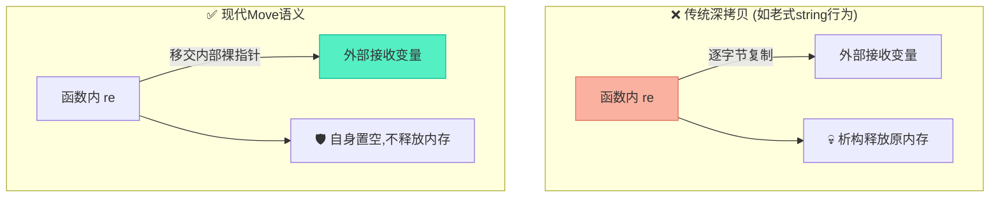
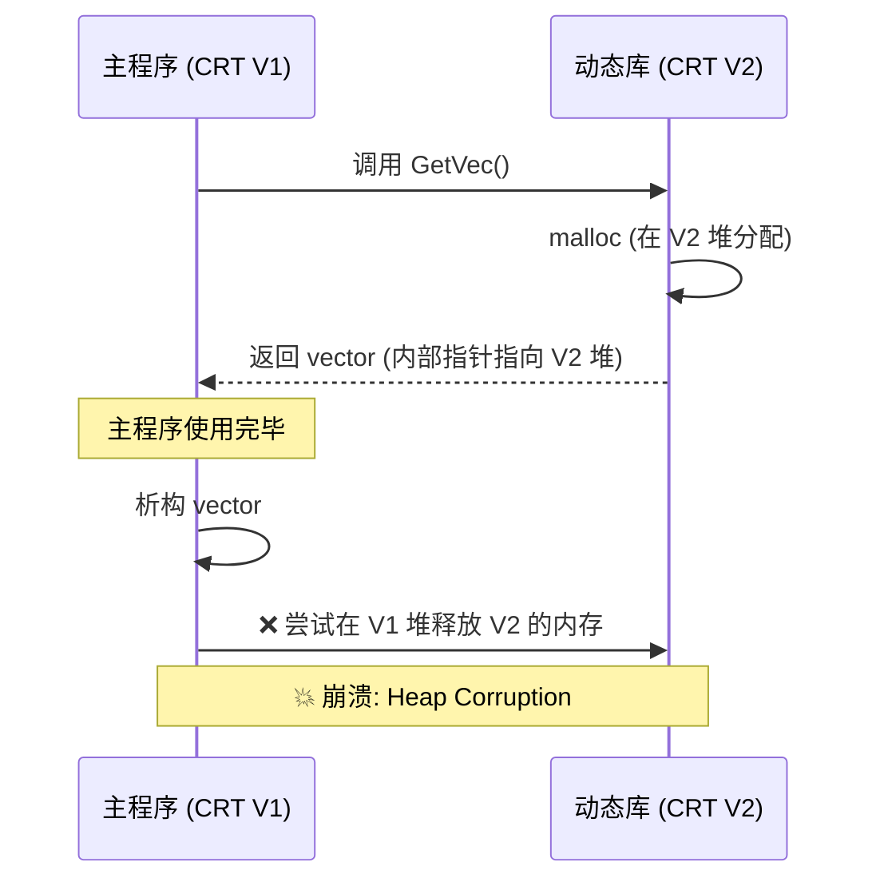

# vector内存流转：传参优化、Move语义与跨DLL陷阱深度解析

> [!abstract] 核心导言
> 在处理对象集合或二进制数据流时，`std::vector` 凭借其自动内存管理与类型安全特性，成为了跨越函数边界传递内存的首选容器。与 `string` 相比，`vector` 在返回值场景下对移动语义的天然亲和力，使其避免了高昂的深拷贝开销。然而，容器的扩容迁移与跨动态库的堆内存壁垒，依然是横亘在工程实践中的暗礁。本节将全景拆解 `vector` 的内存流转机制。

---

## 一、范式对决：vector vs string 的内存管理差异

虽然 `vector` 和 `string` 都具备 RAII 自动释放和预分配内存的能力，但在二进制内存流转的细节上存在关键分歧。

| 对比维度 | std::string (字符流视角) | std::vector<T> (对象/内存视角) |
| :--- | :--- | :--- |
| **尺寸语义** | `size()` 返回**字节数** | `size()` 返回**元素数量**（字节数需乘 `sizeof(T)`） |
| **返回值优化** | 早期/特定场景下可能触发深拷贝 | <span style="color:#2ed573;">天然支持 Move 语义，零成本返回</span> |
| **类型安全** | 弱类型，存取需强制转换 `const_cast` | 强类型，模板原生支持各种结构体 |
| **数据适应性** | 专为字符串设计，遇 `\0` 可能截断 | 完美适配包含 `0x00` 的纯二进制流 |

> [!tip] 二进制数据存储方案
> 若需使用 `vector` 存储纯二进制流，应声明为 `vector<char>` 或 `vector<unsigned char>`（或 C++17 的 `std::byte`）。

---

## 二、所有权流转：传参零拷贝与返回值Move

### 1. 引用传参：避开深拷贝的雷区
传递 `vector` 作为输入/输出参数时，必须使用引用 (`&`)，否则将触发元素的全量复制。

```cpp
// 输入参数：const 引用承诺不修改
// 输出参数：非 const 引用直接修改外部内存
void ProcessVec(const vector<XData>& in_data, vector<XData>& out_data);
```
**验证手段**：打印 `data()` 指针地址，函数内外地址绝对一致。

### 2. 返回值机制：Move 语义的降维打击
当函数内部创建 `vector` 并返回时，现代 C++ 编译器通过移动语义直接转移所有权，避免了内存的重新分配与元素拷贝。[1](@context-ref?id=1)

```cpp
vector<XData> TestVec(vector<XData>& data) {
    vector<XData> re; // 函数内部创建
    re.resize(10);    
    return re;        // ✅ 触发移动语义/RVO，而非深拷贝
}
```



---

## 三、元素生命周期：resize与push_back的暗箱

向 `vector` 中塞入数据时，对象的构造与拷贝在暗中涌动。

### 1. 监控哨兵：XData 测试类
设计包含完备日志输出的类，用以追踪对象的生老病死：
```cpp
class XData {
public:
    int index;
    XData() { cout << "Create XData" << endl; }
    ~XData() { cout << "Drop XData" << endl; }
    XData(const XData& d) { cout << "Copy XData" << endl; } // 关注点
};
```

### 2. 内存操作的行为差异
- **`resize(n)`**：直接调用 `n` 次默认构造函数，在已有内存上原地构造。
- **`push_back(obj)`**：<span style="color:#ff4757;">必定触发一次拷贝构造</span>（将外部对象复制进容器）。

### 3. 扩容的隐形风暴
当 `vector` 容量不足时触发扩容：
1. 申请新的更大内存。
2. 将旧内存中的所有元素**移动/拷贝**到新内存。
3. 析构旧元素并释放旧内存。

> [!warning] 迭代器失效
> 扩容必然导致原有的 `data()` 指针、迭代器、引用全部失效！切勿在扩容后继续使用缓存的旧指针。

---

## 四、工程深渊：DLL边界与跨堆释放死局

> [[!danger]] 绝对禁忌：跨 DLL 传递 vector 或 string 返回值

如果在动态链接库 (DLL/SO) 中分配了 `vector` 内存并将其作为返回值传给主程序，将引发灾难性的崩溃。[1](@context-ref?id=2)

**崩溃根因**：
- 主程序和 DLL 可能链接了不同版本的 C++ 运行时 (CRT)。
- 它们拥有**彼此独立的堆内存管理器**。
- `vector` 在 DLL 中分配内存，返回主程序后，主程序析构时会尝试在自己的堆中释放该内存 —— **跨堆释放**，直接触发 Heap Corruption。



**最佳实践**：
1. **纯 C 接口**：DLL 导出函数只传递裸指针，由调用方分配和释放。
2. **预分配注入**：由主程序预分配 `vector` 空间，传入 DLL 填充数据。
   ```cpp
   // 安全做法
   vector<XData> buffer(1024);
   DLL_Process(buffer.data(), buffer.size()); 
   ```

---

## 五、知识全景小结

| 知识维度 | 核心内容 | ⚠️ 考试重点/易混淆点 | 难度系数 |
| :--- | :--- | :--- | :--- |
| **vector vs string** | 返回值 Move 语义，`size()` 为元素个数 [1](@context-ref?id=3)| <span style="color:#ff4757;">vector 字节数计算：`size() * sizeof(T)`</span> [1](@context-ref?id=4)| ⭐⭐⭐ |
| **引用传参** | 避免深拷贝，保持 `data()` 地址一致 | 输出参数使用 `vector<T>&` | ⭐⭐ |
| **Move 语义返回** | 函数内创建的 vector 可零成本返回 | 所有权转移，原对象析构不释放内存 | ⭐⭐⭐⭐ |
| **元素生命周期** | `push_back` 触发拷贝构造，`resize` 调用默认构造 | <span style="color:#ff4757;">扩容导致全量元素迁移与原迭代器失效</span> | ⭐⭐⭐⭐ |
| **跨 DLL 陷阱** | 禁止跨模块返回 STL 容器 | <span style="color:#ff4757;">内存分配与释放在不同堆进行，必崩</span> | ⭐⭐⭐⭐⭐ |
| **安全接口设计** | 预分配注入或使用纯 C 裸指针接口 | 跨库交互的黄金法则 | ⭐⭐⭐⭐ |

> [!quote] 结语
> `vector` 在内存流转中展现了极高的效率与类型安全性，特别是移动语义为其返回值场景插上了腾飞的翅膀。然而，STL 容器的便利性是有边界的——那条边界就是动态库的 ABI 墙。守住跨 DLL 不传容器的底线，采用预分配或裸指针的契约交互，才是构建稳健大型工程的王道。
