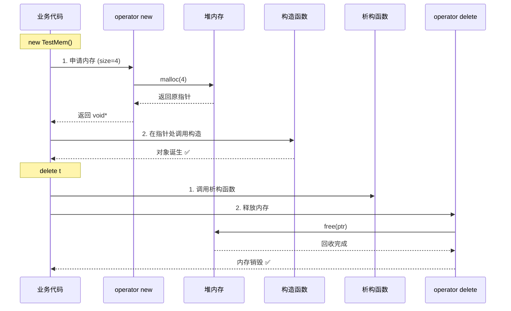

# 重载operator new与delete：内存管控的底层利器

> [!abstract] 核心导言
> `new` 和 `delete` 绝非不可触碰的黑盒，它们本质上是调用底层 `malloc`/`free` 的运算符。当系统默认的内存分配策略无法满足工程需求时，重载 `operator new` 和 `operator delete` 便成了我们切入底层、实施精准管控的利刃。本节将深度拆解全局重载的实现规范、数组版本的尺寸跃迁，以及构造析构与内存分配的严格时序。

---

## 一、破局之道：为何要重载 new/delete？

在深入代码前，必须理解重载这把刀挥向何处。重载并非为了炫技，而是为了解决四大工程痛点：

| 重载目的 | 核心场景 | 工程价值 |
| :--- | :--- | :--- |
| **内存监控** | 统计创建/销毁时机，计算存量 | 排查幽灵般的内存泄漏，绘制生命周期图谱 |
| **对齐处理** | 嵌入式设备、SIMD指令集 | 统一强制内存对齐（如16/64字节），避免硬异常降速 |
| **特殊应用** | 多进程共享内存 | 底层替换为 `shmget`/`mmap`，让 C++ 对象生于共享内存 |
| **前置处理** | 内存初始化、锁保护 | 分配前打标记，释放前清零防泄密，多线程分配加锁 |

---

## 二、全局重载实战：接管内存的生杀大权

### 1. 测试基座：TestMem 类
设计带有明确生命周期日志的类，是验证内存重载生效的最佳观测锚点。

```cpp
class TestMem {
public:
    TestMem() { cout << "Create TestMem" << endl; }
    ~TestMem() { cout << "Drop TestMem" << endl; }
    
    int id; // 注意：空类占1字节，加入int后占4字节
};
```

> [!info] 空类的 1 字节之谜
> C++ 标准规定，每个对象必须有独一无二的地址。若类无任何成员，编译器会强行插入 1 字节的占位符（`char`），以确保 `new` 返回的地址绝不相同。

### 2. 重载 operator new：分配的起点
全局 `operator new` 接管了所有堆内存的申请入口。

**核心规范**：
- **参数**：必须为 `size_t size`（32位为 `unsigned int`，64位为 `unsigned __int64`，自动适配平台）。
- **底层调用**：内部依然使用 `malloc(size)` 完成实际物理内存的划拨。
- **异常机制**：<span style="color:#ff4757;">若 `malloc` 失败，必须抛出 `std::bad_alloc` 异常</span>，而非像 C 语言那样仅返回 `NULL`，这是 C++ 内存耗尽的标准应对策略。

```cpp
void* operator new(size_t size) {
    cout << "operator new: " << size << " Bytes" << endl;
    auto mem = malloc(size);
    if (!mem) {
        throw std::bad_alloc(); // 关键：抛出异常
    }
    return mem;
}
```

### 3. 重载 operator delete：释放的终局
全局 `operator delete` 拦截了所有的内存回收出口。

**核心规范**：
- **参数**：必须为 `void* ptr`。
- **底层调用**：内部调用 `free(ptr)` 归还物理内存。
- **空指针豁免**：标准允许传入 `nullptr`，`free(nullptr)` 是安全的空操作。

```cpp
void operator delete(void* ptr) {
    cout << "operator delete" << endl;
    std::free(ptr);
}
```

---

## 三、数组版本暗坑：new[] 与 delete[] 的字节跃迁

当遇到 `new TestMem[10]` 时，单对象版本的重载将无法拦截，必须重载数组版本 `operator new[]`。

### 1. 尺寸的突变
单对象 `new TestMem` 传入的 `size` 为 4。
数组 `new TestMem[10]` 传入的 `size` <span style="color:#ff4757;">**并非 40**</span>，而是 **40 + 额外开销**！

> [!warning] 数组的额外字节
> `new[]` 分配的内存 = `对象总数 × 单对象大小` + `数组头开销`。编译器通常在头部额外记录数组长度（如 4/8 字节），以便 `delete[]` 时知道要调用多少次析构函数。因此，`int[1024]` 传入的 size 往往是 `4096 + 4`(或8)。

### 2. 数组重载实现
语法与单对象高度一致，仅需加上 `[]` 标识：

```cpp
void* operator new[](size_t size) {
    cout << "operator new[]: " << size << " Bytes" << endl;
    auto mem = malloc(size);
    if (!mem) throw std::bad_alloc();
    return mem;
}

void operator delete[](void* ptr) {
    cout << "operator delete[]" << endl;
    std::free(ptr); // 传入的是整个连续块的首地址，一次性释放
}
```

---

## 四、生命周期的交响乐：构造与析构的严格时序

重载 `new/delete` 后，我们能更清晰地看到对象诞生与消亡的底层编排逻辑。

### 1. 诞生序列：先分配，后构造
`TestMem* t = new TestMem;` 绝非原子操作，它分为两步：
1. 调用 `operator new` 获取原始内存。
2. 在该内存上调用构造函数 `TestMem()`。

### 2. 消亡序列：先析构，后释放
`delete t;` 同样分为两步：
1. 调用析构函数 `~TestMem()`。
2. 调用 `operator delete` 归还内存。



> [!danger] 乱序的灾难
> 若没有 `operator new` 提供有效指针，构造函数无从执行；若没有析构函数清理内部资源（如关闭句柄），`operator delete` 直接释放内存将导致泄漏。这两步的顺序绝对不可颠倒。

---

## 五、知识全景小结

| 知识维度 | 核心内容 | ⚠️ 考试重点/易混淆点 | 难度系数 |
| :--- | :--- | :--- | :--- |
| **重载动机** | 监控、对齐、共享内存、预处理 | 区分重载目的与日常业务开发的差异 | ⭐⭐ |
| **new重载规范** | `size_t` 参数，抛 `std::bad_alloc` | <span style="color:#ff4757;">`malloc` 失败返回 NULL，`new` 失败必须抛异常</span> | ⭐⭐⭐⭐ |
| **delete重载规范** | `void*` 参数，调用 `free` 释放 | `free(NULL)` 安全，因此 `delete nullptr` 也合法 | ⭐⭐⭐ |
| **数组版本差异** | `new[]` / `delete[]` 专用于数组 | <span style="color:#ff4757;">传入 `new[]` 的 size 包含数组头额外开销字节数</span> | ⭐⭐⭐⭐⭐ |
| **构造析构时序** | New -> 构造；析构 -> Delete | <span style="color:#2ed573;">分配/释放与构造/析构是解耦的两阶段</span> | ⭐⭐⭐⭐ |
| **作用域优先级** | 全局重载影响全局，类重载仅影响本类 | 局部类重载优先级高于全局重载 | ⭐⭐⭐ |

> [!quote] 结语
> 重载 `operator new/delete` 是一把切开 C++ 内存管理层脉理的解剖刀。它让我们看清了数组分配背后隐藏的尺寸膨胀，洞悉了构造与分配的严格时序编排。在对齐要求苛刻的底层库、对泄漏零容忍的服务端，这把刀是我们实现极致管控的最后防线。
