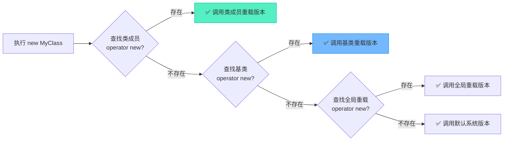
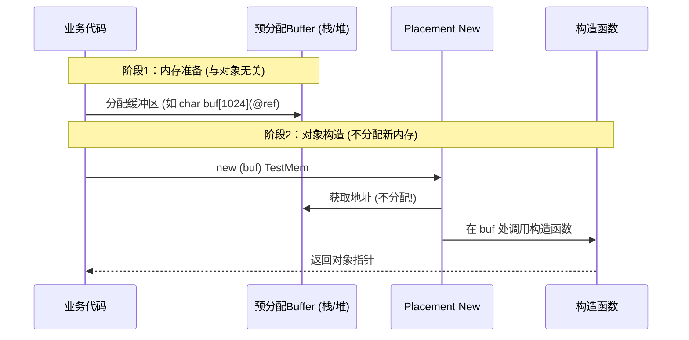

# 类成员new重载与Placement New：内存控制的极致微操

> [!abstract] 核心导言
> 重载全局 `new/delete` 如同握着核按钮，极易误伤友军；而重载类成员 `operator new`，则是为特定对象量身定制的内存管制舱。更进一步，C++ 提供了堪称“黑魔法”的 Placement New，它将内存分配与对象构造彻底解耦，让你能在古老的栈缓冲区或内存池中唤醒新生对象。本节将深度剖析类级重载的继承辐射力，并揭开 Placement New 下“谁分配谁释放”与“手动析构”的硬核法则。

---

## 一、从全局到类域：成员 operator new 的精准管控

与其冒着污染全局内存分配的风险，不如将重载限制在特定类内部，实现精细化管理。

### 1. 作用域与优先级法则
当执行 `new MyClass` 时，编译器遵循严格的查找优先级链：



> [!tip] 强制绕过
> 若类内重载了 `operator new`，但仍想强制使用全局版本，需使用作用域解析符：`::new MyClass`。[1](@context-ref?id=0)

### 2. 实现规范与异常机制
作为类成员函数，其实现规范与全局版本基本一致，但作用域被锁定。

```cpp
class TestMem {
public:
    int index = 0;
    // 类成员重载
    void* operator new(size_t size) {
        cout << "TestMem new: " << size << endl;
        auto mem = malloc(size);
        if (!mem) throw std::bad_alloc(); // 必须检查并抛异常
        return mem;
    }
    
    void operator delete(void* ptr) {
        cout << "TestMem operator delete" << endl;
        std::free(ptr);
    }
    
    // 数组版本必须单独重载！
    void* operator new[](size_t size) { /*...*/ }
    void operator delete[](void* ptr) { /*...*/ }
};
```

### 3. 继承辐射：基类内存池的统御力
这是类成员重载最强大的工程应用：<span style="color:#2ed573;">通过在基类中重载 `operator new`，所有派生类将自动继承该内存分配策略</span>，从而轻松实现针对整族对象的内存池化管理，避免频繁的系统 `malloc` 开销。[1](@context-ref?id=1)

---

## 二、黑魔法：Placement New（放置 new）

常规 `new` 将内存分配与对象构造死死绑定，而 Placement New 则打破了这一铁律：**它不分配内存，只在已有的内存上强行构造对象。**[1](@context-ref?id=2)[](@image-ref?id=2)

### 1. 核心语法
```cpp
// 在预分配的 buffer 地址上构造 TestMem 对象
TestMem* mem = new (buffer) TestMem;
```

### 2. 双场景实战验证

**场景一：栈空间复活（极致性能）**
在栈上预分配缓冲区，避免了堆分配的锁竞争和碎片化。

```cpp
char buf1[1024] = {0}; // 栈缓冲区，大小须 >= sizeof(TestMem)
TestMem* mem2 = ::new(buf1) TestMem; 

// 验证：mem2 的地址将与 buf1 完全一致！
cout << "buf1 addr: " << (void*)buf1 << endl; 
cout << "mem2 addr: " << mem2 << endl;
```

**场景二：堆空间复用（内存池基础）**
在堆上申请大块内存，随后切片放置对象。

```cpp
int* buf2 = new int[1024]; // 堆缓冲区
TestMem* mem3 = new(buf2) TestMem;
```

### 3. 内存与构造的解耦时序



---

## 三、深渊法则：手动析构与释放的生死线

Placement New 带来了极致的自由，也带来了最严苛的内存管理责任。**谁分配内存，谁负责释放； Placement New 只管生，不管死。**

### 1. 绝对禁忌：对 Placement 对象直接 delete
```cpp
TestMem* mem2 = new(buf1) TestMem;
delete mem2; // ❌ 致命错误！
```
**崩溃原因**：`delete` 不仅会调用析构函数，还会调用 `operator delete` 试图释放内存。但 `buf1` 是栈空间，释放栈内存将直接导致程序崩溃；若是堆空间，也会破坏原有的内存管理结构。

### 2. 唯一正解：显式调用析构函数
对于 Placement New 创建的对象，**必须且只能**手动调用其析构函数来清理资源，而内存的释放交由缓冲区的管理者处理。

| 缓冲区来源 | 步骤1：对象清理 | 步骤2：内存回收 |
| :--- | :--- | :--- |
| **栈缓冲区** | `mem2->~TestMem();` | 无需处理，函数结束自动回收 |
| **堆缓冲区** | `mem3->~TestMem();` | `delete[] buf2;` |

> [!warning] 顺序不可颠倒
> 对于堆缓冲区，必须先显式析构对象，再释放堆缓冲区内存。若先释放 buffer，对象析构时若访问自身成员将触发访问违例。

---

## 四、知识全景小结

| 知识维度 | 核心内容 | ⚠️ 考试重点/易混淆点 | 难度系数 |
| :--- | :--- | :--- | :--- |
| **类成员重载** | 在类内部重载 `operator new/delete` [1](@context-ref?id=3)| 查找优先级：当前类 → 基类 → 全局 | ⭐⭐⭐⭐ |
| **数组版本** | `new[]` / `delete[]` 必须单独重载 | <span style="color:#ff4757;">不能混用单对象版本处理数组分配</span> | ⭐⭐⭐⭐ |
| **继承辐射** | 基类重载影响所有派生类 | <span style="color:#2ed573;">实现家族对象统一内存池管理的基石</span> | ⭐⭐⭐⭐ |
| **Placement New** | 在已有内存上构造对象，不分配新内存 | 栈/堆均可放置，地址与原 buffer 完全一致 | ⭐⭐⭐⭐⭐ |
| **手动析构法则** | 禁止 `delete`，必须显式调用析构函数 | <span style="color:#ff4757;">`delete` 会企图释放非 `new` 分配的内存导致崩溃</span> | ⭐⭐⭐⭐⭐ |
| **内存回收权责** | 谁分配 buffer 谁释放 | 先 `~Destructor()`，再 `delete[] buffer` | ⭐⭐⭐⭐ |

> [!quote] 结语
> 类成员重载赋予了对象自主选择内存摇篮的权力，而 Placement New 则彻底斩断了内存分配与对象构造的强耦合。在这个高阶领域中，C++ 将底层的控制权毫无保留地交给了你——权力越大，责任越重。深刻理解“显式析构”与“权责分离”的生存法则，你便掌握了驾驭高性能内存池与嵌入式底层架构的核心密钥。[1](@context-ref?id=4)
