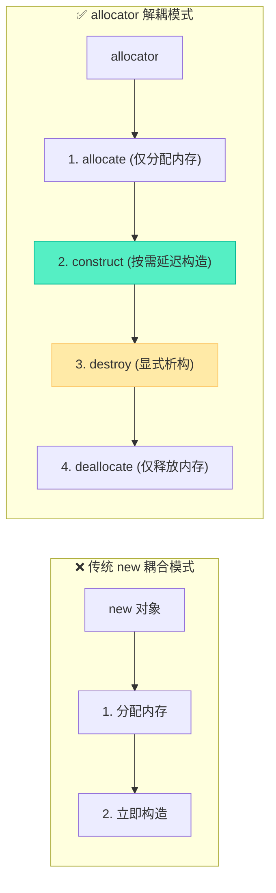
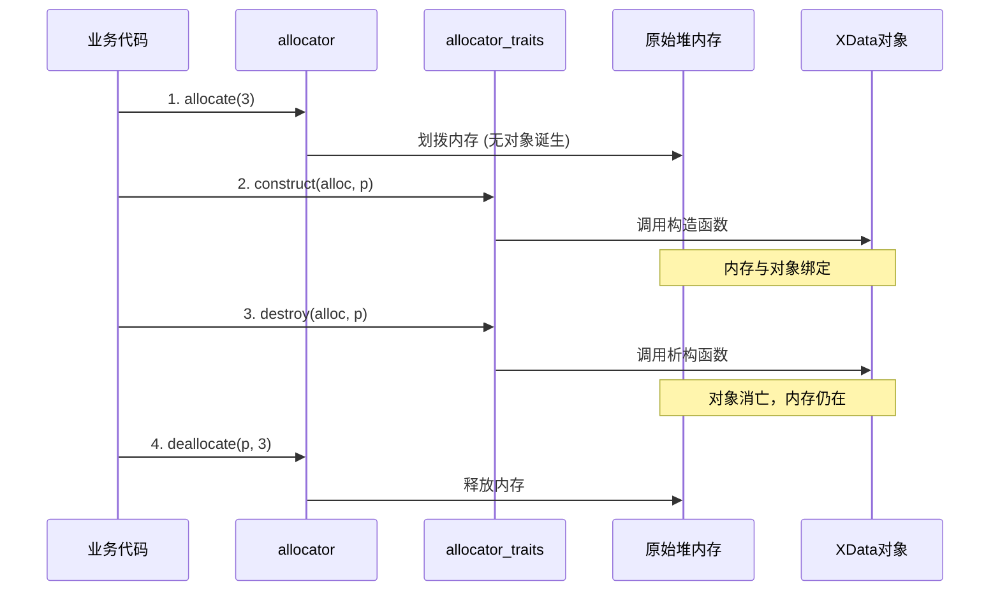

# allocator深度解析：内存分配与对象构造的终极解耦

> [!abstract] 核心导言
> `new` 关键字的致命缺陷，在于将“内存分配”与“对象构造”死死捆绑，这在需要精细化管理的底层工程中是难以忍受的耦合。STL 分配器 `allocator` 横空出世，将这两大阶段彻底撕裂，赋予开发者延迟构造、内存池复用等降维打击能力。随着 C++17/20 的演进，`allocator` 的接口更是经历了从繁杂到极简的蜕变。本节将全景拆解分配器的底层哲学与现代用法。

---

## 一、设计哲学：为何要将分配与构造解耦？

`allocator` 的核心使命是实现**容器算法**与**存储细节**的绝对隔离。

### 1. 传统 new 的痛点
`new XData` 是一步到位的原子操作：先 `allocate` 内存，再调用 `construct` 构造。若内存池中已有预分配的空闲块，`new` 却无法直接在其上构造对象，必须经历无谓的系统分配。

### 2. 分配器的三大破局价值
- **解耦合**：算法不关心数据存在内存、共享内存还是磁盘，存储方式由分配器决定。
- **标准化**：提供统一的 `allocate` / `deallocate` 接口，屏蔽底层 `malloc` / `VirtualAlloc` 差异。
- **延迟构造**：<span style="color:#2ed573;">分配原始内存时不触发构造，按需在指定地址唤醒对象</span>，这是性能跃迁的关键。



---

## 二、接口蜕变：C++17/20 的极简主义

标准的演进方向，是让 `allocator` 越来越像纯粹的“内存管家”，剥离掉一切与对象生命周期相关的职责。

### 1. 保留的核心接口（纯内存操作）
- **`allocate(n)`**：分配 `n` 个对象的原始未初始化内存空间。
- **`deallocate(p, n)`**：释放之前分配的内存空间。

### 2. 废弃与移除的接口（C++17弃用，C++20移除）
曾经属于 `allocator` 的 `construct`、`destroy`、`max_size`、`address` 已被官方无情抛弃。

> [!danger] 迁移警告
> 在 C++20 环境下，直接调用 `allocator.construct()` 将导致编译错误！这些职责已全面移交至 `allocator_traits`。

---

## 三、全生命周期实战：allocator 四步曲

以 `XData` 测试类为哨兵，严格遵循分配器“先分配、后构造、先析构、后释放”的铁律。

### 1. 监控哨兵：XData
```cpp
class XData {
public:
    XData() { cout << "Create XData" << endl; }
    ~XData() { cout << "Drop XData" << endl; }
};
```

### 2. 步骤拆解与现代写法

**Step 1: 构建分配器与分配原始内存**
```cpp
allocator<XData> alloc;           // 1. 获取分配器对象
auto p = alloc.allocate(3);       // 2. 分配3个XData大小的原始内存（无构造输出！）
```

**Step 2: 按需构造对象（C++17/20 推荐写法）**
```cpp
// 旧版（已废弃）：alloc.construct(p, XData());
// 新版：使用 allocator_traits 统一调度
allocator_traits<allocator<XData>>::construct(alloc, p, XData());
// 输出：Create XData ✅
```

**Step 3: 显式析构对象**
```cpp
allocator_traits<allocator<XData>>::destroy(alloc, p);
// 输出：Drop XData ✅
```

**Step 4: 回收原始内存**
```cpp
alloc.deallocate(p, 3); // 必须传入原指针和分配时的数量
```

### 3. 生命周期时序保障



> [!warning] 顺序错乱的灾难
- 若未 `construct` 就使用 `p`：访问未初始化的内存，未定义行为。
- 若未 `destroy` 就 `deallocate`：对象析构函数永远不调用，若对象内部有 `new` 的资源，必致泄漏。
- 若 `deallocate` 参数 `n` 与 `allocate` 不一致：引发内存堆损坏。

---

## 四、适配器哲学：为何投向 allocator_traits？

将 `construct` 等方法从 `allocator` 剥离至 `allocator_traits`，绝非闲得无聊的重构，而是为了支撑**自定义分配器**的泛型生态。

### 1. 核心优势
- **自动类型推导**：内部通过 `decltype` 自动获取类型，极大降低了模板参数传递的心智负担。
- **兜底与兼容**：若自定义分配器实现了 `construct`，`traits` 会调用它；若没有，`traits` 会退回默认的 `::new` 实现。这保证了<span style="color:#2ed573;">无论何种奇葩分配器，代码均能安全编译运行</span>。
- **面向未来**：解除了容器（如 `vector`）与分配器具体实现的强耦合，未来标准再变，只需适配 `traits`。

---

## 五、工程巅峰：内存池中的降维打击

分配器的终极用武之地，是高频小对象的内存池。

**传统痛点**：游戏逻辑或网络框架中，每秒创建/销毁数万个连接对象，系统 `malloc`/`free` 陷入内核态锁争用，性能暴跌。

**分配器破局**：
1. 启动时 `allocate` 大块内存池。
2. 需要对象时，直接在池中偏移位置 `construct`（跳过系统调用）。
3. 对象不用时 `destroy`，内存归还池子（不调用系统 `free`）。
4. 退出时一次性 `deallocate` 池子。

---

## 六、知识全景小结

| 知识维度 | 核心内容 | ⚠️ 考试重点/易混淆点 | 难度系数 |
| :--- | :--- | :--- | :--- |
| **分配器设计哲学** | 内存分配与对象构造解耦，算法与存储隔离 [1](@context-ref?id=1)| <span style="color:#2ed573;">延迟构造是性能优化的核心前提</span> | ⭐⭐⭐ |
| **C++17/20 接口变更** | 废弃/移除 `construct`、`destroy` 等方法 | <span style="color:#ff4757;">C++20 环境下调用 `alloc.construct()` 将编译报错</span> | ⭐⭐⭐⭐ |
| **现代构造/析构法** | 统一使用 `allocator_traits::construct/destroy` | 第一个参数必须传入分配器对象 `alloc` | ⭐⭐⭐⭐ |
| **四步操作时序** | allocate → construct → destroy → deallocate | <span style="color:#ff4757;">必须先析构再释放内存，否则对象内部资源泄漏</span> | ⭐⭐⭐⭐⭐ |
| **allocator_traits** | 提供标准化访问方式，兼容自定义分配器 | 具备自动推导与兜底默认实现的能力 | ⭐⭐⭐⭐ |
| **内存池应用** | 预分配大块内存，按需延迟构造 [1](@context-ref?id=2)| 彻底消除高频小对象的系统分配开销 | ⭐⭐⭐⭐⭐ |

> [!quote] 结语
> `allocator` 揭开了 C++ 内存管理最隐秘的面纱，它残忍地将我们从 `new` 的温室拖出，逼迫我们直面“生（构造）”与“空间（分配）”的本质差异。拥抱 `allocator_traits`，熟练驾驭四步时序，你便具备了在内存池与自定义存储的深水区中，编织极致性能基础设施的能力。
````