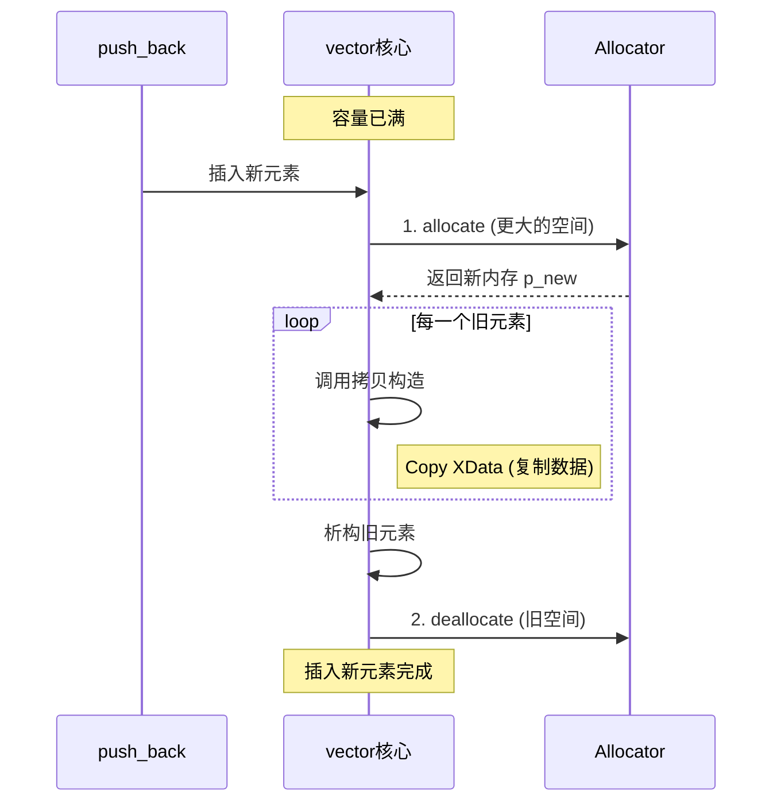

# 自定义Allocator实战：Vector扩容与List节点分配深度解析

> [!abstract] 核心导言
> 标准分配器 `std::allocator` 固然通用，却在高性能场景下显得力不从心。自定义 `allocator` 是 C++ 程序员掌握内存管理主动权的里程碑。通过重写 `allocate` 与 `deallocate`，我们得以介入容器的内存底层，实现内存池复用、泄漏探测与共享内存通信。本节将深度剖析 `vector` 扩容时的元素迁徙代价，揭示 `list` 节点分配的隐式类型变换，并手把手构建一个符合 STL 规范的自定义分配器。

---

## 一、破局之道：为何要自定义 Allocator？

将业务逻辑与内存存储解耦，是现代 C++ 工程的高级修养。

### 1. 核心应用场景
- **内存池**：预分配大块内存，消除频繁系统调用的开销，规避内存碎片。
- **共享内存**：将对象直接构造在多进程可访问的共享区域，实现零拷贝通信。
- **泄漏探测**：在分配/释放接口中植入日志与计数，精准捕获泄漏点。

### 2. 容器的底层诉求
- **Vector**：要求内存连续，扩容时涉及“申请-拷贝-释放”的沉重流程。
- **List**：按需分配节点，涉及复杂的类型转换。

---

## 二、Vector 扩容之殇：内存迁徙的代价

`vector` 的连续存储特性是一把双刃剑，带来了极高的随机访问性能，却也引入了扩容时的动荡。

### 1. 扩容机制全景
当 `push_back` 发现容量不足时：
1. **申请新宅**：按倍增策略（如 2 倍）申请更大的连续内存。
2. **全员搬迁**：调用拷贝构造函数，将旧内存中的元素逐个复制到新内存。
3. **老宅拆除**：析构旧元素，释放旧内存。



### 2. 拷贝构造函数的必然性
扩容过程中，对象的生死存亡完全依赖于拷贝构造函数。
```cpp
XData(const XData& d) {
    this->index = d.index; // 深拷贝核心数据
    cout << "Copy XData " << index << endl;
}
```
> [!warning] 验证输出
> 每次扩容，控制台都会打印出对应数量的 `Copy XData` 日志。若无此日志，说明发生了移动语义或未触发扩容。

### 3. 性能优化策略
- **预分配**：`vd.reserve(1024)`，一次性分配足够空间，消除扩容开销。
- **引用遍历**：`for (auto& xd : vd)`，避免遍历时的冗余拷贝。

---

## 三、手写分配器：MyAllocator 的诞生

自定义分配器并非随意编写，必须严格遵循 STL 的接口契约。

### 1. 必备的模板结构
```cpp
template <typename Ty>
class MyAllocator {
public:
    // 1. 必须定义 value_type，否则 vector 无法通过编译
    using value_type = Ty;

    // 2. 必须提供默认构造函数
    MyAllocator() noexcept = default;

    // 3. 泛化转换构造函数（支持 rebind 机制）
    template <class Other>
    MyAllocator(const MyAllocator<Other>&) noexcept {}

    // ... 核心接口见下文
};
```

### 2. 核心接口实现
C++17/20 标准下，只需实现 `allocate` 与 `deallocate`，构造与析构交由 `allocator_traits` 处理。

```cpp
// 分配内存：仅申请空间，不调用构造函数
Ty* allocate(const size_t count) {
    // 计算总字节数，而非对象数
    size_t total = sizeof(Ty) * count;
    cout << "Allocate: " << total << " bytes" << endl;
    // 底层通常调用 malloc
    return static_cast<Ty*>(malloc(total));
}

// 释放内存：仅回收空间
void deallocate(Ty* const ptr, const size_t count) {
    cout << "Deallocate: " << ptr << endl;
    free(ptr); // 对应 free
}
```

> [!danger] 编译错误的启示
> 若缺少 `using value_type = Ty;`，编译器会报错 `value_type` 未定义。这是排查自定义分配器问题的第一线索。[1](@context-ref?id=1)

---

## 四、List 的隐秘真相：节点类型的偷梁换柱

`list` 的内存管理比 `vector` 更具欺骗性。

### 1. 节点封装机制
`list<XData>` 并不直接存储 `XData`，而是存储包装节点 `_List_node<XData>`。该节点内部包含：
- 前驱指针 (`prev`)
- 后继指针 (`next`)
- 数据成员 (`_Myval`，即 `XData`)

### 2. Rebind 机制：分配器的类型变身
当 `list` 向分配器申请内存时，它申请的**不是 `XData` 的大小**，而是**节点的大小**。


这就是为什么自定义分配器必须提供模板转换构造函数：
```cpp
template <class Other>
MyAllocator(const MyAllocator<Other>&) noexcept {}
```
此构造函数允许编译器将 `MyAllocator<XData>` 静默转换为 `MyAllocator<_List_node<XData>>`，从而正确分配节点所需的内存空间。

---

## 五、知识全景小结

| 知识维度 | 核心内容 | ⚠️ 考试重点/易混淆点 | 难度系数 |
| :--- | :--- | :--- | :--- |
| **分配器核心职责** | 分配原始内存与释放内存 | <span style="color:#2ed573;">C++17/20 已剥离构造/析构职责至 traits</span> | ⭐⭐⭐ |
| **Vector 扩容** | 申请新内存 -> 拷贝元素 -> 释放旧内存 | <span style="color:#ff4757;">扩容必然调用拷贝构造函数，有性能损耗</span> | ⭐⭐⭐⭐ |
| **自定义分配器模板** [1](@context-ref?id=2)| 必须包含 `value_type` 定义 | 缺少此定义会导致 vector 实例化编译失败 | ⭐⭐⭐ |
| **Rebind 机制** | 容器内部可能申请与 T 类型不同的内存 | <span style="color:#ff4757;">list 分配的是 `_List_node`，而非直接是 `XData`</span> | ⭐⭐⭐⭐⭐ |
| **转换构造函数** | `template<class Other> MyAllocator(...)` | 允许分配器在不同类型间隐式转换，支撑 Rebind [1](@context-ref?id=3)| ⭐⭐⭐⭐ |
| **内存池优化** | 预分配大块内存，减少系统调用 [1](@context-ref?id=4)| 以空间换时间，适用于高频分配释放场景 | ⭐⭐⭐⭐ |

> [!quote] 结语
> 自定义 `allocator` 是 C++ 内存管理的“元编程”层面。它让我们窥见了 `vector` 扩容时笨重的搬运过程，也揭示了 `list` 节点分配时精妙的类型转换欺诈。掌握 `rebind` 机制与模板契约，你便打通了从“使用容器”到“定制容器基础设施”的最后一道壁垒，得以构建出契合特定业务场景的高性能内存基础设施。[1](@context-ref?id=5)
