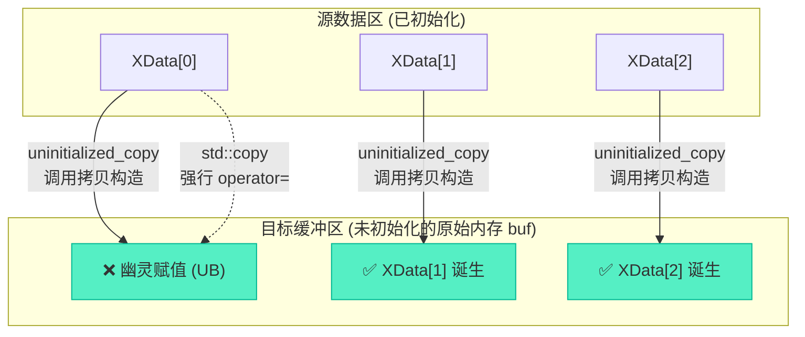

# 深度解析：未初始化内存的复制与对象构造机制

> [!abstract] 核心导言
> 将对象转移至新开辟的原始内存（如 `char buf[]` 或 `malloc` 空间），看似简单的内存搬家，实则暗藏杀机。盲目使用 `memcpy` 会带来浅拷贝的悬垂指针，而错用 `std::copy` 则会在未初始化的荒原上对幽灵对象强行赋值。`uninitialized_copy` 正是为破解此困境而生，它严格恪守 C++ 对象生命周期法则，在荒芜的内存上有序唤醒新对象。本节将全景拆解这三大内存复制机制的本质差异。

---

## 一、核心冲突：为何普通复制无法胜任未初始化内存？

未初始化内存是一片没有构造对象存在的“荒原”（仅有原始字节），而复制操作必须在尊重对象生命周期法则的前提下进行。

### 1. 三大复制机制的本职与越权

| 机制 | 底层动作 | 对象生命周期行为 | 作用域限定 |
| :--- | :--- | :--- | :--- |
| **`memcpy`** | 逐字节覆写 | ❌ 无任何构造/析构行为 | 仅限 POD 类型 (如 int, 原生指针) |
| **`std::copy`** | 调用 `operator=` | ❌ 强行赋值给未初始化的“幽灵” | 仅限**已初始化**的目标内存 |
| **`uninitialized_copy`** | 调用拷贝构造函数 | ✅ 在目标位置原地构造新对象 | 专用于**未初始化**的目标内存 |

### 2. 风险推演：深浅拷贝的致命陷阱
若对象内部持有堆空间指针（如 `char* data`）：
- **`memcpy` 的灾难**：只复制指针的地址值，导致新旧对象指向同一块堆内存。双方析构时将对同一块内存 `delete` 两次，触发 **Double Free 崩溃**。
- **`uninitialized_copy` 的救赎**：调用拷贝构造函数，允许我们在函数内部重新 `new` 一块独立的堆空间，实现真正的深拷贝，彻底切断资源关联。

---

## 二、侦察哨兵：XData 生命周期监控类

为了在控制台清晰捕捉不同的复制行为，我们设计一个全生命周期打日志的测试类：

```cpp
class XData {
public:
    int index = 0;
    XData() { cout << "Create XData" << endl; }
    
    // 拷贝构造函数：用于未初始化内存的对象诞生
    XData(const XData& d) {
        this->index = d.index;
        cout << "Copy XData " << index << endl; 
    }
    
    // 赋值运算符：用于已初始化对象间的状态覆盖
    XData& operator=(const XData& d) {
        this->index = d.index;
        cout << "XData " << index << " = " << endl;
        return *this;
    }
    
    ~XData() { cout << "Drop XData " << index << endl; }
};
```

---

## 三、逐层击破：三种内存复制机制的实战对决

测试场景：将栈上的数组 `XData datas[3]` 复制到原始缓冲区 `unsigned char buf[1024]` 中。

### 1. memcpy：野蛮的字节倾倒
```cpp
XData datas[3];
unsigned char buf[1024] = {0};
memcpy(buf, &datas, sizeof(datas)); // ❌ 危险操作
```
- **现象**：控制台**不会**输出任何 `Copy` 相关日志。
- **本质**：纯粹的内存位模式复制，完全无视 C++ 对象的构造逻辑。
- **后果**：若 `XData` 含有虚函数表指针或堆空间，复制后的对象结构将被彻底破坏。

### 2. std::copy：荒原上的错误赋值
```cpp
std::copy(std::begin(datas), std::end(datas), (XData*)(buf));
```
- **现象**：编译通过，但行为极其诡异（可能输出 `=` 赋值日志，也可能直接崩溃）。
- **本质**：`std::copy` 的内部逻辑是对目标区间执行 `*dest = *src`，即调用 `operator=`。
- **致命缺陷**：<span style="color:#ff4757;">`buf` 中尚未构造对象，`operator=` 试图对一个不存在的对象进行状态覆盖</span>，这是典型的未定义行为 (UB)。

### 3. uninitialized_copy：荒原上的合规营建
```cpp
auto end_it = uninitialized_copy(std::begin(datas), std::end(datas), (XData*)(buf));
```
- **现象**：控制台精确输出 3 次 `Copy XData`。
- **本质**：使用**定位新建** 技术，在 `buf` 的对应偏移位置上，逐一调用 `XData` 的拷贝构造函数。
- **安全性**：确保目标内存上的对象被合规地诞生，拥有独立的生命周期与资源状态。



---

## 四、构造与赋值的楚河汉界：底层时序推演

深刻理解 `uninitialized_copy` 与 `std::copy` 的区别，就是理解 C++ 中“从无到有”与“锦上添花”的界限。[1](@context-ref?id=0)

### 1. 拷贝构造：从无到有
- **触发时机**：对象尚不存在，内存未初始化。
- **动作**：根据已有对象的特征，在空白内存上勾勒出新对象的完整轮廓。
- **STL 映射**：`uninitialized_copy`、`allocator::construct`。

### 2. 赋值运算：锦上添花 (状态覆盖)
- **触发时机**：目标对象已经合法存在（已构造）。
- **动作**：擦除目标对象原有的状态特征，覆写为源对象的状态。需警惕自赋值及旧资源的释放。
- **STL 映射**：`std::copy`、`std::fill`。

> [!warning] 内存清理责任
> 使用 `uninitialized_copy` 在 `buf` 上构造的对象，在其生命周期结束时，**必须手动调用析构函数**释放资源，而绝不能直接 `delete[] buf`。

---

## 五、知识全景小结

| 知识维度 | 核心内容 | ⚠️ 考试重点/易混淆点 | 难度系数 |
| :--- | :--- | :--- | :--- |
| **memcpy 复制** | 逐字节浅拷贝，无视对象结构 | <span style="color:#ff4757;">非 POD 类型严禁使用，必致指针悬挂或虚表损坏</span> | ⭐⭐⭐ |
| **std::copy 复制** | 基于迭代器，调用 `operator=` | <span style="color:#ff4757;">目标区间必须已初始化，对荒原赋值属未定义行为</span> | ⭐⭐⭐⭐ |
| **uninitialized_copy** | 在原始内存调用拷贝构造函数 | <span style="color:#2ed573;">唯一安全的未初始化内存对象复制手段</span> | ⭐⭐⭐⭐⭐ |
| **构造 vs 赋值** | 拷贝构造是从无到有，赋值是状态覆盖 | 拷贝构造日志：`Copy`；赋值日志：`=` | ⭐⭐⭐⭐ |
| **深浅拷贝原理** | 深拷贝独立资源，浅拷贝共享指针 | 自定义类含堆指针时，必须提供深拷贝的拷贝构造函数 | ⭐⭐⭐⭐⭐ |
| **内存类型判定** | 未初始化 vs 已初始化 | 选择复制算法的唯一判定标准 | ⭐⭐⭐ |

> [!quote] 结语
> 内存复制绝不是简单的数据搬运，而是对象生命周期的重塑。`memcpy` 是 C 时代的遗迹，`std::copy` 是已初始化世界的通行证，而 `uninitialized_copy` 则是未初始化荒原上唯一的合法建筑师。认清“构造”与“赋值”的楚河汉界，在正确的内存状态下选择对应的算法，是写出健壮 C++ 代码的底线要求。[1](@context-ref?id=1)[](@image-ref?id=1)
