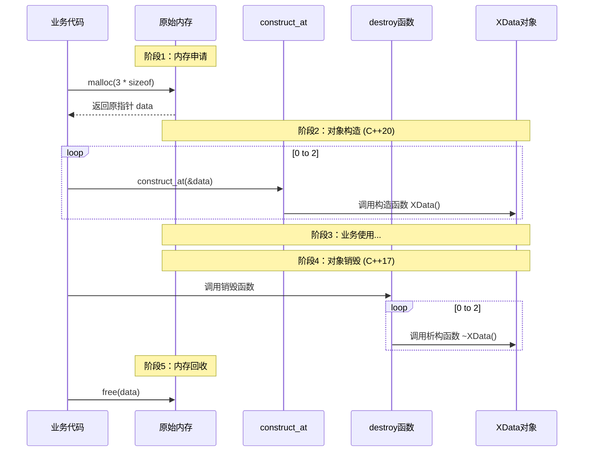

# 现代C++对象构造与销毁：construct_at与destroy深度解析

> [!abstract] 核心导言
> 在 C++11 时代，要在已分配的原始内存上构造对象，我们不得不借助于晦涩的 `placement new`；而在 C++17 和 C++20 标准下，STL 终于提供了更直观、更符合现代模板编程习惯的工具——`std::destroy` 与 `std::construct_at`。本节将深度拆解这对“双子星”如何通过显式的接口调用，实现对象生命周期的精准掌控，彻底终结手动写定位构造代码的历史。

---

## 一、构造新纪元：std::construct_at (C++20)

`std::construct_at` 是 C++20 引入的用于替代 `placement new` 的标准库函数，它让“在指定地址构造对象”这一动作变得显式且类型安全。

### 1. 传统痛点：Placement New 的晦涩
```cpp
// C++11 传统写法：晦涩难懂，容易遗漏括号
new (ptr) XData(); 
```
对于初学者而言，`new (ptr)` 的语法极具误导性，容易误以为是在分配内存。

### 2. 现代解法：construct_at 的直观
```cpp
// C++20 现代写法：意图清晰，语义明确
std::construct_at(ptr, args...);
```
- **参数透明**：第一个参数明确为内存地址，后续参数完美转发给构造函数。
- **返回值**：返回构造好的对象指针，便于链式调用。

### 3. 实战代码：循环构造对象
在预分配的 `malloc` 内存上批量构造对象：

```cpp
#include <memory> // 必须包含头文件

int size = 3;
// 1. 仅分配原始内存（未构造对象）
auto data = static_cast<XData*>(malloc(sizeof(XData) * size));

if (data) { // 安全性检查：防止 malloc 失败
    for(int i = 0; i < size; i++) {
        // 2. 逐个构造对象
        std::construct_at(&data[i]); 
    }
}
```

> [!warning] 编译器版本限制
> `construct_at` 属于 C++20 特性。VS2019 支持不完整，**VS2022 已完全支持**。编译时需设置 `/std:c++20` 或 `/std:c++latest`。[1](@context-ref?id=1)[](@image-ref?id=1)

---

## 二、销毁新范式：std::destroy (C++17)

`std::destroy` 解决了批量析构对象的痛点。它仅负责调用析构函数，**绝不释放内存**。

### 1. 核心功能：批量析构
与 `std::construct_at` 对应，`std::destroy` 接受一个迭代器范围 `[first, last)`，对范围内的每个对象调用析构函数。

```cpp
// 销毁范围：从 data 开始的 size 个元素
std::destroy(data, data + size);
```

### 2. 内存管理的权责分离
`destroy` 与 `free` 的调用顺序绝不可颠倒：
1. **先析构**：`std::destroy` 清理对象内部资源（如关闭文件句柄、释放内部堆内存）。
2. **后释放**：`free(data)` 归还原始内存给操作系统。



---

## 三、全景对比：从 C++11 到 C++20 的演进

理解新旧接口的差异，有助于我们更好地维护遗留代码并编写现代 C++。

| 操作阶段 | C++11/14 (传统) | C++17/20 (现代) | 核心改进点 |
| :--- | :--- | :--- | :--- |
| **对象构造** | `new (ptr) T(args)` | `std::construct_at(ptr, args...)` | 语法更直观，避免了 `new` 的内存分配歧义 |
| **对象销毁** | 手动循环调用 `ptr->~T()` | `std::destroy(first, last)` | 支持迭代器范围批量处理，异常安全 |
| **内存管理** | 手动 `free(ptr)` | 手动 `free(ptr)` | 内存释放依然独立，保持了控制权 |

---

## 四、知识全景小结

| 知识维度 | 核心内容 | ⚠️ 考试重点/易混淆点 | 难度系数 |
| :--- | :--- | :--- | :--- |
| **construct_at** | C++20 新增，在指定内存地址构造对象 [1](@context-ref?id=2)| <span style="color:#ff4757;">替代 placement new，需 C++20 标准（VS2022）</span> | ⭐⭐⭐⭐ |
| **destroy** | C++17 新增，批量析构指定范围对象 [1](@context-ref?id=3)| <span style="color:#ff4757;">仅调用析构函数，不释放内存！必须随后手动 free</span> | ⭐⭐⭐⭐ |
| **内存与对象分离** | `malloc`/`free` 管内存，`construct`/`destroy` 管对象 | <span style="color:#2ed573;">实现了内存分配与对象生命周期的完全解耦</span> | ⭐⭐⭐⭐⭐ |
| **安全性检查** | 构造前需检查指针非空 (`if(data)`) [1](@context-ref?id=4)| 避免对 `nullptr` 进行构造操作导致崩溃 | ⭐⭐⭐ |
| **逆向析构原则** | 构造顺序 `0->n`，析构顺序 `n->0` | 在手动循环析构时需遵循后进先出原则（`destroy` 自动处理） | ⭐⭐⭐ |
| **RAII 封装** | 建议使用 RAII 类封装裸指针逻辑 | 异常发生时自动回滚，防止内存泄漏 | ⭐⭐⭐⭐ |

> [!quote] 结语
> `construct_at` 与 `destroy` 的引入，标志着 C++ 彻底补齐了对象生命周期手动管理的最后一块拼图。它们将晦涩的底层语法封装为清晰的函数调用，让“内存池”与“对象池”的管理代码更易读、更安全。在现代 C++ 工程中，请大胆拥抱这一新范式，让代码告别 `placement new` 的阴影。[1](@context-ref?id=5)
