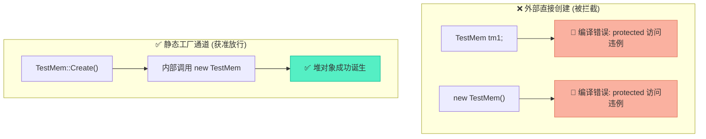

# 对象生命周期管控：限制栈创建与受控销毁机制深度解析

> [!abstract] 核心导言
> 在 C++ 面向对象设计中，对象的生与死不应是随意的狂欢。通过指针操控内存是面向对象的底层本质，而掌控对象在何时、何地、以何种方式诞生与消亡，则是架构稳健性的顶层要求。本节将深度拆解如何利用 `protected` 访问权限构筑防火墙，强行剥夺栈上创建与直接 `delete` 的权力，进而通过静态工厂与销毁接口实现对象生命周期的绝对集权管控。

---

## 一、面向对象的底层映射：指针的统领地位

一切面向对象的抽象，最终都要落位于内存中的实体操作。

### 1. 内存操作的实质
- **数据驱动**：类属性即内存空间的占用，类方法即对这块内存数据的逻辑加工。
- **指针中枢**：无论是成员变量的读写，还是虚函数的动态派发，其底层引擎皆是指针。指针是沟通代码逻辑与物理内存的唯一桥梁。

### 2. 掌控生死的诉求
既然指针是操作内存的核心，那么如果不加限制地允许随处创建栈对象或随意 `delete` 堆对象，将导致系统资源状态失控。我们需要一种强制的语法契约来规范对象的生命周期。

---

## 二、剥夺栈生存权：protected 构造与静态工厂

默认情况下，`TestMem tm1;` 会在栈上自动构造对象，这超出了架构师的绝对控制范围。阻断它的第一步，就是藏匿构造函数。

### 1. 限制原理：降级构造权限
将构造函数声明为 `protected`，使得类外部的代码（包括 `main` 函数）无法直接访问，从而在**编译期**直接掐断栈对象和外部随意 `new` 的可能。

### 2. 授信通道：静态工厂方法
类内部的静态成员函数享有访问 `protected` 成员的特权。我们提供一个 `Create()` 静态方法作为唯一的合法诞生通道，内部执行 `new` 操作确保对象只生在堆上。

```cpp
class TestMem {
public:
    // 唯一的合法诞生通道
    static TestMem* Create() {
        // 可在此处植入统一初始化、对象计数等管控逻辑
        return new TestMem(); 
    }

protected:
    TestMem() { // 藏匿构造函数
        cout << "Create TestMem" << endl;
    }
};
```

> [!tip] 编译期铁壁
> 尝试 `TestMem tm1;` 或 `new TestMem()` 均会引发编译错误。这是一种**强语法约束**，远胜于“请在文档中注明不要这样用”的软弱规劝。



---

## 三、封锁 delete 入口：protected 析构与受控销毁

仅限制创建是不够的，若外部代码获取了对象指针后随意 `delete ptr;`，依然会绕过我们的管控逻辑（如忘记释放关联资源、忘记通知观察者）。

### 1. 限制原理：藏匿析构函数
将析构函数也声明为 `protected`，使得外部代码无法直接 `delete` 对象指针。[1](@context-ref?id=1)

### 2. 终结通道：静态销毁方法
同理，提供静态方法 `Drop()`，在其中执行必要的清理逻辑后，触发受保护的析构函数。[1](@context-ref?id=2)

```cpp
class TestMem {
public:
    static void Drop(TestMem* ptr) {
        // 统一清理逻辑：如日志记录、解除关联等
        delete ptr; // 类内部允许调用 protected 析构
    }

protected:
    ~TestMem() { // 藏匿析构函数
        cout << "Drop TestMem" << endl;
    }
};
```

> [!warning] 双重防御的副作用
> 将析构函数设为 `protected` 后，不仅阻止了直接 `delete`，**同时也彻底阻断了栈对象的创建**。因为栈对象离开作用域时必须调用析构函数，此时析构不可访问，编译器将直接报错拒编译。这正是“受控生命周期”设计的终极诉求。[1](@context-ref?id=3)

---

## 四、基类的生死契约：虚析构的必然性

在受控生命周期的体系中，类往往会被设计为基类。此时，虚析构函数不再是可选项，而是生死攸关的必选项。

### 1. 泄漏惨剧：非虚析构的切肤之痛
若基类析构非虚，通过基类指针 `delete` 派生类对象时（即使在 `Drop` 方法内），C++ 的静态绑定机制只会调用基类析构，派生类特有的析构逻辑被彻底跳过，引发严重的内存泄漏。[1](@context-ref?id=4)

### 2. 黄金法则
**任何可能被继承且通过基类指针管理的类，其析构函数必须声明为 `virtual`。**

### 3. 构造不能为虚的硬约束
- **语法禁令**：构造函数绝不能声明为虚函数。
- **因果倒置**：虚函数机制的运作依赖于编译器在对象内存中安插的 `vptr`（虚函数表指针），而 `vptr` 的初始化正是在构造函数中完成的。构造未执行，`vptr` 尚不存在，虚构造无从谈起。

---

## 五、工程哲学：强约束与统一管控的价值

这套 `protected` + 静态接口的模式，本质上是用编译器的强力手腕替代人类脆弱的记忆。

### 1. 工厂模式的基石
强制所有对象经由 `Create` 诞生，使得我们可以：
- 统一注入依赖项。
- 实现对象池复用。
- 轻松演进为抽象工厂模式。

### 2. 文档约束 vs 语法约束
| 约束类型 | 示例 | 可靠性 | 维护成本 |
| :--- | :--- | :--- | :--- |
| **文档约束** | "请不要直接 delete 此对象" | ❌ 极低，总有人会忘记 | 高，需排查运行时泄漏 |
| **语法约束** | `protected ~TestMem()` | ✅ 极高，违规代码无法编译 | 低，错误暴露在编码阶段 |

---

## 六、知识全景小结

| 知识维度 | 核心内容 | ⚠️ 考试重点/易混淆点 | 难度系数 |
| :--- | :--- | :--- | :--- |
| **指针与 OOP** | 指针是操作对象内存与虚函数的根本 [1](@context-ref?id=5)| 虚函数表布局与动态绑定的物理基础 | ⭐⭐⭐ |
| **限制栈创建** | 构造函数设为 `protected` | <span style="color:#ff4757;">编译期阻断，而非运行期检查</span> | ⭐⭐⭐⭐ |
| **限制直接 delete** | 析构函数设为 `protected` + 静态 `Drop` [1](@context-ref?id=6)| <span style="color:#ff4757;">protected 析构同时也能阻断栈对象的创建</span> | ⭐⭐⭐⭐ |
| **静态工厂方法** | `static Create()` 作为唯一合法诞生通道 | 实现单例模式、对象池的常用手法 | ⭐⭐⭐⭐ |
| **虚析构必要性** | 防止基类指针 delete 派生类对象时泄漏 | <span style="color:#2ed573;">只要有多态，析构必须为虚；构造绝不能为虚</span> | ⭐⭐⭐⭐⭐ |
| **设计模式应用** | 强语法约束取代弱文档约束 | 提升接口的防呆性与架构的长期健壮性 | ⭐⭐⭐⭐ |

> [!quote] 结语
> 将构造与析构藏匿于 `protected` 的坚盾之后，只留出静态工厂与销毁的狭窄栈道，是 C++ 程序员对混乱内存秩序的强力反击。它用冰冷的编译错误斩断了误用的可能，用虚析构捍卫了继承体系的完整。当你学会了这种“先封锁，后开放通道”的控制反转哲学，你便拥有了设计坚不可摧业务框架的核心力量。
