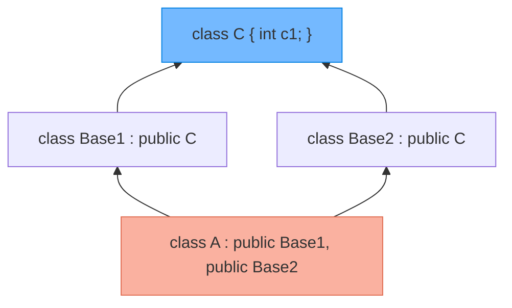
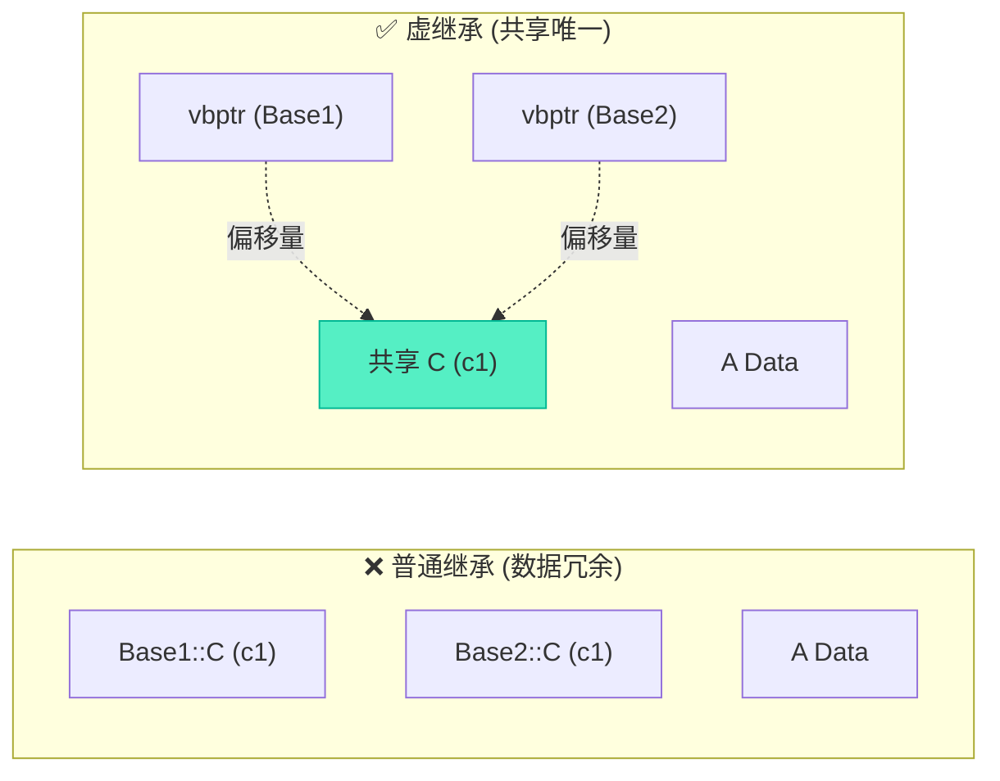

# 多继承二义性与虚基类内存布局深度解析

> [!abstract] 核心导言
> 多继承赋予了 C++ 强大的表达能力，却也引入了臭名昭著的“菱形继承”陷阱。当派生类通过多条路径继承同一个基类时，基类成员在内存中会产生冗余副本，不仅造成空间浪费，更引发了严重的访问二义性。本节将深度剖析“数据分裂”的内存本质，并通过虚继承这一“空间折叠”技术，彻底根除多继承的致命隐患。

---

## 一、深渊陷阱：菱形继承的数据分裂

### 1. 场景复现：菱形结构
当一个类 `A` 同时继承自 `Base1` 和 `Base2`，而这两个基类又共同继承自同一个祖先类 `C` 时，继承关系图呈现出一个菱形结构。



### 2. 内存布局剖析：两个基类副本
在普通多继承模式下，派生类 `A` 的内存布局并非简单的叠加，而是包含了**两份独立的基类 `C` 子对象**。[1](@context-ref?id=1)

**内存分布示意**：
```
[ A 的内存布局 ]
+---------------------+--> Base1 部分
| C::c1 (来自 Base1)   | <-- 副本 1
| Base1 的独有成员     |
+---------------------+--> Base2 部分
| C::c1 (来自 Base2)   | <-- 副本 2 (冗余！)
| Base2 的独有成员     |
+---------------------+
| A 的独有成员         |
+---------------------+
```

### 3. 二义性爆发：编译器的迷茫
当尝试访问 `a.c1` 时，编译器面临“两难”抉择：
- 是访问 `Base1` 路径继承来的 `c1`？
- 还是访问 `Base2` 路径继承来的 `c1`？

**代码表现**：
```cpp
A a;
// a.c1 = 10; // ❌ 编译错误：error C2385: 对 'c1' 的访问不明确
```

> [!warning] 强行指定作用域
> 虽然可以通过 `a.Base1::c1` 或 `a.Base2::c1` 强行通过编译，但这只是治标不治本。两个变量不仅地址不同，且互不干扰，修改其中一个完全不影响另一个，这在逻辑上往往违背“唯一基类”的设计初衷。[1](@context-ref?id=2)

---

## 二、底层验证：内存地址的对峙

通过打印成员变量的内存地址，可以直观地验证数据分裂的事实。

```cpp
A a;
cout << "&a.Base1::c1 = " << (long long)&a.Base1::c1 << endl; // 输出: 518960184120
cout << "&a.Base2::c1 = " << (long long)&a.Base2::c1 << endl; // 输出: 518960184128
```

**现象分析**：
- 两个地址相差 `8 字节`（示例中 `int` 占 4 字节，由于内存对齐可能产生额外间隔）。
- 结论：内存中确实存在两份独立的 `c1` 变量，它们物理上互不相关。

---

## 三、终极解法：虚继承

为了解决冗余与二义性，C++ 引入了**虚继承** 机制。

### 1. 语法规范
在中间继承类（`Base1` 和 `Base2`）声明继承关系时，加上 `virtual` 关键字。

```cpp
class Base1 : virtual public C { ... }; // 关键：virtual
class Base2 : virtual public C { ... }; // 关键：virtual
class A : public Base1, public Base2 { ... };
```

### 2. 内存重组：共享基类
虚继承打破了原有的内存叠加规则。编译器会在派生类 `A` 中**仅保留一份**基类 `C` 的实例，并将其置于内存布局的特殊位置（通常在最末端或最前端）。[1](@context-ref?id=3)



### 3. 实现原理：虚基类指针
`Base1` 和 `Base2` 中不再直接存储 `C` 的成员，而是存储一个**虚基类指针**。该指针指向一个偏移量表，通过查表计算出共享基类 `C` 的实际地址。

**验证代码**：
```cpp
A a;
cout << "&a.c1 = " << (long long)&a.c1 << endl;           // 合法！
cout << "&a.Base1::c1 = " << (long long)&a.Base1::c1 << endl;
cout << "&a.Base2::c1 = " << (long long)&a.Base2::c1 << endl;
// 输出：三个地址完全一致！
```

---

## 四、知识全景小结

| 知识维度 | 核心内容 | ⚠️ 考试重点/易混淆点 | 难度系数 |
| :--- | :--- | :--- | :--- |
| **菱形继承问题** | 派生类拥有多份基类副本，导致访问二义性 [1](@context-ref?id=4)| <span style="color:#ff4757;">`a.c1` 编译报错“访问不明确”</span> [1](@context-ref?id=5)| ⭐⭐⭐⭐ |
| **内存布局差异** | 普通继承包含多份基类数据；虚继承仅一份 [1](@context-ref?id=6)| 通过打印地址验证，普通继承地址不同 | ⭐⭐⭐⭐ |
| **虚继承语法** | 中间类使用 `virtual public Base` | `virtual` 关键字加在中间类，而非最派生类 | ⭐⭐⭐ |
| **vbptr 机制** | 虚基类指针指向共享基类，通过偏移量访问 | <span style="color:#2ed573;">时间换空间：访问速度略慢，但解决了冗余</span> | ⭐⭐⭐⭐⭐ |
| **二义性消除** | 无论通过何种路径访问，最终指向同一内存地址 | `a.c1`、`a.Base1::c1`、`a.Base2::c1` 地址完全相同 | ⭐⭐⭐⭐ |

> [!quote] 结语
> 虚继承是 C++ 为多继承副作用开出的一剂猛药。它通过牺牲微小的访问效率（引入指针间接访问），换取了内存空间的极致节省与逻辑的一致性。在设计复杂的类层次结构时，如果预见到菱形结构的可能，务必在早期引入虚继承，否则后期的重构将是一场牵一发而动全身的噩梦。
