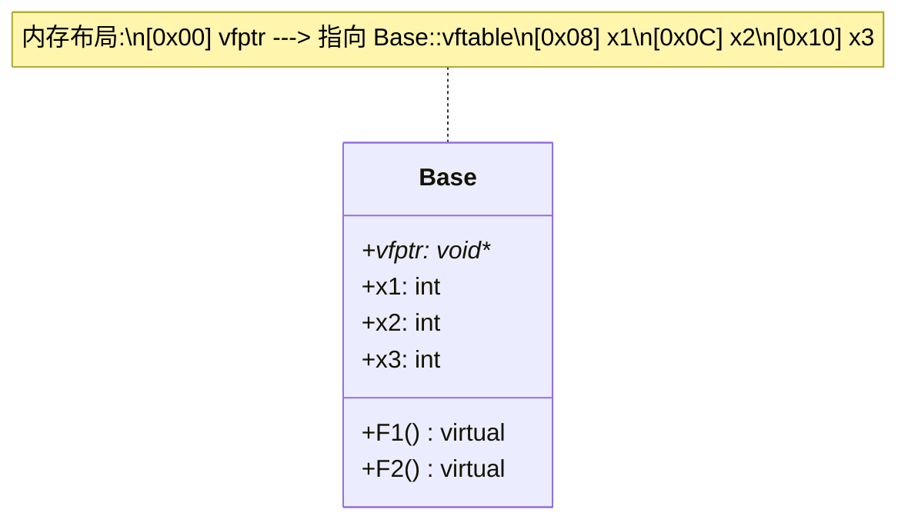

# 虚函数原理与内存布局深度解析

> [!abstract] 核心导言
> C++ 的多态并非魔法，而是编译器在幕后精心编排的一场内存戏剧。通过在对象头部安插“虚函数表指针”，并将虚函数地址汇入“虚函数表”，C++ 实现了在运行时根据对象真实类型动态派发函数调用的能力。本节将穿透源代码的表象，深入内存底层，全景拆解虚函数表的前世今生与多态调用的寻址路径。

---

## 一、虚函数表：多态的核心引擎

每一个包含虚函数的类，编译器都会为其秘密生成一张**虚函数表**。这是实现运行时多态的路由器。

### 1. 核心机制解析
- **表的本质**：虚函数表是一个**函数指针数组**，表中存储了该类所有虚函数的入口地址。
- **独占性**：虚函数表是**类级别**的数据，而非对象级别。无论该类实例化了多少个对象，它们都共享同一张虚函数表。
- **动态性**：在继承体系中，派生类会复制基类的虚函数表，并根据是否“重写”来更新表中的函数指针。

### 2. 对象内存布局的变迁
一旦类中声明了虚函数，对象的内存布局将发生质变：
- **首部插入指针**：编译器在对象的内存起始位置（偏移量为 0 处）安插一个指针，即 **虚函数表指针**。
- **指针指向**：该指针指向该类对应的虚函数表。

---

## 二、多态调用的底层寻址流程

为何通过基类指针调用虚函数，能执行到派生类的代码？这一切都在运行时的内存跳转中完成。[1](@context-ref?id=0)

### 1. 调用链路推演
假设代码为 `Base* p = new Derived(); p->F1();`

1.  **解引用 vfptr**：程序首先访问对象内存首地址，取出 `vfptr` 的值。
2.  **定位 vftable**：通过 `vfptr` 找到该对象所属类的虚函数表（此处是 `Derived` 类的表）。
3.  **索引函数地址**：根据编译器分配的索引（如 `F1` 在索引 0 位置），从表中取出对应的函数指针。
4.  **执行调用**：跳转到该地址执行函数代码。

### 2. 静态绑定 vs 动态绑定
- **普通成员函数**：编译期间直接确定函数地址（静态绑定），调用效率高，但缺乏灵活性。
- **虚函数**：运行期间通过查表确定函数地址（动态绑定），有微小的寻址开销，但实现了多态。

---

## 三、继承体系下的内存演变

虚函数表在继承中展现出其真正的威力。

### 1. 单继承：覆盖与扩充
派生类 `A` 继承自 `Base`：
- **内存结构**：`[vfptr] -> [Base成员] -> [A成员]`。
- **表的变化**：
    - 若 `A` 重写了 `F1`，则表中 `F1` 的位置被替换为 `A::F1()` 的地址。
    - 若 `A` 新增虚函数 `F3`，则追加到表的末尾。

### 2. 多继承：多张虚函数表
若派生类同时继承自 `Base1` 和 `Base2`：
- **内存布局**：对象内部可能包含**多个 vfptr**，分别指向 `Base1` 的虚函数表和 `Base2` 的虚函数表。[1](@context-ref?id=1)
- **Thunks 技术**：当通过第二个基类指针调用派生类函数时，编译器可能需要调整 `this` 指针的偏移量，以正确访问派生类成员。

---

## 四、内存开销与性能权衡

虚函数的灵活性并非无代价，它是典型的“以空间换时间，以效率换灵活”的设计。

### 1. 空间成本
- **对象层面**：每个对象体积增加一个指针大小（32位系统 4 字节，64位系统 8 字节）。[1](@context-ref?id=2)
- **类层面**：每个类需要额外的内存存储虚函数表（无论有多少对象，表只有一份）。

### 2. 时间成本
- **间接调用**：每次虚函数调用需经过“查表”过程，比普通函数的直接调用稍慢（通常被忽略不计，除非在极度高频循环中）。
- **阻碍内联**：虚函数由于地址在运行期确定，编译器通常无法将其内联优化。

### 3. 必要性判定
- **无需虚函数**：类不作为基类使用，或不需要运行时多态（如单纯的工具类、数据结构体）。
- **必须虚函数**：需要通过基类接口操纵不同的派生类对象（如插件系统、工厂模式、UI 控件树）。

---

## 五、知识全景小结

| 知识维度 | 核心内容 | ⚠️ 考试重点/易混淆点 | 难度系数 |
| :--- | :--- | :--- | :--- |
| **vfptr (虚表指针)** | 位于对象内存首部，指向虚函数表 [1](@context-ref?id=3)| 对象的 `sizeof` 会增加一个指针大小 | ⭐⭐⭐ |
| **vftable (虚函数表)** [1](@context-ref?id=4)| 函数指针数组，存储虚函数入口地址 | 同类对象共享，编译期生成 | ⭐⭐⭐⭐ |
| **动态绑定原理** | 运行期通过 `vfptr` -> `vftable` -> `func` 寻址 | 必须通过基类**指针**或**引用**调用才会触发多态 | ⭐⭐⭐⭐⭐ |
| **继承中的覆盖** | 派生类重写虚函数会替换表中对应的地址 | 若未重写，则表中保留基类函数地址 | ⭐⭐⭐ |
| **多继承复杂性** | 对象可能包含多个 `vfptr` | 通过不同基类指针访问时，`this` 指针可能需要调整 | ⭐⭐⭐⭐⭐ |
| **构造/析构陷阱** | 构造/析构期间虚函数表未完全成型 | 此时调用虚函数**不会**体现多态，仅调用当前类版本 | ⭐⭐⭐⭐ |

> [!quote] 结语
> 虚函数表是 C++ 面向对象精神的基石。理解了 `vfptr` 的指向与 `vftable` 的结构，多态便不再是黑盒，而是清晰的内存跳转逻辑。在实际工程中，请慎重使用虚函数：在需要扩展与灵活的地方，它是神兵利器；在追求极致性能与紧凑内存的场景下，它可能成为累赘。[1](@context-ref?id=5)
