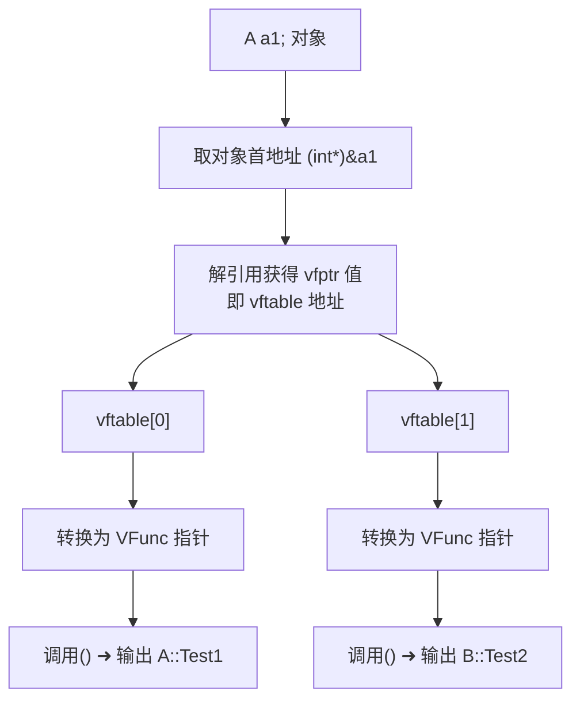

# 虚函数表指针直接访问实验：穿透多态的底层面纱

> [!abstract] 核心导言
> 虚函数的多态调用，在高级语言层面是优雅的抽象，在底层则是冰冷的内存寻址。通过直接操作对象的虚函数表指针，我们可以绕过编译器的语法糖，窥见并验证 C++ 多态机制的物理实现。本节将进行一次“外科手术式”的实验，手动提取虚函数表地址并直接调用其中的函数指针，从而深刻理解 `vfptr` 与 `vftable` 的工作机制。**请注意，此实验仅用于原理验证，绝对禁止用于实际工程项目。**

---

## 一、实验基础：虚函数表的内存模型回顾

在开始“手术”前，必须明确患者的解剖结构。

### 1. 核心公理
- **虚函数表 (`vftable`)**：一个**函数指针数组**。数组索引从 0 开始，依次对应类中声明的第 1、第 2 个虚函数。
- **虚函数表指针 (`vfptr`)**：位于**含有虚函数的对象内存首部**（偏移量 0），其值指向该类对应的 `vftable`。
- **共享与独立**：同一类的所有对象共享同一张 `vftable`；但基类与派生类拥有各自独立的 `vftable`。

### 2. 实验目标
我们将编写代码，手动完成以下步骤，以验证上述公理：
1.  获取对象的 `vfptr`。
2.  通过 `vfptr` 找到 `vftable`。
3.  从 `vftable` 中按索引取出函数地址。
4.  将地址转换为函数指针并直接调用。

---

## 二、单继承场景下的直接调用实验

我们以一个简单的继承体系 `B <- A` 作为实验对象。

### 1. 类定义与内存布局
```cpp
class B { // 基类
public:
    virtual void Test1() { cout << "B::Test1" << endl; }
    virtual void Test2() { cout << "B::Test2" << endl; }
};

class A : public B { // 派生类
public:
    virtual void Test1() override { cout << "A::Test1" << endl; } // 重写
    // Test2 未重写，将继承 B::Test2
};
```
此时，一个 `A` 类对象的内存布局如下：
```
[ A 对象内存 ]
+------------+  <- &a
| vfptr      |  ---> 指向 A::vftable
| ...B成员...|
| ...A成员...|
+------------+
```

### 2. 手术步骤：地址的层层剥解
通过一系列危险的强制类型转换，我们穿透到内存最底层。

```cpp
A a1, a2; // 创建两个A类对象

// 步骤1：获取对象地址，并强制视为 int* (假设指针大小与int一致)
int* pObj = (int*)&a1;

// 步骤2：解引用 pObj。由于 vfptr 在首地址，*pObj 即为 vfptr 的值，也就是虚函数表的地址！
int* vftable = (int*)(*pObj);

cout << "a1 对象地址: " << &a1 << endl;
cout << "a1 虚函数表地址: " << vftable << endl;
cout << "a2 虚函数表地址: " << (int*)(*((int*)&a2)) << endl; // 操作a2
```
**预期输出**：`a1` 和 `a2` 的**对象地址不同**，但它们的**虚函数表地址相同**。这验证了“同类对象共享虚函数表”。[1](@context-ref?id=0)

### 3. 终极操作：从表中提取并调用函数
定义与虚函数签名一致的函数指针类型，然后从数组中提取地址进行调用。

```cpp
// 定义函数指针类型
typedef void(*VFunc)();

// 从虚函数表中提取函数地址
// vftable[0] 是第一个虚函数 Test1 的地址
// vftable[1] 是第二个虚函数 Test2 的地址
VFunc func_test1 = (VFunc)(vftable[0](@ref);
VFunc func_test2 = (VFunc)(vftable[1](@ref);

// 直接调用！
func_test1(); // 应输出：A::Test1 (调用的是重写后的版本)
func_test2(); // 应输出：B::Test2 (调用的是继承的基类版本)
```



> [!success] 实验成功标志
> 通过手动查表调用，成功执行了 `A` 类重写的 `Test1` 和从 `B` 类继承的 `Test2`。这完美证明了虚函数表的内容与继承、重写逻辑完全吻合。

---

## 三、多继承的复杂战场

多继承时，情况变得复杂：派生类对象内部会包含**多个虚函数表指针**，分别对应每个含有虚函数的基类。

### 1. 内存布局模型
对于 `class A : public Base1, public Base2`，其内存大致如下：
```
[ A 对象内存 ]
+------------------+ <- &a, 也是 &a_as_base1
| vfptr_for_Base1  | ---> Base1 的虚函数表 (A类版本)
| ...Base1成员...  |
+------------------+ <- &a_as_base2 (需要偏移)
| vfptr_for_Base2  | ---> Base2 的虚函数表 (A类版本)
| ...Base2成员...  |
+------------------+
| ...A自有成员...  |
+------------------+
```

### 2. 实验挑战与要点
- **指针偏移**：当我们将 `A*` 转换为 `Base2*` 时，编译器会自动调整指针值，使其指向对象内 `Base2` 子对象的起始处。手动操作时，我们必须计算或模拟这个偏移。
- **多个 vftable**：我们需要先定位到对应基类子对象的首地址，才能取得正确的 `vfptr`，进而访问该基类独立的虚函数表。
- **结论验证**：此实验能验证“多继承中每个基类维护自己的虚函数表”这一关键机制。

> [!warning] 高度危险
> 多继承下的内存布局因编译器实现（Itanium C++ ABI、MSVC ABI 等）和优化选项而异。手动计算偏移极其脆弱，是未定义行为的重灾区。

---

## 四、严肃警告：原理与工程的鸿沟

**请务必清醒认识：本节所有技术仅用于学习和调试，绝不可用于实际项目。**

### 1. 为何禁止工程化？
- **未定义行为**：C++ 标准并未规定 `vfptr` 的具体内存位置和 `vftable` 的格式。不同编译器、不同版本、不同编译选项（如 RTTI 开关）都会导致布局不同。
- **彻底破坏封装**：绕过虚函数机制直接调用，破坏了面向对象的设计初衷，使代码无法维护。
- **极度脆弱**：任何类定义的改动（如增减虚函数、调整继承顺序）都将导致偏移计算错误，引发程序崩溃。

### 2. 正确的工程实践
当需要高级多态技巧时，应使用：
- **设计模式**：如访问者模式、策略模式。
- **标准库设施**：如 `std::function`、`std::variant`。
- **类型擦除技术**：在保持类型安全的前提下提供灵活性。

---

## 五、知识全景小结

| 知识维度 | 核心内容 | ⚠️ 考试重点/易混淆点 | 难度系数 |
| :--- | :--- | :--- | :--- |
| **虚函数表结构** | 函数指针数组，索引顺序对应声明顺序 | `vftable[0]` 是第一个虚函数，而非按名称排序 | ⭐⭐⭐⭐ |
| **对象与表关系** | 同类对象共享 `vftable`，`vfptr` 值相同 | 对象地址不同，但 `vfptr` 指向的地址相同 | ⭐⭐⭐ |
| **手动调用实验** | `(int*)&obj` -> `*(int*)&obj` -> `vftable[index]` | 强制类型转换的层级与解引用的时机 | ⭐⭐⭐⭐ |
| **多继承复杂性** | 对象内含多个 `vfptr`，指针转换伴随地址偏移 | <span style="color:#ff4757;">手动计算偏移是未定义行为，高度编译器依赖</span> | ⭐⭐⭐⭐⭐ |
| **工程化禁令** | **绝对禁止**在生产代码中使用此技术 | 其价值仅在于**理解原理**与**底层调试** | ⭐⭐⭐⭐ |

> [!quote] 结语
> 本次实验如同用示波器探查CPU引脚的电信号，它让我们亲眼见证了多态并非魔法，而是精确的内存电路。然而，正如工程师不会用飞线焊接的方式来生产电脑主板一样，理解底层是为了更好地运用高层抽象，而非取而代之。将这份认知作为调试复杂问题的最后利器，并将其永远锁在原理学习的工具箱内。
