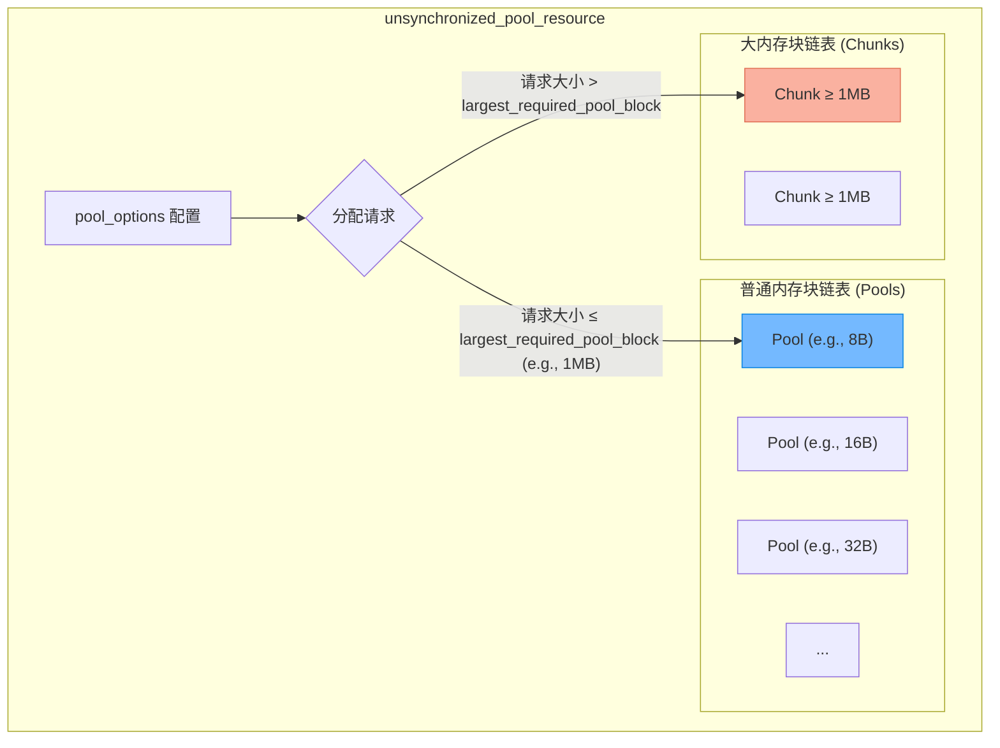

# C++17内存池深度解析：memory_resource架构与性能权衡

> [!abstract] 核心导言
> 频繁的 `new`/`delete` 或 `malloc`/`free` 是高性能 C++ 应用的性能杀手，它们不仅引入系统调用开销，更会导致内存碎片。C++17 标准引入的 `memory_resource` 及其池化实现，为我们提供了接管全局内存分配、实现定制化内存管理的终极武器。本节将深度拆解其三层架构、双链表存储机制与线程安全封装，助你在内存管理的深水区构建高性能基础设施。

---

## 一、设计哲学与核心类三层架构

C++17 内存池并非一个单一的类，而是一个清晰的三层抽象体系，旨在分离接口、实现与线程安全策略。

### 1. 核心类分工
| 类名 | 角色定位 | 线程安全性 | 核心职责 |
| :--- | :--- | :--- | :--- |
| **`memory_resource`** | 抽象基类 (接口层) | 由派生类决定 | 定义 `allocate`/`deallocate` 纯虚接口，是所有内存资源的契约 |
| **`unsynchronized_pool_resource`** | 池化实现 (策略层) | ❌ 非线程安全 | 实现具体的内存池管理逻辑：双链表存储、几何扩容 |
| **`synchronized_pool_resource`** | 线程安全包装器 (装饰层) | ✅ 线程安全 | 内部持有一个非安全池实例，通过互斥锁 (`mutex`) 包装所有接口 |

### 2. 版本与编译器要求
- **标准版本**：C++17 及以上。
- **编译器**：VS2019（部分支持）、VS2022（完全支持）或 GCC/Clang 对应版本。

---

## 二、基石：memory_resource 抽象接口

`memory_resource` 是所有自定义内存管理的起点，它规定了内存资源必须提供的基本操作。

### 1. 核心接口规范
```cpp
class memory_resource {
public:
    // 分配内存
    void* allocate(size_t _Bytes, size_t _Align = alignof(max_align_t));
    
    // 释放内存
    void deallocate(void* _Ptr, size_t _Bytes, size_t _Align = alignof(max_align_t));
    
    // 判断两个 memory_resource 是否相等
    bool is_equal(const memory_resource& _Other) const noexcept;
};
```

### 2. 关键参数解析
- **`_Bytes` (字节数)**：<span style="color:#ff4757;">**必须为 2 的次方**</span>（如 8, 16, 32, …）。这是为了适配 CPU 缓存行与高效的内存块分割。
- **`_Align` (对齐要求)**：默认跟随系统最大对齐（`alignof(max_align_t)`）。在 64 位系统中，**推荐使用 8 字节对齐**，以避免 CPU 跨缓存行读取带来的性能惩罚。
- **释放时的大小**：`deallocate` 必须传入与 `allocate` 时一致的 `_Bytes` 和 `_Align` 参数，以便内存池正确识别该内存块所属的链表（普通块 or 大块）。[1](@context-ref?id=1)

---

## 三、引擎：unsynchronized_pool_resource 池化实现

这是内存池的核心引擎，实现了高效的非线程安全内存管理。

### 1. 双链表存储架构
池内部采用两种数据结构管理不同大小的内存块，以实现高效复用与扩容。



### 2. 核心配置参数 (`pool_options`)
通过 `pool_options` 结构体精细调控池的行为：
- **`max_blocks_per_chunk`**：**初始内存块大小**。例如设置为 100 MB，池首次申请即获得 100 MB 的连续内存。[1](@context-ref?id=2)
- **`largest_required_pool_block`**：**普通/大内存块分界线**。默认常为 1 MB。小于等于此值的内存请求由 `_Pools`（普通链表）处理；大于此值的请求则由 `_Chunks`（大块链表）处理。[1](@context-ref?id=3)[](@image-ref?id=3)

### 3. 动态扩容策略：几何倍数增长
当某个尺寸的普通内存块链表耗尽时，池并非申请恰好所需的内存，而是进行**几何倍数扩容**。[1](@context-ref?id=4)
- **示例**：初始块 100 MB 用完 → 扩容至 200 MB → 再用完则扩容至 400 MB。
- **优势**：大幅减少系统调用次数，以空间换取时间，特别适合长期运行、内存需求稳定的服务。

### 4. 释放逻辑：标记复用，延迟归还
`deallocate` 并非立即调用 `free`，而是：
1.  **标记为空闲**：将内存块放回对应的空闲链表，标记为可用状态。
2.  **延迟释放**：当某个内存块的总空闲空间超过其自身大小的 **50%** 时，才会真正将物理内存归还给操作系统。
3.  **强制清空**：调用 `release()` 方法会**立即清空所有内存**，包括未使用的保留空间。[1](@context-ref?id=5)

---

## 四、铠甲：synchronized_pool_resource 线程安全封装

在多线程环境下，直接使用非线程安全版本会导致数据竞争。`synchronized_pool_resource` 通过装饰器模式为其穿上铠甲。[1](@context-ref?id=6)

### 1. 实现机制
- **继承关系**：公有继承 `unsynchronized_pool_resource`，获得所有池化管理能力。
- **锁保护**：在 `allocate`, `deallocate`, `release` 等所有公共接口内部，使用 `std::lock_guard<std::mutex>` 对内部互斥量 `_Mtx` 进行加锁。[1](@context-ref?id=7)
- **RAII 保障**：利用 `lock_guard` 的 RAII 特性，确保即使抛出异常，锁也能被正确释放，避免死锁。

```mermaid
graph BT
    A[“synchronized_pool_resource”] --> B[“继承所有功能”]
    B --> C[“unsynchronized_pool_resource (池核心)”]
    
    A --> D[“包装一层锁”]
    D --> E[“lock_guard<mutex> _Guard{_Mtx}”]
    
    style E fill:#ffeaa7,stroke:#fdcb6e
```

### 2. 性能权衡
- **性能损耗**：线程安全版本因全局锁的串行化，会有约 **10%-15%** 的性能损耗（实测数据）。[1](@context-ref?id=8)
- **适用场景**：
    - **多线程环境**（如网络服务器后台）：必须使用线程安全版本。[1](@context-ref?id=9)
    - **单线程/协程环境**（如 Parser 脚本）：使用非线程安全版本以获得极致性能。[1](@context-ref?id=10)

---

## 五、知识全景小结

| 知识维度 | 核心内容 | ⚠️ 考试重点/易混淆点 | 难度系数 |
| :--- | :--- | :--- | :--- |
| **三层架构** | 接口(`mr`)、实现(`unsync`)、安全包装(`sync`) | `sync_pool_resource` 继承自 `unsync_pool_resource` 并加锁 | ⭐⭐⭐ |
| **接口规范** | `allocate`/`deallocate`，字节需为2的次方，注意对齐 [1](@context-ref?id=11)| <span style="color:#ff4757;">释放时必须传递原始大小与对齐参数</span> | ⭐⭐⭐⭐ |
| **双链表存储** | `_Pools`管普通块，`_Chunks`管大块 | 分界线由 `largest_required_pool_block` 配置决定 | ⭐⭐⭐⭐ |
| **动态扩容** | 几何倍数增长 (100M→200M→400M) [1](@context-ref?id=12)| 以空间换时间，减少系统调用 | ⭐⭐⭐ |
| **释放逻辑** | 先标记复用，空闲超50%才实际释放 | `release()` 会强制清空所有内存，包括空闲部分 [1](@context-ref?id=13)| ⭐⭐⭐⭐ |
| **线程安全** | `sync`版本通过互斥锁实现，有性能损耗 | <span style="color:#2ed573;">锁仅保护池操作，返回的内存地址由调用方管理同步</span> | ⭐⭐⭐ |
| **性能权衡** | 对齐影响CPU读取；线程安全有固定开销 | 单线程场景禁用线程安全可提升性能 [1](@context-ref?id=14)| ⭐⭐⭐⭐ |

> [!quote] 结语
> C++17 内存池将系统级的内存管理权下放给了开发者。理解其接口的精度要求（2的次方、对齐）、内部的双链表分区智慧，以及线程安全包装的成本，你便能在构建数据库连接池、游戏对象池、网络缓冲区等高并发基础设施时，做出最贴合场景的架构决策，从底层榨取出极致的性能。[1](@context-ref?id=15)
