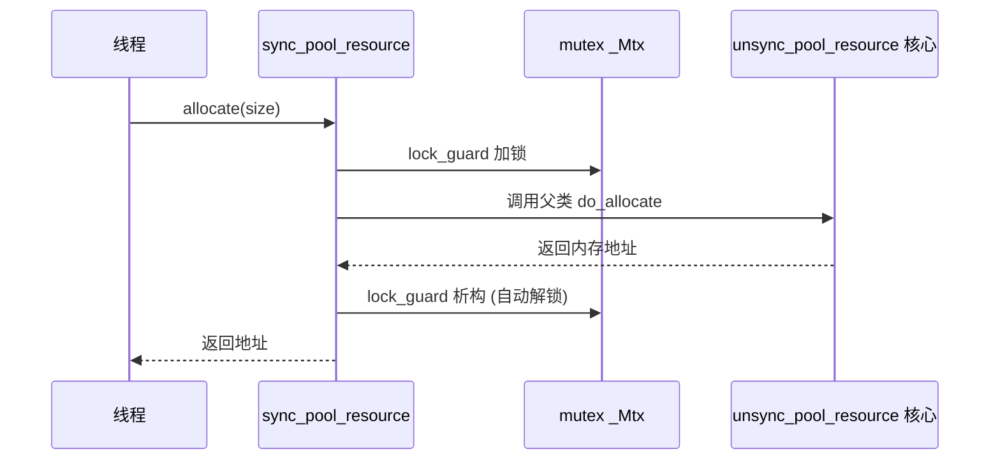

# synchronized_pool_resource 源码级解析：线程安全内存池的实现与调优

> [!abstract] 核心导言
> `synchronized_pool_resource` 是 C++17 内存池体系中兼顾性能与线程安全的“铠甲武士”。它在非线程安全池的核心之上，披上了一层互斥锁的盔甲，让多线程环境下的内存分配井然有序。本节将穿透源码，深度解析其装饰器模式的实现、配置参数的精细调控、大块内存的特殊处理，以及在32位系统下内存耗尽的优化策略。

---

## 一、环境配置与核心架构

### 1. 编译环境与命名空间
- **标准要求**：项目必须设置为 **C++17** 或更高标准（如 `/std:c++17`）。
- **头文件**：必须包含 `<memory_resource>`。
- **命名空间**：相关类位于 `std::pmr` 命名空间下。
```cpp
#include <iostream>
#include <memory_resource>
using namespace std;
using namespace std::pmr; // 关键命名空间
```

### 2. 三层架构回顾
`synchronized_pool_resource` 是内存池体系的**线程安全装饰层**：
1.  **基类**：`memory_resource`（抽象接口）。
2.  **核心**：`unsynchronized_pool_resource`（池化算法实现）。
3.  **装饰**：`synchronized_pool_resource`（继承核心，添加互斥锁）。

---

## 二、心脏调参：pool_options 配置艺术

内存池的行为完全由 `pool_options` 结构体的两个参数主宰，理解它们是高效使用的关键。

```cpp
pool_options opt;
// 关键参数1：大块阈值。大于此值的请求被视为“大内存”，走特殊路径。
opt.largest_required_pool_block = 1024 * 1024 * 10; // 10 MB
// 关键参数2：普通块初始大小。池首次向系统申请的内存块尺寸，也是倍增基数。
opt.max_blocks_per_chunk = 1024 * 1024 * 100; // 100 MB
```

| 参数 | 作用 | 调优建议 |
| :--- | :--- | :--- |
| **`largest_required_pool_block`** | 区分“普通块”与“大块”管理的分水岭 | 根据业务数据特征设定。如图像处理，单图约10MB，则可设为10MB。 |
| **`max_blocks_per_chunk`** | 池向系统申请内存的**初始块大小**与**倍增基数** | 预估常驻内存量，设为合理初始值（如100MB）。避免过小导致频繁扩容。 |

> [!info] 倍增策略
> 当普通块链表耗尽时，池会按 `max_blocks_per_chunk` 的**几何倍数**申请新内存：100MB → 200MB → 400MB ……

---

## 三、线程安全实现：装饰器模式与锁机制

`synchronized_pool_resource` 的核心价值在于其线程安全实现，源码清晰地展示了装饰器模式的应用。[1](@context-ref?id=1)

### 1. 继承与组合
它**公有继承**自 `unsynchronized_pool_resource`，从而获得了所有池化管理能力。同时，内部持有一个 `std::mutex` 成员 `_Mtx`。[1](@context-ref?id=2)

### 2. 锁保护的关键路径
线程安全通过对关键虚函数 `do_allocate` 和 `do_deallocate` 的**重写加锁**来实现。[1](@context-ref?id=3)

```cpp
// 简化后的核心源码逻辑
class synchronized_pool_resource : public unsynchronized_pool_resource {
protected:
    void* do_allocate(size_t _Bytes, size_t _Align) override {
        lock_guard<mutex> _Guard(_Mtx); // 自动加锁
        return unsynchronized_pool_resource::do_allocate(_Bytes, _Align);
    }
    
    void do_deallocate(void* _Ptr, size_t _Bytes, size_t _Align) override {
        lock_guard<mutex> _Guard(_Mtx); // 自动加锁
        unsynchronized_pool_resource::do_deallocate(_Ptr, _Bytes, _Align);
    }
private:
    mutable mutex _Mtx; // 核心互斥锁
};
```



> [!tip] 性能提示
> 锁的粒度在**方法级**。对于超高并发场景，此全局锁可能成为瓶颈。若业务场景允许，可考虑使用**多个专用内存池**来分散锁竞争。

---

## 四、空间申请机制与异常处理

### 1. 申请流程详解
1.  **检查大小**：判断请求字节数是否 `<= largest_required_pool_block`。
2.  **查找空闲块**：在对应的普通块空闲链表中查找。
3.  **分配新块**：若链表为空，则触发**倍增扩容**，向系统申请新的大块内存，并加入 `_Chunks` 链表管理。
4.  **大块直通**：若请求大小超过阈值，则直接调用上游资源分配，并添加 `_Oversized_header` 记录信息后加入 `_Chunks` 链表。[1](@context-ref?id=4)[](@image-ref?id=4)

### 2. 大块内存的对齐计算
对于大块内存，需要预留头部信息 (`_Oversized_header`) 的空间。其实际申请大小计算公式体现了精细的内存对齐：
```cpp
_Bytes = (_Bytes + sizeof(_Oversized_header) + alignof(_Oversized_header)) 
         & ~(alignof(_Oversized_header) - 1);
```

### 3. 异常处理：应对内存耗尽
当系统内存耗尽，上游资源 `allocate()` 调用失败时，将抛出 `std::bad_alloc` 异常。

**工程实践**：
```cpp
std::vector<void*> datas;
try {
    for (int i = 0; i < 2000; i++) {
        auto data = mpool.allocate(size);
        datas.push_back(data);
    }
} catch (const std::exception& ex) {
    cerr << “pool allocate failed!” << ex.what() << endl;
    exit(1); // 内存耗尽，通常选择终止程序
}
```

---

## 五、32位系统的挑战与优化策略

在32位进程中，虚拟地址空间有限（通常约2GB），内存池的**几何倍增策略**极易快速耗尽地址空间。[1](@context-ref?id=5)

**优化策略**：
1.  **精准预分配**：根据业务峰值，将 `max_blocks_per_chunk` 设置为接近总需求的值，避免多次倍增。
2.  **创建多个专用池**：例如，创建多个1GB上限的专用池，分别服务于不同模块或数据类型。
3.  **监控与调整**：使用性能工具监控内存使用曲线，动态调整池参数。

---

## 六、知识全景小结

| 知识维度 | 核心内容 | ⚠️ 考试重点/易混淆点 | 难度系数 |
| :--- | :--- | :--- | :--- |
| **环境配置** | C++17标准，`<memory_resource>`头文件，`std::pmr`命名空间 [1](@context-ref?id=6)| 项目属性需手动设置C++17标准，否则编译报错 | ⭐⭐ |
| **配置参数** | `largest_required_pool_block` (大块阈值)，`max_blocks_per_chunk` (初始/倍增基数) [1](@context-ref?id=7)| 参数单位为字节，建议使用 `1024*1024*x` 形式提高可读性 | ⭐⭐⭐ |
| **线程安全实现** | 公有继承 + 重写 `do_allocate/deallocate` + `lock_guard<mutex>` [1](@context-ref?id=8)| <span style=”color:#2ed573;”>装饰器模式的经典应用，锁保护父类核心逻辑</span> | ⭐⭐⭐⭐ |
| **申请流程** | 检查阈值 → 查找空闲链 → 倍增扩容或大块直通 | 大块内存分配需额外计算对齐，以容纳管理头 `_Oversized_header` [1](@context-ref?id=9)| ⭐⭐⭐⭐ |
| **异常处理** | 内存耗尽时抛出 `std::bad_alloc` | 需全局捕获，通常内存耗尽是不可恢复错误，应终止程序 | ⭐⭐⭐ |
| **32位优化** | 几何倍增易耗尽地址空间，需预分配或多池拆分 [1](@context-ref?id=10)| <span style=”color:#ff4757;”>32位程序需特别注意池的初始大小与倍增策略</span> | ⭐⭐⭐⭐ |
| **性能取舍** | 线程安全带来约10-15%开销，但保障多线程安全 | 单线程环境应使用 `unsynchronized_pool_resource` 以获得极致性能 | ⭐⭐⭐ |

> [!quote] 结语
> `synchronized_pool_resource` 通过精巧的装饰器模式，在强大的池化引擎外包裹了一层可靠的锁铠甲。理解其配置参数对行为的影响，洞察其底层加锁的调用链，方能在大规模并发服务中驾驭好这把利器。尤其在资源受限的32位环境中，慎重的参数调优与架构设计，是避免内存过早耗尽的生存法则。[1](@context-ref?id=11)
````