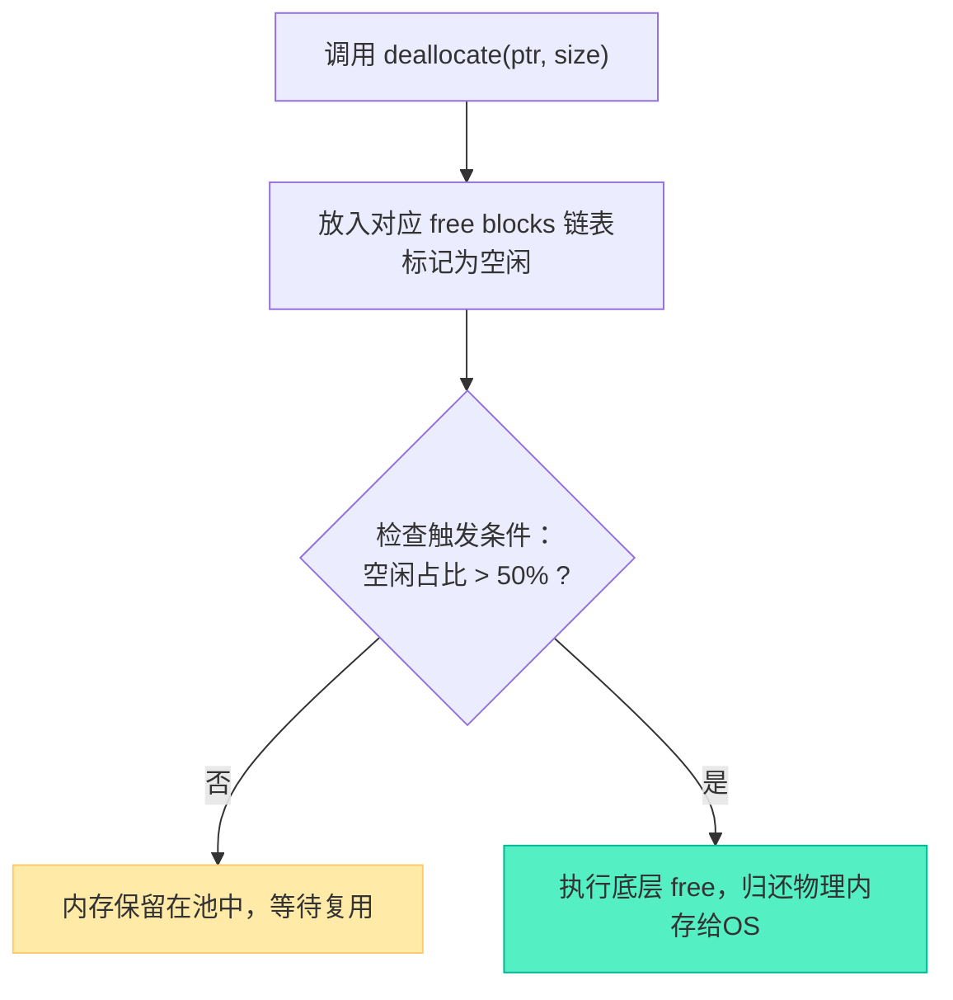

# 内存池空间释放深度解析：延迟归还与条件触发机制

> [!abstract] 核心导言
> 内存池的智慧不仅体现在高效的分配上，更在于其“吝啬”的释放策略。与系统 `free` 的即时归还不同，`synchronized_pool_resource` 采用“延迟释放”与“条件触发”的复合机制：释放的内存先进入空闲链表待命，直至池内空闲空间积累到一定阈值，才真正割舍给操作系统。本节将穿透源码，解析 `deallocate` 的链表管理逻辑，揭示 `release` 的强制清空威力，并指导你在工程中平衡内存占用与性能。

---

## 一、释放的核心机制：延迟归还与条件触发

内存池释放内存的行为模式与直觉相反，其设计目标是最大化内存块的复用，减少与操作系统交互的开销。

### 1. 释放 ≠ 立即归还
当调用 `mpool.deallocate(ptr, size)` 时，其内部动作是：
1.  **标记空闲**：将该内存块标记为空闲状态，并插入对应大小的 **`free blocks` 空闲链表**。
2.  **就地保留**：物理内存依然保留在池的管辖范围内，**并未调用 `free` 归还系统**。

### 2. 真正的释放：条件触发
空闲内存不会无限期保留。当池的整体空闲内存量积累到一定规模时，会触发真正的释放。
- **触发条件**：通常为“某个内存块的空闲部分超过其总大小的 **50%**”。
- **触发动作**：此时，池才会将这部分空闲的物理内存切割出来，真正归还给操作系统。



> **[!info] 设计哲学**
> 这种机制类似于酒店的“房间保留政策”：客人退房（`deallocate`）后，房间不会立刻拆毁，而是打扫干净后留在酒店库存（`free blocks`）中，以备新客人入住（`allocate`）。只有当长期空置率过高时，酒店才会考虑关闭部分楼层（触发条件释放）。

---

## 二、源码级释放流程剖析

`synchronized_pool_resource::do_deallocate` 是释放操作的线程安全入口。[1](@context-ref?id=1)

### 1. 线程安全入口
```cpp
virtual void do_deallocate(void* _Ptr, size_t _Bytes, size_t _Align) override {
    lock_guard<mutex> _Guard(_Mtx); // 自动加锁，保证线程安全
    this->unsynchronized_pool_resource::do_deallocate(_Ptr, _Bytes, _Align);
}
```
- **锁保护**：通过 `lock_guard` 确保多线程环境下，对空闲链表的修改是原子的。
- **委托父类**：实际的释放逻辑委托给父类 `unsynchronized_pool_resource` 的核心引擎。

### 2. 核心释放逻辑 (`unsynchronized_pool_resource`)
父类的 `do_deallocate` 按以下路径执行：
1.  **大小判断**：判断 `_Bytes` 是否超过 `largest_required_pool_block`（如10MB）。
2.  **大块处理**：若是大块，则在 `_Chunks` 链表中查找并特殊处理。
3.  **普通块处理**：若是普通块，则定位到对应的 `_Pool` 链表。
4.  **插入空闲链表**：将 `_Ptr` 指向的内存块，通过 `_Single_link` 指针嵌入到对应 `_Pool` 的 `free blocks` 链表头部。
5.  **更新计数器**：递增该 `_Pool` 的 `_Free_count`。当 `_Free_count` 达到阈值时，触发前述的“条件释放”。

---

## 三、工程实践：释放 API 的使用与抉择

内存池提供了两种释放方式，对应不同的使用场景。

### 1. 单元释放：`deallocate`
用于释放单个之前分配的内存块。
- **必须匹配**：传入的 `_Bytes` 和 `_Align` 必须与 `allocate` 时完全一致，否则将导致池的内部记账错误，可能引发崩溃或泄漏。
- **示例**：
```cpp
auto big_block = mpool.allocate(1024 * 1024 * 20); // 申请20MB
// ... 使用 big_block ...
mpool.deallocate(big_block, 1024 * 1024 * 20); // 释放，大小必须一致
```

### 2. 核弹释放：`release()`
强制释放池持有的**所有**内存，立即归还给操作系统。
- **作用**：清空所有 `_Pools` 和 `_Chunks` 链表。
- **场景**：在程序特定阶段（如关卡结束、服务重启）需要彻底清理内存时使用。
- **后果**：调用后，池回到初始空状态，之前通过此池分配的所有指针都变为**悬垂指针**，绝对不可再使用。

### 3. 批量释放模式
在循环中分配和释放大量对象时，内存池的优势尽显。
```cpp
std::vector<void*> buffers;
for (int i = 0; i < 1000; i++) {
    buffers.push_back(mpool.allocate(1024));
}
// 批量释放
for (auto ptr : buffers) {
    mpool.deallocate(ptr, 1024);
}
buffers.clear();
// 可选：如果此后长时间不再需要内存，可调用 mpool.release()
```

---

## 四、性能特征与监控

内存池的释放行为直接影响程序的**内存占用曲线**。

### 1. 申请与释放的曲线不对称
- **申请曲线（陡峭）**：由于**指数级扩容**策略，内存占用呈阶梯式跳跃增长。[1](@context-ref?id=2)
- **释放曲线（平缓）**：由于**延迟释放**策略，内存占用的下降是缓慢的斜坡状，而非垂直下跌。

### 2. 监控与调试建议
- **使用性能工具**：在调试器中观察进程内存（如 `Working Set`）的变化，验证释放的延迟效应。
- **添加调试断点**：在批量释放前后使用 `std::cin.get()` 暂停程序，通过任务管理器观察实际内存变化。
- **理解统计偏差**：调试器显示的内存用量可能与系统管理器略有不同，这是正常的，应以趋势为准。

---

## 五、知识全景小结

| 知识维度 | 核心内容 | ⚠️ 工程重点/易错点 | 难度系数 |
| :--- | :--- | :--- | :--- |
| **释放机制本质** | 延迟释放：先入空闲链表，条件触发后才真正归还OS | <span style="color:#2ed573;">目的是复用内存块，减少系统调用</span> | ⭐⭐⭐ |
| **触发条件** | 通常为某内存块空闲部分超过其总大小的50% | 非即时释放，内存占用下降曲线平缓 | ⭐⭐⭐⭐ |
| `deallocate` **规范** | 必须传入与 `allocate` 时完全一致的 `size` 和 `alignment` | 参数错误会导致池内部状态损坏，引发未定义行为 | ⭐⭐⭐⭐ |
| `release()` **核弹效应** | 强制释放池中所有内存，池被重置 | <span style="color:#ff4757;">调用后，此前分配的所有指针立即失效</span> | ⭐⭐⭐ |
| **线程安全实现** | `do_deallocate` 中通过 `lock_guard` 加锁 [1](@context-ref?id=3)| 锁开销是线程安全版本性能损耗的主因之一 | ⭐⭐⭐ |
| **性能监控** | 申请曲线阶梯式增长，释放曲线缓慢下降 | 调试时需区分“池持有内存”与“进程实际占用内存” | ⭐⭐⭐ |

> [!quote] 结语
> 内存池的释放策略，是“以空间换时间”哲学的又一次体现。它用短暂的内存冗余，换取了下一次分配时命中缓存的极高概率。掌握 `deallocate` 的匹配铁律，理解 `release` 的毁灭性与必要性，你便能在这场内存的时空游戏中，为你的应用制定出最细腻的资源回收节奏。[1](@context-ref?id=4)
