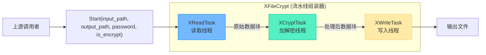

# 项目架构深度解析：基于内存池的批量文件加解密系统

> [!abstract] 核心导言
> 本项目是一个融合了现代 C++ 多项核心技术的综合性实战案例：利用 C++17 内存池管理高频 IO 产生的内存碎片，通过责任链模式串联多线程处理流水线，并集成 OpenSSL 实现高效的加解密运算。该系统旨在解决海量文件批处理场景下的性能瓶颈与资源管理难题，是理解高性能服务端架构的绝佳样板。

---

## 一、核心需求与技术选型

### 1. 核心业务需求
- **批量处理**：支持对指定目录下的所有文件进行遍历与加解密操作。
- **高性能**：利用多线程并行化，实现读取、计算、写入的流水线作业。
- **资源可控**：避免频繁的 `new`/`delete` 导致的内存碎片与性能抖动，需引入内存池。
- **灵活扩展**：加解密算法可插拔，处理流程各环节可独立替换或升级。

### 2. 核心技术栈
| 技术领域 | 具体技术 | 选型理由 |
| :--- | :--- | :--- |
| **语言标准** | C++17 | 提供 `std::pmr::memory_resource` 等现代内存管理工具 |
| **设计模式** | 责任链模式、单例模式 | 解耦处理阶段，统一管理全局资源（如内存池） |
| **内存管理** | 智能指针 (`shared_ptr`)、内存池 | 自动化生命周期，避免泄漏；池化减少系统调用 |
| **多线程** | `std::thread`, `std::mutex`, `std::condition_variable` | 实现流水线并行与线程间同步 |
| **密码学** | OpenSSL 库 | 工业级标准，提供丰富、可靠的加解密算法 |

---

## 二、核心类图分析与职责分解

系统采用“组合优于继承”的原则，通过责任链模式将文件处理流程分解为独立的、可串联的任务节点。

### 1. 公共基类：`IOStream` (责任链的纽带)
这是整个责任链的抽象基类，定义了节点间协作的契约。
- **核心职责**：
    1.  **线程管理**：封装线程的启动 (`Start()`)、等待 (`Wait()`) 逻辑。
    2.  **链式传递**：通过 `SetNext()` 方法建立处理流水线。
    3.  **数据中转**：提供 `PushBack()` 等方法，实现线程安全的数据缓冲区传递。
- **设计意义**：将多线程的调度与同步细节隐藏在基类中，使具体任务类 (`XReadTask`, `XCryptTask`等) 只需关注自身的业务逻辑。

### 2. 加解密核心类：`XCrypt` (算法提供者)
此类是对 OpenSSL 库的封装，是纯粹的算法模块，不涉及线程或流程控制。
- **核心接口**：
    ```cpp
    bool Encrypt(const unsigned char* in, int in_len,
                 unsigned char* out, int* out_len, bool is_final);
    bool Decrypt(...); // 参数同上
    ```
- **关键处理**：内部自动处理**数据填充** (Padding)，当输入数据长度不是算法块大小（如 AES 的 16 字节）的整数倍时，自动补足。

### 3. 任务处理类：`XCryptTask` (责任链中间处理器)
继承自 `IOStream`，是责任链上的一个核心节点。
- **角色定位**：作为**消费者-生产者**。从上游（如 `XReadTask`）获取原始数据块，调用 `XCrypt` 进行加解密，然后将结果块传递给下游（如 `XWriteTask`）。
- **内存池集成**：其内部持有的数据缓冲区，均来自项目全局的单例内存池，从而保证在整个处理链路中，内存的申请与释放高效且一致。

### 4. 任务组合类：`XFileCrypt` (流水线组装与控制器)
这是面向用户的顶层接口类，采用组合模式将各个任务节点组装成完整的处理流水线。
- **核心成员**：
    - `XReadTask`: 文件读取线程。[1](@context-ref?id=1)
    - `XCryptTask`: 加解密处理线程。[1](@context-ref?id=2)[](@image-ref?id=2)
    - `XWriteTask`: 文件写入线程。[1](@context-ref?id=3)[](@image-ref?id=3)
- **工作流程**：
    1.  **加密**：`读取 → 加密 → 写入`[1](@context-ref?id=4)
    2.  **解密**：`读取 → 解密 → 写入`
- **控制入口**：`Start()` 方法接收输入/输出路径、密码和操作标志，启动整个流水线。支持目录批量处理。



---

## 三、核心工作机制与难点剖析

### 1. 内存池与多线程的协同
- **全局单例池**：整个程序使用一个全局的 `synchronized_pool_resource`。其线程安全性保证了多个处理线程可以安全地从同一池中分配和释放内存。
- **缓冲区生命周期**：一个数据块在 `读取线程` 中从池内分配，流经 `加解密线程`，最终在 `写入线程` 写入磁盘后，于 `写入线程` 中归还给内存池。生命周期横跨多个线程，由智能指针的引用计数确保安全。

### 2. 责任链的线程间同步
- **数据队列**：每个 `IOStream` 子类内部维护一个线程安全的队列（如 `std::queue<std::shared_ptr<Buffer>>`）。
- **生产者-消费者模型**：上游任务通过 `PushBack()` 放入数据，并通知条件变量；下游任务等待条件变量，通过 `PopFront()` 取出数据。
- **结束信号**：需要一种特殊的“结束标志”数据块在链中传递，以告知下游线程所有数据已处理完毕，可以正常退出。

### 3. 文件批处理的流程控制
- **目录遍历**：`XFileCrypt` 需要先遍历输入目录，为每个文件创建独立的处理流水线或任务单元。
- **并发度控制**：需要限制同时活跃的流水线数量，避免线程过多导致上下文切换开销过大或内存耗尽。可通过线程池模式进一步优化。

---

## 四、知识全景与工程价值小结

| 知识维度 | 在本项目中的体现 | 工程价值与难点 |
| :--- | :--- | :--- |
| **C++17 内存池** | 全局 `synchronized_pool_resource` 管理所有数据缓冲区 | **价值**：彻底消除碎片，提升性能。<br>**难点**：需确保所有跨线程内存均从池中分配，并在正确线程中释放。 |
| **责任链模式** | `IOStream` -> `XReadTask` -> `XCryptTask` -> `XWriteTask` | **价值**：流程清晰，环节可插拔。<br>**难点**：线程间数据传递与状态同步（结束信号）。 |
| **智能指针** | 使用 `shared_ptr<Buffer>` 传递数据块 | **价值**：自动管理横跨多线程的内存生命周期。<br>**难点**：需注意循环引用，尤其在复杂回调关系中。 |
| **OpenSSL 集成** | `XCrypt` 类封装加解密算法，处理填充 | **价值**：提供工业级安全算法。<br>**难点**：正确使用 EVP 接口，处理各种填充模式和错误码。 |
| **多线程协作** | 读取、计算、写入三阶段流水线 | **价值**：充分利用多核，隐藏 IO 延迟。<br>**难点**：平衡流水线速度，避免某一环节成为瓶颈。 |
| **项目架构** | 组合模式组装任务，基类统一接口 | **价值**：高内聚、低耦合，易于测试和扩展。<br>**难点**：初期抽象的粒度把握，既要不失灵活，又要避免过度设计。 |

> [!quote] 结语
> 本项目宛如一个微型的“大数据处理引擎”，它将内存池、多线程、设计模式与密码学等离散的知识点，编织成一个有机协作的高性能系统。通过剖析其架构，我们不仅学到了如何用 C++17 构建现代应用，更重要的是掌握了如何权衡性能、资源与代码结构，这是迈向资深架构师的关键一步。
