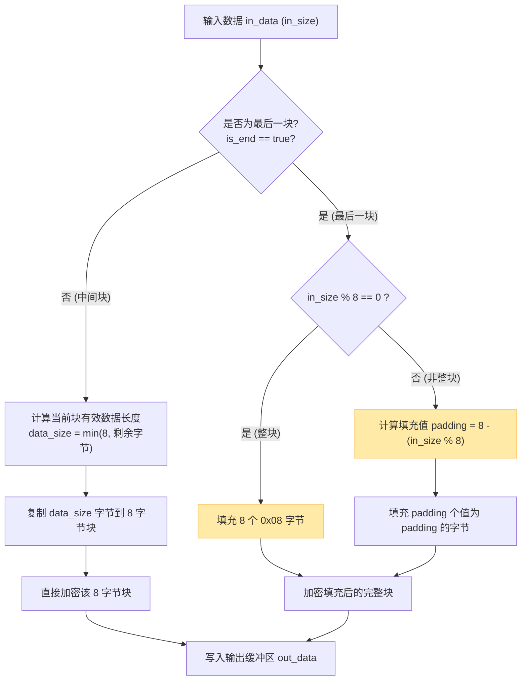

# XCrypt加密模块实现：DES算法、密钥管理与数据填充

> [!abstract] 核心导言
> 在基于内存池的批量文件加解密系统中，`XCrypt` 类是密码学能力的核心载体。它封装了 OpenSSL 的 DES 算法，提供了简洁的初始化、加密与解密接口。本章将深度拆解其密钥的标准化处理、ECB 模式下的块加密机制，以及至关重要的 PKCS#5 数据填充方案，确保数据无论大小都能被正确加密与还原。

---

## 一、接口定义与初始化

`XCrypt` 类的设计遵循了接口与实现分离的原则，为后续更换算法（如 AES）留有扩展空间。

### 1. 核心接口一览
```cpp
class XCrypt {
public:
    /// @brief 初始化密钥，DES加密算法密钥最多8位，多余丢弃，不足补0
    bool Init(std::string password);
    
    /// @brief 加密数据，结尾填充补充的大小，加密数据大小如果不是8/16的倍数
    int Encrypt(const char* in_data, int in_size, char* out_data, bool is_end = false);
    
    /// @brief 解密数据，结尾去掉填充大小
    int Decrypt(const char* in_data, int in_size, char* out_data, bool is_end = false);
};
```

### 2. 密钥初始化：标准化处理
DES 算法要求密钥长度为 8 字节。`Init` 方法负责将用户输入的任意长度密码标准化。
- **超过8位**：截断，只取前8个字符。
- **不足8位**：在末尾补零 (`\0`) 直到满8字节。
- **内部存储**：使用 OpenSSL 的 `DES_key_schedule` 结构体存储处理后的密钥，供后续加解密使用。

```cpp
bool XCrypt::Init(std::string password) {
    DES_cblock key;
    memset(key, 0, sizeof(key));
    // 安全复制，最多8字节
    memcpy(key, password.c_str(), min(password.size(), sizeof(key)));
    // 设置加密密钥
    if (DES_set_key(&key, &key_sched_) != 0) {
        return false; // 密钥设置失败
    }
    return true;
}
```

---

## 二、加密函数实现与数据填充

加密是核心，其难点在于处理非整块数据和对最后一块数据的特殊填充。

### 1. 函数原型与参数
```cpp
int Encrypt(const char* in_data, int in_size, char* out_data, bool is_end = false);
```
- **`in_data`**：输入明文数据指针。
- **`in_size`**：输入数据长度（字节）。
- **`out_data`**：输出密文缓冲区（**调用者需确保其容量足够**，通常为 `in_size + 块大小`）。
- **`is_end`**：是否为最后一段数据。**仅当此标志为 `true` 时，才执行填充操作**。[1](@context-ref?id=1)
- **返回值**：加密后的数据长度（字节），可能因填充而大于 `in_size`。[1](@context-ref?id=2)[](@image-ref?id=2)

### 2. 数据块处理与填充机制
DES 采用 ECB 模式，每 8 字节为一个加密块。非整块数据需进行填充。



**PKCS#5 填充规则详解**：
- **情况一（数据不是8的倍数）**：假设最后剩余 3 字节，则需要填充 `5` 个值为 `5` 的字节。
- **情况二（数据恰好是8的倍数）**：需要额外填充一个完整的块（8个字节），每个字节值为 `8`。这是为了解密时能无歧义地识别并移除填充。

### 3. 核心加密代码片段
```cpp
int XCrypt::Encrypt(const char* in_data, int in_size, char* out_data, bool is_end) {
    if (!in_data || in_size <= 0 || !out_data) return 0;
    
    const int BLOCK_SIZE = 8;
    int write_size = 0;
    DES_cblock in_block, out_block;
    
    for (int i = 0; i < in_size; i += BLOCK_SIZE) {
        memset(in_block, 0, BLOCK_SIZE);
        // 1. 计算本次要处理的有效数据长度
        int data_size = min(BLOCK_SIZE, in_size - i);
        memcpy(in_block, in_data + i, data_size);
        
        // 2. 如果是最后一块且需要填充
        if (is_end && (i + BLOCK_SIZE >= in_size)) {
            int padding = BLOCK_SIZE - (in_size % BLOCK_SIZE);
            if (padding == BLOCK_SIZE) padding = BLOCK_SIZE; // 特殊情况
            memset(in_block + data_size, padding, padding);
        }
        
        // 3. 执行加密
        DES_ecb_encrypt(&in_block, &out_block, &key_sched_, DES_ENCRYPT);
        
        // 4. 输出
        memcpy(out_data + write_size, &out_block, BLOCK_SIZE);
        write_size += BLOCK_SIZE;
    }
    return write_size;
}
```

---

## 三、测试验证与结果分析

通过简单的测试程序验证加密功能。

### 1. 测试代码
```cpp
#include <iostream>
#include “xcrypt.h”
using namespace std;

int main() {
    cout << “测试加密功能” << endl;
    XCrypt crypt;
    crypt.Init(“12345678”); // 初始化密钥
    
    char out[1024] = {0};
    // 加密 “abcdefg” (7字节)
    int en_size = crypt.Encrypt(“abcdefg”, 7, out, true);
    
    cout << “加密后大小: ” << en_size << endl; // 输出: 8
    // out 中前8字节为密文（乱码）
    return 0;
}
```

### 2. 测试结论
- **长度变化**：7字节的输入，加密后变为8字节，符合填充预期。[1](@context-ref?id=3)
- **密文形态**：直接打印 `out` 缓冲区会显示乱码，这是正常的加密结果。[1](@context-ref?id=4)
- **功能完整**：初始化、分段加密、填充机制均工作正常，为后续整合到多线程责任链打下坚实基础。

---

## 四、知识全景小结

| 知识维度 | 核心内容 | ⚠️ 工程重点/易错点 | 难度系数 |
| :--- | :--- | :--- | :--- |
| **算法与接口** | 封装 DES 算法，提供 Init、Encrypt、Decrypt 接口 | 接口设计不绑定具体算法，为未来换用 AES 留有余地 [1](@context-ref?id=5)| ⭐⭐⭐ |
| **密钥初始化** | 密码截断或补零至 8 字节，存入 `DES_key_schedule` [1](@context-ref?id=6)| <span style=“color:#ff4757;”>必须检查 `DES_set_key` 返回值，防止无效密钥</span> | ⭐⭐⭐ |
| **块加密模式** | ECB 模式，每 8 字节独立加密 | ECB 模式不适合加密图像等具有规律的数据，但本项目用于文件流 | ⭐⭐⭐⭐ |
| **PKCS#5 填充** | 非整块补 N 个 N；整块额外补 8 个 0x08 | <span style=“color:#2ed573;”>解密时必须依赖填充值准确移除填充字节</span> | ⭐⭐⭐⭐⭐ |
| **参数 `is_end`** | 仅最后一块数据触发填充逻辑 | 中间数据块即使不是8的倍数也不填充，必须累积到最后处理 | ⭐⭐⭐⭐ |
| **缓冲区管理** | 调用者负责提供足够大的 `out_data` 缓冲区 | 所需容量至少为 `in_size + 块大小`，否则缓冲区溢出 | ⭐⭐⭐⭐ |
| **测试验证** | 验证长度变化与密文形态 | 密文为乱码是正常现象，需通过解密还原验证正确性 | ⭐⭐ |

> [!quote] 结语
> `XCrypt` 模块的成功实现，标志着项目获得了核心的密码学能力。它将琐碎的密钥处理、令人头疼的数据填充封装在简洁的接口之后。理解并妥善处理 `is_end` 标志与填充规则，是保证加密数据能被正确解密的关键。至此，项目的“计算”核心已就绪，下一步便是将其嵌入到高效的多线程流水线之中。[1](@context-ref?id=7)[](@image-ref?id=7)
