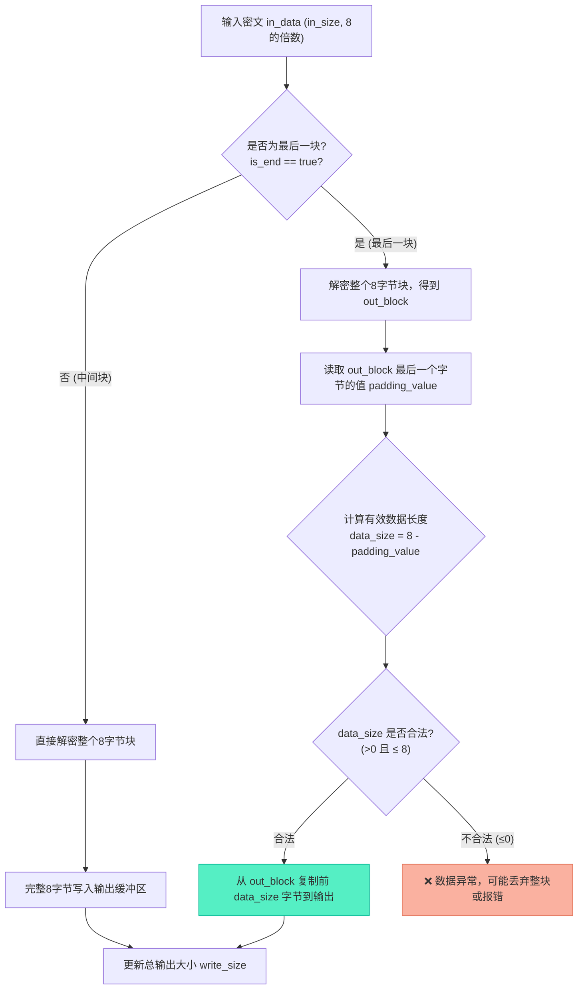

# XCrypt解密模块实现：填充移除与数据还原

> [!abstract] 核心导言
> 加密与解密是一对镜像操作。如果说加密的核心是“填充”，那么解密的核心便是“去填充”。`XCrypt::Decrypt` 函数肩负着将密文还原为原始明文的重任，它必须精确识别并移除加密时添加的 PKCS#5 填充字节。本节将深度拆解脱密流程，聚焦于如何通过密文块最后一个字节的值，逆向推算出有效数据长度，并安全地裁剪掉多余的填充，完成数据的完美复原。

---

## 一、对称的接口：解密函数定义

解密接口与加密接口保持高度对称，这是良好设计的体现。

### 1. 函数原型
```cpp
int Decrypt(const char* in_data, int in_size, char* out_data, bool is_end = false);
```
- **`in_data`**：输入密文数据指针。
- **`in_size`**：输入密文长度（字节）。对于有效的 DES 加密数据，其长度必然是 8 的倍数。
- **`out_data`**：输出明文缓冲区（**调用者需确保其容量足够**，通常不小于 `in_size`）。
- **`is_end`**：是否为最后一段数据。**仅当此标志为 `true` 时，才执行去除填充的操作**。[1](@context-ref?id=1)
- **返回值**：解密后的有效数据长度（字节），**可能因移除填充而小于 `in_size`**。

### 2. 核心职责
1.  **块解密**：将密文按 8 字节分块，使用 DES ECB 模式解密。
2.  **填充识别**：当 `is_end` 为真时，识别最后一块的填充模式。[1](@context-ref?id=2)
3.  **数据裁剪**：根据填充值，计算出原始数据长度，并从输出缓冲区中移除非数据字节。

---

## 二、解密流程与填充移除机制

解密的难点和精髓，完全在于对最后一块数据的“去填充”处理。

### 1. 整体处理流程
解密过程同样是循环处理每个 8 字节块，但对于最后一块，需要进行额外的逻辑判断。[1](@context-ref?id=3)



### 2. PKCS#5 填充移除原理
这是整个解密逻辑的核心。根据 PKCS#5 规则：
- 加密时，在数据末尾添加了 `N` 个值为 `N` 的字节。
- 因此，解密后，**最后一块的最后一个字节的值 `padding_value`，就等于添加的填充字节数**。

**有效数据长度计算公式**：

\[
\text{data\_size} = \text{BLOCK\_SIZE} - \text{padding\_value}
\]

其中 `BLOCK_SIZE = 8`。

**两种情况的推演**：
- **情况A（原始数据非8的倍数）**：假设原始数据 5 字节，填充了 3 个 `0x03`。解密后 `padding_value = 3`，则 `data_size = 8 - 3 = 5`，正确还原。
- **情况B（原始数据是8的倍数）**：原始数据 8 字节，填充了 8 个 `0x08`。解密后 `padding_value = 8`，则 `data_size = 8 - 8 = 0`。这意味着**整个最后一块都是填充，应全部丢弃**。[1](@context-ref?id=4)

### 3. 核心解密代码片段 (聚焦去填充)
```cpp
int XCrypt::Decrypt(const char* in_data, int in_size, char* out_data, bool is_end) {
    if (!in_data || in_size <= 0 || !out_data) return 0;
    
    const int BLOCK_SIZE = 8;
    int write_size = 0;
    DES_cblock in_block, out_block;
    
    for (int i = 0; i < in_size; i += BLOCK_SIZE) {
        // 1. 复制密文块
        memcpy(in_block, in_data + i, BLOCK_SIZE);
        // 2. 执行解密
        DES_ecb_encrypt(&in_block, &out_block, &key_sched_, DES_DECRYPT);
        
        int data_size = BLOCK_SIZE; // 默认整块有效
        
        // 3. 如果是最后一块且需要处理填充
        if (is_end && (i + BLOCK_SIZE >= in_size)) {
            // 获取填充值
            unsigned char padding_value = out_block[BLOCK_SIZE - 1];
            // 计算有效数据长度
            data_size = BLOCK_SIZE - padding_value;
            
            // 4. 有效性校验 (关键防御)
            if (data_size < 0 || data_size > BLOCK_SIZE) {
                // 数据异常，可能密文被篡改或密钥错误
                cerr << "padding size error!" << endl;
                data_size = 0; // 丢弃该块
            }
        }
        
        // 5. 复制有效数据到输出
        if (data_size > 0) {
            memcpy(out_data + write_size, out_block, data_size);
            write_size += data_size;
        }
    }
    return write_size;
}
```

---

## 三、测试验证：完整的加解密回路

只有通过解密还原出原始数据，才能证明整个加解密系统的正确性。

### 1. 测试代码
```cpp
#include <iostream>
#include “xcrypt.h”
using namespace std;

int main() {
    XCrypt crypt;
    crypt.Init(“12345678”); // 双方使用相同密钥
    
    char origin[] = “abcdefg”; // 原始数据：7字节
    char encrypted[1024] = {0};
    char decrypted[1024] = {0};
    
    // 1. 加密（指明是结尾）
    int en_size = crypt.Encrypt(origin, strlen(origin), encrypted, true);
    cout << “加密后大小: ” << en_size << endl; // 输出 8
    
    // 2. 解密（指明是结尾）
    int de_size = crypt.Decrypt(encrypted, en_size, decrypted, true);
    decrypted[de_size] = ‘\0’; // 添加字符串结束符
    cout << “解密后大小: ” << de_size << endl; // 输出 7
    cout << “解密后内容: ” << decrypted << endl; // 输出 abcdefg
    
    return 0;
}
```

### 2. 测试要点与结论
- **长度验证**：7 → 8 → 7，填充与去填充逻辑正确。
- **内容验证**：解密后的字符串与原始内容完全一致。
- **回路闭合**：加密和解密配合 `is_end` 参数，构成了一个完整、可靠的数据变换回路。

---

## 四、知识全景小结

| 知识维度 | 核心内容 | ⚠️ 工程重点/易错点 | 难度系数 |
| :--- | :--- | :--- | :--- |
| **接口对称性** | `Decrypt` 与 `Encrypt` 接口镜像，`is_end` 参数意义一致 | 必须成对使用相同的 `is_end` 值，否则填充逻辑错乱 | ⭐⭐⭐⭐ |
| **PKCS#5 移除原理** | 通过最后字节值 `padding_value` 计算有效数据长度 | 公式：`data_size = 8 - padding_value` | ⭐⭐⭐⭐⭐ |
| **边界情况处理** | `padding_value == 8` 时，`data_size = 0`，需丢弃整块 | 这是合法情况，而非错误，代表原始数据恰好为8的倍数 | ⭐⭐⭐⭐ |
| **数据有效性校验** | 检查 `data_size` 是否在 0 到 8 之间 | 超出范围意味着密文损坏、密钥错误或传输错误，必须处理 | ⭐⭐⭐⭐ |
| **错误处理** | 输出 “padding size error”，并安全丢弃异常块 | 避免因异常数据导致缓冲区越界或程序崩溃 | ⭐⭐⭐ |
| **测试验证** | 构建加密-解密回路，验证长度与内容的无损还原 | 这是验证算法实现正确性的唯一金标准 | ⭐⭐ |

> [!quote] 结语
> `Decrypt` 函数的实现，标志着 `XCrypt` 类完成了闭环。它不仅仅是将密文变回明文，更是对加密契约的严格履行——通过解读填充留下的“密码”，精准地还原数据的本来面貌。至此，一个健壮、可用的加解密核心模块已然建成，随时可以被注入到更庞大的多线程数据处理流水线中，发挥其安全守护者的价值。
