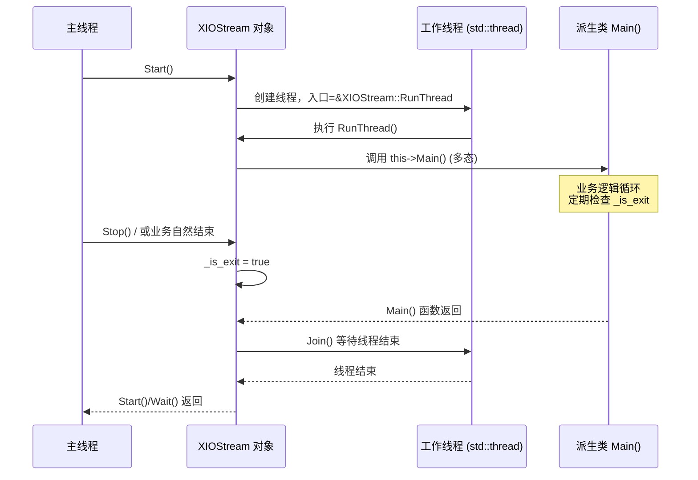

# 线程基类与文件读取任务：责任链模式下的IO引擎

> [!abstract] 核心导言
> 在基于责任链的批量文件加解密系统中，稳定、高效的数据供给是流水线的第一环。`XIOStream` 线程基类封装了多线程的通用生命周期管理，而 `XReadTask` 作为其首个具体实现，承担了从磁盘读取原始文件数据的重任。本节将深度拆解线程的启动、运行与优雅退出机制，并剖析文件读取任务中二进制模式、缓冲区大小与性能调优的关键决策。

---

## 一、线程基类 XIOStream：多线程的通用引擎

`XIOStream` 作为所有处理任务（读取、加解密、写入）的抽象基类，其核心价值在于将繁琐的线程管理逻辑封装起来，让派生类只需关注自身的业务逻辑（`Main`函数）。

### 1. 核心职责与成员
- **线程句柄**：使用 `std::thread _thread` 管理底层线程。
- **生命周期控制**：
    - `_is_exit`：线程退出标志，通过 `volatile` 修饰确保多线程可见性。
    - `Start()`：创建线程，并绑定到虚函数 `Main()`。
    - `Wait()`：等待线程自然结束，并处理可能的异常。
    - `Stop()`：请求线程退出（设置 `_is_exit` 标志）。
- **数据统计**：`_data_byte` 记录本任务处理的数据总量，用于监控和调试。
- **责任链链接**：提供 `SetNext()` 方法，用于将本任务与下游任务连接。

### 2. 线程入口与生命周期管理
派生类必须重写 `Main()` 虚函数，作为线程的执行体。基类通过 `_is_exit` 标志和 `Join()` 调用来实现优雅的启停控制。



---

## 二、文件读取任务 XReadTask：数据流的源头

`XReadTask` 继承自 `XIOStream`，是责任链的起点。它负责以二进制模式打开文件，并按固定大小的缓冲区循环读取数据，将原始数据块送入处理流水线。

### 1. 初始化：打开文件与获取元信息
`Init(const std::string& filename)` 函数完成准备工作：
1.  **验证与打开**：检查文件名有效性，以 `std::ios::binary` 模式打开文件。
    > [!warning] 二进制模式是铁律
    > 对于加解密操作，**必须使用二进制模式** (`ios::binary`)。文本模式会对换行符等进行转换，破坏数据完整性，导致加密后的文件无法正确解密。
2.  **获取大小**：通过 `seekg` 到文件尾，获取文件总大小，用于进度显示或调试。
3.  **重置指针**：将文件指针重置回开头 (`seekg(0)`)，准备读取。

### 2. 线程主循环：读取与推送
在重写的 `Main()` 函数中，任务进入读取循环。

```cpp
void XReadTask::Main() {
    const int BUFFER_SIZE = 10240; // 10KB 缓冲区
    char buffer[BUFFER_SIZE];
    
    while (!_is_exit) {
        // 1. 从文件读取一块数据
        _file.read(buffer, BUFFER_SIZE);
        std::streamsize bytes_read = _file.gcount();
        
        if (bytes_read > 0) {
            // 2. 打印调试信息（可选）
            std::cout << “read size: ” << bytes_read << std::endl;
            // 3. 更新统计数据
            _data_byte += bytes_read;
            // 4. 将数据块封装并推送给下游任务 (责任链传递)
            auto data_block = std::make_shared<XDataBlock>(buffer, bytes_read);
            _PushToNext(data_block); // 内部调用下游任务的 PushBack()
        }
        
        // 5. 检查文件是否结束
        if (_file.eof()) {
            break; // 读取完成，退出循环
        }
        
        // 6. 避免空转，短暂休眠（单线程测试时尤为重要）
        std::this_thread::sleep_for(std::chrono::milliseconds(1));
    }
    // 7. 发送结束信号给下游
    _PushEndSignalToNext();
}
```

```mermaid
flowchart TD
    A[“Main() 线程启动”] --> B[“分配缓冲区 (e.g., 10KB)”]
    B --> C{“循环条件: !_is_exit”}
    C --> D[“_file.read(buffer, size)”]
    D --> E{“读取成功 bytes_read > 0?”}
    E -- “是” --> F[“更新统计量 _data_byte”]
    F --> G[“封装数据块为 shared_ptr<XDataBlock>”]
    G --> H[“调用 _PushToNext 传递给下游”]
    E -- “否 (读到文件尾)” --> I[“break 跳出循环”]
    H --> J[“短暂休眠 std::sleep_for(1ms)”]
    J --> C
    I --> K[“向下游推送‘结束信号’数据块”]
    K --> L[“Main() 返回，线程结束”]
    
    style H fill:#55efc4,stroke:#00b894
```

---

## 三、工程实践与调试技巧

### 1. 缓冲区大小权衡
- **10KB (10240字节)** 是一个折中选择：足够大以减少IO次数，又不会单次分配过大内存导致池压力或延迟增高。
- **可调参数**：应根据实际硬件（SSD/HDD）和文件平均大小，将其设计为可配置参数。

### 2. 性能与CPU占用
- **单线程测试**：在 `Main()` 循环中加入短暂休眠 (`sleep_for(1ms)`)，可以防止在文件IO间隙CPU空转，占用率飙升至100%。[1](@context-ref?id=1)
- **多线程并发**：项目支持4-5个文件并行读取，这对于SSD可以有效提升吞吐量。但需注意磁盘IO的物理极限，并发数并非越多越好。

### 3. 调试与日志
- **关键日志点**：在 `Init` 中打印文件名和大小；在 `Main` 循环中打印每次读取的字节数。
- **生命周期标记**：在 `Start()` 和 `Main()` 开始/结束时打印标记，便于跟踪线程状态。
- **示例输出**：
    ```
    file: ./test.png size:747834
    read size: 10240
    read size: 10240
    ... 
    read size: 234 (最后一次)
    ```

---

## 四、知识全景小结

| 知识维度 | 核心内容 | ⚠️ 工程重点/易错点 | 难度系数 |
| :--- | :--- | :--- | :--- |
| **线程基类设计** | 封装 `std::thread`、`volatile _is_exit` 标志、`Start/Wait/Stop` 接口 | <span style=“color:#2ed573;”>通过虚函数 `Main()` 实现多态，是模板方法模式的典型应用</span> | ⭐⭐⭐⭐ |
| **优雅退出机制** | 工作线程循环检查 `_is_exit`，主线程通过 `Wait()` 等待 | 避免粗暴调用 `terminate`，确保资源被正确释放 | ⭐⭐⭐⭐ |
| **文件读取模式** | **必须使用 `std::ios::binary`** | 文本模式会篡改数据，导致加解密失败，是最常见的错误之一 | ⭐⭐⭐ |
| **缓冲区循环读取** | 固定大小缓冲区，循环读取直至 `eof()`，使用 `gcount()` 获取实际大小 | 正确处理最后一次读取的不完整块 | ⭐⭐⭐ |
| **责任链数据传递** | 读取后将数据封装为 `shared_ptr<XDataBlock>`，调用 `_PushToNext` | 数据所有权通过智能指针跨越线程边界安全传递 | ⭐⭐⭐⭐ |
| **性能调优** | 单线程加休眠防CPU空转；多线程并发读取利用SSD IOPS | 并发数需要实测，找到磁盘IO的甜蜜点 | ⭐⭐⭐ |
| **调试与日志** | 记录文件大小、每次读取字节数、线程生命周期事件 | 日志是验证IO正确性和诊断流水线阻塞点的关键 | ⭐⭐ |

> [!quote] 结语
> `XIOStream` 与 `XReadTask` 的完成，为整个加解密流水线装上了稳定可靠的“水泵”和“传送带”。基类对线程复杂度的隐藏，使得后续开发加密、写入任务时，可以专注于核心算法。而读取任务中对二进制模式的坚守、对缓冲区与性能的权衡，则体现了系统编程中对细节的敬畏。至此，数据已能从磁盘顺畅流出，等待着被注入加密改造的下一站。
