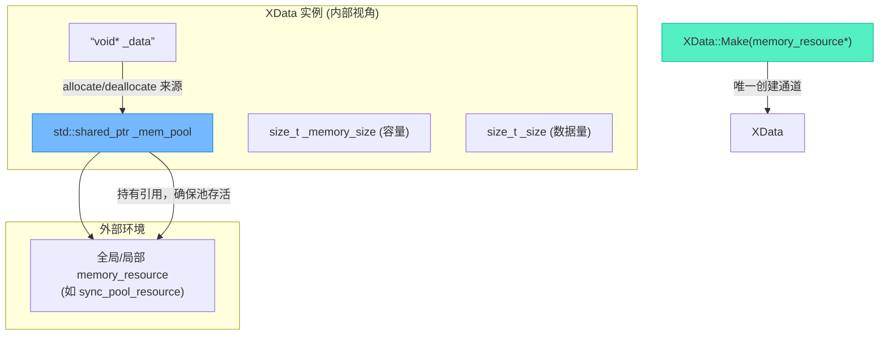

# XData数据块：基于内存池的安全内存管理封装

> [!abstract] 核心导言
> 在跨线程流水线中，数据块的生命周期横贯多个处理阶段，其内存管理必须是绝对安全且高效的。`XData` 类（或称 `XState`）正是为此而生：它通过智能指针持有内存池资源，将原始内存的申请与释放封装在对象生命周期内，并独创“双尺寸”管理策略，分离容量与用量。本节将深度拆解这一“内存池注入”设计模式，揭示其如何通过编译期约束保障线程安全与资源合规。

---

## 一、设计哲学：内存池注入与强封装

`XData` 的核心设计原则是 **“依赖注入”** 与 **“强封装”**。它不自持内存分配策略，而是由外部传入一个内存池对象，从而实现算法与存储的彻底解耦。

### 1. 关键设计决策
- **内存池注入**：构造函数接收一个 `std::pmr::memory_resource*` 或智能指针，以此作为所有内存操作的来源。
- **私有构造**：将构造函数设为 `private`，强制所有实例必须通过静态工厂方法 `Make` 创建。这确保了对象在诞生时就与一个有效的内存池绑定。
- **智能指针持有池**：使用 `std::shared_ptr<memory_resource>` 成员变量持有内存池。这保证了**`XData` 对象的生命周期绝不会长于它所依赖的内存池**，从根本上杜绝了悬垂指针。



---

## 二、核心实现：双尺寸管理与生命周期

### 1. 成员变量与含义
```cpp
class XData {
private:
    std::shared_ptr<std::pmr::memory_resource> _mem_pool; // 内存池智能指针
    void* _data = nullptr;                                 // 原始数据指针
    size_t _memory_size = 0;                               // 实际申请的内存容量
    size_t _size = 0;                                      // 有效数据长度
    
    // 私有构造函数，强制通过 Make 创建
    XData(std::pmr::memory_resource* pool);
public:
    static std::shared_ptr<XData> Make(std::pmr::memory_resource* pool);
    // ... 其他接口
};
```
- **`_memory_size` vs `_size`**：这是“双尺寸管理”的精髓。`_memory_size` 是向内存池申请的物理空间大小（容量）；`_size` 是当前存储的有效数据长度（用量）。二者可以不同，为数据增长预留了空间。[1](@context-ref?id=1)

### 2. 静态工厂方法：安全的对象诞生
`Make` 方法是创建 `XData` 的唯一合法途径。
```cpp
std::shared_ptr<XData> XData::Make(std::pmr::memory_resource* pool) {
    if (!pool) return nullptr; // 防御性编程
    // 使用 std::make_shared 分配 XData 对象本身（在堆上）
    auto ptr = std::make_shared<XData>(pool);
    // 此时，ptr->_mem_pool 已持有 pool 的智能指针
    return ptr;
}
```

### 3. 内存申请：`New` 方法
`New` 方法用于向注入的内存池申请指定大小的原始内存。
```cpp
bool XData::New(size_t mem_size) {
    if (mem_size <= 0) return false; // 防御：拒绝零大小申请
    if (!_mem_pool) return false;    // 防御：确保内存池有效
    
    // 释放旧内存（如果存在）
    if (_data) {
        _mem_pool->deallocate(_data, _memory_size);
    }
    
    // 申请新内存
    _data = _mem_pool->allocate(mem_size);
    if (!_data) return false; // 分配失败（理论上 bad_alloc，但做检查）
    
    _memory_size = mem_size;
    _size = 0; // 新内存，暂无有效数据
    return true;
}
```

### 4. 析构函数：安全的资源回收
析构函数确保资源在对象销毁时被正确归还给内存池。
```cpp
XData::~XData() {
    if (_data && _mem_pool) {
        _mem_pool->deallocate(_data, _memory_size);
        _data = nullptr;
        _memory_size = 0;
        _size = 0;
    }
}
```
> **[!important] 智能指针的保障**
> 由于 `_mem_pool` 是 `shared_ptr`，即使多个 `XData` 对象共享同一个内存池，也能保证在所有 `XData` 都销毁后，内存池的引用计数才归零，从而安全释放池本身。这完美解决了“池先于对象释放”的致命问题。

---

## 三、工程细节与最佳实践

### 1. 命名空间的使用规范
- **头文件 (.h/.hpp)**：**避免**使用 `using namespace std;`，以防止污染包含此头文件的全局命名空间。
- **实现文件 (.cpp)**：**可以使用** `using namespace std;` 和 `using namespace std::pmr;` 来简化代码，因为影响范围仅限于本文件。

### 2. 接口命名规范
遵循 Google C++ 风格指南：
- **成员变量**：以下划线结尾，如 `_size`。
- **公有方法**：使用驼峰命名，如 `SetSize()`。
- **私有方法**：同样使用驼峰命名。

### 3. 线程安全分析
- **内存池层面**：如果注入的是 `synchronized_pool_resource`，则 `allocate`/`deallocate` 调用本身是线程安全的。
- **XData 对象层面**：单个 `XData` 实例**不是线程安全的**。如果多个线程需要操作同一个 `XData`，外部必须加锁。但其设计确保了跨线程传递时（通过 `shared_ptr<XData>`），底层内存池资源是安全共享的。[1](@context-ref?id=2)

---

## 四、知识全景小结

| 知识维度 | 核心内容 | ⚠️ 工程重点/易错点 | 难度系数 |
| :--- | :--- | :--- | :--- |
| **设计模式** | **内存池依赖注入** + **静态工厂方法** | 通过私有构造函数强制使用工厂，保证初始化合法性 | ⭐⭐⭐⭐ |
| **智能指针持有池** | 使用 `shared_ptr<memory_resource>` 管理池生命周期 [1](@context-ref?id=3)| <span style=“color:#2ed573;”>确保数据块不会比内存池活得更久，根治悬垂指针</span> | ⭐⭐⭐⭐ |
| **双尺寸管理** | `_memory_size` (容量) 与 `_size` (数据量) 分离 | 允许预留空间，`SetSize()` 只改数据量，不改容量 | ⭐⭐⭐ |
| **内存申请释放** | `New()` 和析构函数中调用池的 `allocate`/`deallocate` | 释放时必须传入原始的 `_memory_size`，否则池记账错误 | ⭐⭐⭐⭐ |
| **防御性编程** | 检查指针非空、大小大于零 | 在 `New()` 和析构函数中进行有效性校验，增强鲁棒性 | ⭐⭐⭐ |
| **命名空间规范** | 头文件不用 `using namespace`，实现文件可以用 | 防止头文件污染全局命名空间，引发难以察觉的冲突 | ⭐⭐ |
| **线程安全** | 依赖底层内存池的线程安全性，对象本身非线程安全 | 跨线程传递 `shared_ptr<XData>` 安全，但并发修改需外部同步 | ⭐⭐⭐ |

> [!quote] 结语
> `XData` 类是一个教科书级别的资源管理封装范例。它将易错的原始指针操作、复杂的内存池生命周期协调，封装在简洁的接口与确定的RAII行为之下。通过“注入”与“持有”的设计，它完美地扮演了流水线中“数据搬运工”的角色，为后续实现 `XReadTask`、`XCryptTask` 提供了坚实、可靠的数据容器基础。
