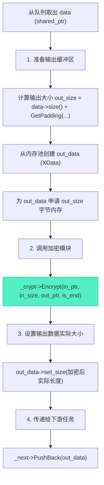

# XCryptTask加密线程：责任链中的核心处理器

> [!abstract] 核心导引
> 在文件加解密的流水线中，`XCryptTask` 扮演着承上启下的核心角色。它作为责任链的中间节点，从上游读取线程获取原始数据块，调用 `XCrypt` 模块进行加密或解密运算，再将处理后的数据块传递给下游写入线程。本节将深度拆解其如何集成加密模块、处理可变长度的数据填充，并实现线程间的协同与优雅终止。

---

## 一、加密线程的工作蓝图

`XCryptTask` 继承自 `XIOStream`，其 `Main()` 函数是线程执行的引擎，遵循经典的生产者-消费者循环。

### 1. 线程主循环框架
```cpp
void XCryptTask::Main() {
    cout << “begin XCryptTask::Main” << endl;
    while (!_is_exit) {
        // 1. 从本任务队列中取出一个数据块
        auto data = PopFront();
        // 2. 队列为空则休眠等待
        if (!data) {
            this_thread::sleep_for(10ms);
            continue;
        }
        // 3. 处理数据块 (核心逻辑)
        ProcessData(data);
    }
    cout << “end XCryptTask::Main” << endl;
}
```
- **数据驱动**：线程活动由数据可用性驱动，无数据时主动休眠 (`sleep_for`)，避免CPU空转。
- **退出条件**：循环检查基类的 `_is_exit` 标志，支持外部请求优雅退出。

### 2. 核心处理流程 `ProcessData`
这是加密线程的心脏，负责协调内存、算法与数据流。



---

## 二、与XCrypt模块的集成

`XCryptTask` 并不直接实现算法，而是持有并调用独立的 `XCrypt` 对象。

### 1. 依赖管理与初始化
- **前置声明降低依赖**：在头文件中使用 `class XCrypt;` 前置声明，而非 `#include “xcrypt.h”`。这降低了 `XCryptTask` 调用者对 OpenSSL 库的间接依赖，提高了模块的封装性和可替换性。[1](@context-ref?id=1)
- **智能指针持有**：使用 `std::shared_ptr<XCrypt> _crypt` 成员变量管理加密模块的生命周期。
- **初始化接口**：提供 `Init(const std::string& password)` 方法，内部创建 `XCrypt` 对象并调用其 `Init`。

### 2. 密钥处理规范
- **长度标准化**：DES 算法要求密钥为 8 字节。`XCrypt::Init` 内部会将输入的密码字符串截断或补零至 8 字节。
- **一处初始化**：密钥在流水线启动前，通过 `XCryptTask::Init` 一次性设置好，后续所有数据块共享此密钥上下文。

---

## 三、核心难点：数据填充处理

分组加密算法要求输入数据长度是块大小的整数倍。处理非整块数据，特别是流水线中的流式数据，是主要挑战。

### 1. 填充计算：`GetPadding` 方法
`XCrypt` 模块提供一个辅助方法，用于计算需要填充的字节数。
```cpp
int XCrypt::GetPadding(int data_size) const {
    const int BLOCK_SIZE = 8; // DES 块大小
    int padding = BLOCK_SIZE - (data_size % BLOCK_SIZE);
    // 特殊情形：如果数据恰好是块的整数倍，仍需填充一个完整块
    if (padding == BLOCK_SIZE) {
        padding = BLOCK_SIZE; // 填充8个0x08
    }
    return padding;
}
```
**公式解析**：`padding = BLOCK_SIZE - (data_size % BLOCK_SIZE)`[1](@context-ref?id=2)
- 例如，`data_size = 13`，则 `13 % 8 = 5`，`padding = 8 - 5 = 3`。
- 当 `data_size % BLOCK_SIZE == 0` 时，`padding = 8`。这是 PKCS#5 规范的要求，以便解密时能无歧义地移除填充。

### 2. 输出缓冲区的分配策略
加密输出的长度会因填充而增加。分配输出缓冲区时有两大策略：
- **精确计算（推荐）**：`output_size = input_size + GetPadding(input_size)`。内存利用率最高。
- **保守估计**：`output_size = input_size + 128`（或其他固定值）。实现简单，避免频繁计算，但可能浪费少量内存。适用于性能敏感且块大小固定的场景。

在 `XCryptTask` 中，应采用精确计算，以契合内存池高效利用的设计目标。

---

## 四、文件结束处理与信号传递

流水线必须知道何时处理最后一块数据，以便触发填充并通知下游任务结束。

### 1. 结束标志的传递
- **源头标记**：`XReadTask` 在检测到文件结束 (`_file.eof()`) 后，在它发出的最后一个 `XData` 块上设置结束标志（例如调用 `data->set_end(true)`）。[1](@context-ref?id=3)
- **传递与使用**：`XCryptTask` 在处理每个 `data` 时，需要检查该标志。当 `is_end == true` 时，调用 `_crypt->Encrypt(..., is_end)`，触发对该最后一块数据的填充逻辑。
- **继续传递**：加密处理完成后，`XCryptTask` 需要将结束标志携带到输出的 `out_data` 中，继续传递给下游的 `XWriteTask`，以便写入线程在写完最后一块后安全关闭文件。[1](@context-ref?id=4)[](@image-ref?id=4)

### 2. 线程终止
- **自然终止**：当 `XCryptTask` 从队列中取到一个携带结束标志的数据块，并且处理完毕后，它可以安全地退出 `Main()` 循环（即使 `_is_exit` 为 `false`）。[1](@context-ref?id=5)
- **外部终止**：主线程或上游异常时，可通过调用 `Stop()` 设置 `_is_exit = true`，请求线程退出。

---

## 五、知识全景小结

| 知识维度 | 核心内容 | ⚠️ 工程重点/易错点 | 难度系数 |
| :--- | :--- | :--- | :--- |
| **线程角色** | 责任链中的消费者-生产者，调用加密模块 | 需妥善处理队列空转与数据就绪的平衡 | ⭐⭐⭐⭐ |
| **模块集成** | 通过 `shared_ptr<XCrypt>` 持有算法模块，头文件使用前置声明 [1](@context-ref?id=6)| <span style=“color:#2ed573;”>降低编译依赖，隔离算法变化</span> | ⭐⭐⭐⭐ |
| **填充计算** | `GetPadding` 计算需添加的字节数，遵循 PKCS#5 | 当数据长度恰好为块整数倍时，需填充**完整一个块** | ⭐⭐⭐⭐⭐ |
| **输出缓冲区** | 大小 = 输入大小 + 填充大小，从共享内存池分配 | 必须精确计算或保守估计，防止缓冲区溢出 | ⭐⭐⭐⭐ |
| **结束信号传递** | 读取线程标记末尾数据块，加密线程识别并传递该标志 [1](@context-ref?id=7)| 标志需在责任链中穿透传递，确保每个环节都知道“最后一刻” | ⭐⭐⭐⭐ |
| **密钥管理** | 在线程启动前一次性初始化，所有数据块共用 | 密钥字符串需在算法模块内部被标准化为固定长度 | ⭐⭐⭐ |
| **错误处理** | 加密操作可能失败，需检查返回值并做相应处理 | 考虑加密失败时是丢弃数据、重试还是终止流水线 | ⭐⭐⭐⭐ |

> [!quote] 结语
> `XCryptTask` 的成功实现，标志着加解密流水线的“中央处理器”正式就位。它绝非简单的函数调用封装，而是融合了**流式数据计算**、**动态内存规划**与**多线程协同**的复杂构件。理解其对填充的精细处理和对结束信号的忠实传递，就掌握了构建可靠数据处理流水线的核心心法。至此，数据已被赋予密码学的保护，只待最终落盘。
