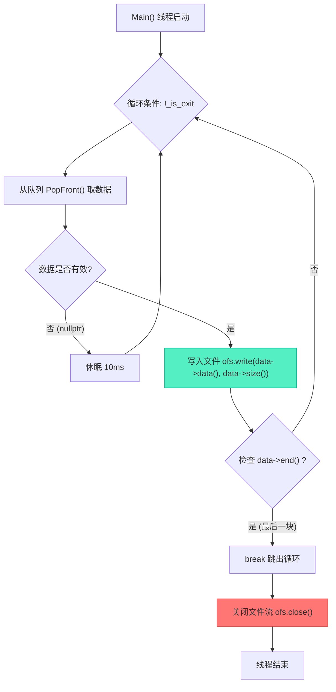

# XWriteTask 写入任务实现与完整加解密流水线验证

> [!abstract] 核心导言
> 作为责任链的终点，`XWriteTask` 肩负着将处理后的数据安全、完整写入磁盘的最终使命。它继承了 `XIOStream` 的线程管理与队列通信能力，专注于文件 IO 操作。本节将完整实现写入任务，并串联起读取 (`XReadTask`)、加密 (`XCryptTask`)、写入 (`XWriteTask`) 三大模块，构建一个可验证的完整加解密流水线，从而打通从源文件到加密产出的全链路。

---

## 一、XWriteTask 写入任务实现

`XWriteTask` 是责任链的最终环节，作为纯消费者，从上游加密线程获取数据并写入文件。

### 1. 类定义与初始化
- **继承关系**：公有继承自 `XIOStream`，获得线程管理与队列通信能力。
- **初始化方法 `Init`**：
    - **返回值**：使用 `bool` 类型，用于处理文件权限等可能出现的打开失败情况。
    - **打开模式**：**必须使用二进制模式** (`std::ios::binary`)，以确保写入的字节与加密输出完全一致，避免文本模式下的字符转换破坏数据。
    - **错误处理**：失败时输出 `"文件打开失败"`，成功时输出 `"open success"` 以便调试。

```cpp
class XWriteTask : public XIOStream {
public:
    bool Init(const std::string& filename) {
        _ofs.open(filename, std::ios::binary);
        if (!_ofs.is_open()) {
            std::cerr << "文件打开失败" << std::endl;
            return false;
        }
        std::cout << "open success" << std::endl;
        return true;
    }
    // ... 其他成员
private:
    std::ofstream _ofs; // 文件输出流
};
```

### 2. 线程主循环 (`Main`)
写入线程作为消费者，其主循环逻辑与加密线程类似，但核心动作是写入文件。

```cpp
void XWriteTask::Main() {
    std::cout << "begin XWriteTask::Main" << std::endl;
    while (!_is_exit) {
        // 1. 从队列取出数据
        auto data = PopFront();
        // 2. 队列为空则休眠，避免空转
        if (!data) {
            std::this_thread::sleep_for(std::chrono::milliseconds(10));
            continue;
        }
        // 3. 写入数据到文件
        _ofs.write((const char*)data->data(), data->size());
        // 4. 检查结束标志，若为最后一块则退出循环
        if (data->end()) {
            break;
        }
    }
    // 5. 关闭文件流，确保缓冲区数据刷入磁盘
    _ofs.close();
    std::cout << "end XWriteTask::Main" << std::endl;
}
```

### 3. 关键实现细节
- **休眠策略**：使用 `std::this_thread::sleep_for(10ms)` 避免队列空时的 CPU 忙等待。
- **结束标志**：通过检查 `data->end()` 判断是否为最后一块数据，是则退出循环，确保文件写入完整。
- **资源释放**：**必须显式调用 `_ofs.close()`**，以确保输出流缓冲区中的数据被强制写入磁盘。依赖析构函数有时可能因异常路径而导致数据丢失。[1](@context-ref?id=1)



---

## 二、完整加解密流水线构建与验证

### 1. 任务链构建
在 `main` 函数或控制器中，需要按顺序创建任务、设置内存池、建立责任链，并正确启动和等待线程。

```cpp
int main() {
    // 1. 创建全局线程安全内存池
    auto mp = std::make_shared<std::pmr::synchronized_pool_resource>();
    
    // 2. 创建三个任务实例
    auto rt = std::make_shared<XReadTask>();   // 读取任务
    auto ct = std::make_shared<XCryptTask>();  // 加密任务
    auto wt = std::make_shared<XWriteTask>();  // 写入任务
    
    // 3. 初始化各任务
    rt->Init("./img/test.png");          // 读取任务绑定输入文件
    ct->Init("12345678");                // 加密任务设置密钥
    wt->Init("./test_out.prg");          // 写入任务指定输出路径
    
    // 4. 为任务注入共享的内存池
    rt->set_mem_pool(mp);
    ct->set_mem_pool(mp);
    wt->set_mem_pool(mp);
    
    // 5. 建立责任链：读取 -> 加密 -> 写入
    rt->set_next(ct);
    ct->set_next(wt);
    
    // 6. 按顺序启动线程（建议生产者先行）
    rt->Start();
    ct->Start();
    wt->Start();
    
    // 7. 等待所有线程完成任务（至关重要！）
    rt->Wait();
    ct->Wait();
    wt->Wait();
    
    std::cout << "所有任务完成" << std::endl;
    return 0;
}
```

### 2. 关键步骤与注意事项
- **内存池共享**：所有任务必须注入**同一个**内存池实例 (`mp`)，这是跨线程高效复用内存的基础。
- **责任链链接**：通过 `set_next` 建立单向链，数据将从 `rt` 流向 `ct` 再流向 `wt`。
- **启动顺序**：理论上，生产者 (`rt`) 应先于消费者 (`ct`, `wt`) 启动，但线程调度可能导致任何顺序。这里按逻辑顺序启动。
- **等待机制 (`Wait`)**：**必须调用每个任务的 `Wait()` 方法**，确保主线程等待所有工作线程完成。否则，主线程可能提前退出，导致进程终止，工作线程被强行中断，造成数据丢失或不完整。

### 3. 验证方法
- **输出文件检查**：验证生成的文件 `./test_out.prg` 是否存在，其大小应为 **747840 字节**（对应于原始测试文件 `test.png` 加密并填充后的预期大小）。[1](@context-ref?id=2)
- **进程退出码**：程序应正常退出，退出代码为 0。若出现异常终止，需检查线程同步与资源释放逻辑。
- **后续解密验证**：本阶段仅完成加密写入流程的验证。完整的正确性验证需后续进行解密还原，确认解密后的文件与原始文件完全一致。[1](@context-ref?id=3)

---

## 三、知识全景小结

| 知识维度 | 核心内容 | ⚠️ 工程重点/易错点 | 难度系数 |
| :--- | :--- | :--- | :--- |
| **XWriteTask 类实现** [1](@context-ref?id=4)| 继承 `XIOStream`，管理 `ofstream`，实现 `Init` 和 `Main` | 文件打开必须用 `ios::binary` 模式；需显式 `close()` | ⭐⭐ |
| **写入逻辑** | 循环 `PopFront`、判空休眠、写入文件、检查结束标志 | 无数据时需休眠，避免 CPU 空转；依赖 `end()` 标志确定文件边界 | ⭐⭐ |
| **线程同步与等待** | 主线程必须调用每个任务的 `Wait()` 等待其完成 | 缺少 `Wait()` 会导致主线程提前退出，进程终止，任务中断 | ⭐⭐⭐⭐ |
| **完整流水线构建** | 创建池和任务 → 初始化 → 注入池 → 链接责任链 → 启动 → 等待 | 所有任务共享同一内存池；`set_next` 建立单向链；启动顺序虽不严格但建议合理 | ⭐⭐⭐ |
| **验证与调试** | 检查输出文件大小、进程退出码；后续需解密验证完整性 | 加密后文件大小为原始大小加填充，需计算预期值；调试时添加日志追踪数据流 | ⭐⭐⭐ |
| **错误处理** | `Init` 返回 `bool`，处理权限等问题；写入失败需考虑异常处理 | 文件打开失败应反馈；写入过程一般不会失败，但磁盘满等情况也需考虑 | ⭐⭐ |

> [!quote] 结语
> `XWriteTask` 的完成与整个责任链的贯通，标志着基于内存池的多线程文件加解密系统核心架构已全部落地。它演示了如何将复杂的异步处理分解为独立的、可测试的任务单元，并通过清晰的接口与协议进行串联。牢记**二进制模式**、**显式关闭文件**与**线程等待**这三个血泪教训般的要点，你的流水线将能稳定地将加密数据交付给物理存储。至此，一个具备生产级潜力的数据加解密引擎已具雏形。[1](@context-ref?id=5)[](@image-ref?id=5)
