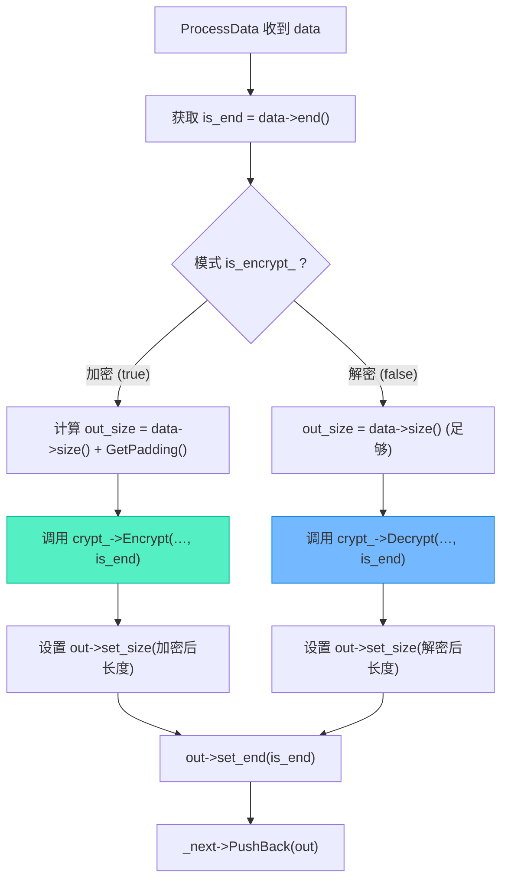

# 完整闭环：文件加解密模式切换与端到端测试验证

> [!abstract] 核心导言
> 一个健壮的加解密系统，不仅要能“加”，更要能“解”。本节将完成项目的最后一块拼图：实现解密流程，并通过 `is_encrypt` 标志在同一套代码中无缝切换加解密模式。核心挑战在于正确处理解密时的数据收缩与填充移除，尤其是依赖 `is_end` 标志精准定位最后一块数据。最终，通过图片与文本文件的端到端测试，验证整个系统“加密-解密”闭环的完整性与数据保真度。

---

## 一、解密流程架构：复用与调整

解密流程并非全新开发，而是在成熟的加密流程框架上进行针对性调整。

### 1. 架构复用原则
- **任务链不变**：保持 `XReadTask -> XCryptTask -> XWriteTask` 的责任链结构。
- **线程池独立**：加密与解密可使用独立的线程池实例，避免任务间相互干扰，但更常见的做法是复用同一套线程管理机制。
- **核心调整**：关键在于 `XCryptTask` 内部的行为切换，以及输入输出文件的指向。

### 2. 代码实现：构建解密链
与加密链构建几乎一致，仅需改变任务初始化的参数。
```cpp
// 1. 创建共享内存池
auto mp = std::make_shared<std::pmr::synchronized_pool_resource>();
// 2. 创建任务实例
auto rt = std::make_shared<XReadTask>();
auto ct = std::make_shared<XCryptTask>();
auto wt = std::make_shared<XWriteTask>();
// 3. 初始化：关键变化在此！
rt->Init("./test_out.prg");   // 读取的是**加密后**的文件
ct->Init(“12345678”);         // 密钥必须与加密时一致
wt->Init(“./test_dec.png”);   // 输出解密后的文件
// 4. 注入内存池、建立责任链、启动、等待（与加密流程完全相同）
rt->set_mem_pool(mp); ct->set_mem_pool(mp); wt->set_mem_pool(mp);
rt->set_next(ct); ct->set_next(wt);
rt->Start(); ct->Start(); wt->Start();
rt->Wait(); ct->Wait(); wt->Wait();
```

---

## 二、加解密模式切换：`is_encrypt` 标志

为了让 `XCryptTask` 既能加密也能解密，我们引入一个模式开关。

### 1. 成员变量与接口
在 `XCryptTask` 类中添加私有成员和设置方法。
```cpp
class XCryptTask {
private:
    bool is_encrypt_ = true; // 默认模式为加密
    std::shared_ptr<XCrypt> crypt_; // 算法模块
public:
    void set_is_encrypt(bool encrypt) { is_encrypt_ = encrypt; }
    // ... 其他成员
};
```

### 2. `ProcessData` 中的模式分流
在核心处理函数中，根据 `is_encrypt_` 标志决定调用加密或解密算法。
```cpp
void XCryptTask::ProcessData(std::shared_ptr<XData> data) {
    // 1. 准备输出缓冲区
    int out_size = data->size();
    if (is_encrypt_) {
        // 加密：输出可能变大，需计算填充
        out_size += crypt_->GetPadding(data->size());
    }
    // 解密：输出可能变小，但缓冲区大小暂与输入相同（足够）
    auto out = XData::Make(_mem_pool);
    out->New(out_size);
    
    // 2. 获取关键的 is_end 标志
    bool is_end = data->end();
    
    // 3. 模式分流，调用算法
    int result_size = 0;
    if (is_encrypt_) {
        result_size = crypt_->Encrypt(
            (char*)data->data(), data->size(),
            (char*)out->data(), is_end // 传递 is_end!
        );
    } else {
        result_size = crypt_->Decrypt(
            (char*)data->data(), data->size(),
            (char*)out->data(), is_end // 传递 is_end!
        );
    }
    
    // 4. 设置输出数据实际大小并传递
    out->set_size(result_size);
    out->set_end(is_end); // 结束标志原样传递给下游
    if (_next) _next->PushBack(out);
}
```



---

## 三、核心难点：`is_end` 标志与填充处理

`is_end` 是贯穿整个责任链、确保加解密正确的“生命线”。

### 1. `is_end` 的作用机制
- **起源**：在 `XReadTask` 中，当读取到文件末尾时，它为最后一个 `XData` 块调用 `data->set_end(true)`。
- **传递**：该标志随着 `XData` 块在责任链中向下游传递，`XCryptTask` 和 `XWriteTask` 都能读取到。
- **关键用途**：**仅在 `is_end` 为 `true` 时，`XCrypt` 的 `Encrypt` 和 `Decrypt` 函数才会执行填充或去除填充的操作**。这是处理最后一块非整块数据的唯一依据。[1](@context-ref?id=1)

### 2. 一个致命的错误与修正
如果忘记将 `is_end` 传递给 `Encrypt`/`Decrypt` 函数，会导致：
- **加密时**：最后一块数据不会被填充，长度不是8的倍数，破坏密文结构。
- **解密时**：无法识别并移除最后一块的填充字节，导致解密后数据尾部包含乱码，文件大小错误。[1](@context-ref?id=2)

**修正**：必须确保在 `XCryptTask::ProcessData` 中，从 `data` 提取 `is_end`，并作为参数传递给 `crypt_->Encrypt(...， is_end)` 或 `crypt_->Decrypt(...， is_end)`。[1](@context-ref?id=3)

---

## 四、测试验证：从单元到集成

### 1. 单元测试：算法核心
首先验证 `XCrypt` 类本身的加解密是否正确。
```cpp
XCrypt crypt;
crypt.Init(“12345678”);
char out[1024] = {0};
// 加密
int en_size = crypt.Encrypt(“abcdefg”, 7, out, true);
cout << “加密后大小:” << en_size << endl; // 应为8
// 解密
char dec_out[1024] = {0};
int de_size = crypt.Decrypt(out, en_size, dec_out, true);
dec_out[de_size] = ‘\0’;
cout << “解密后内容:” << dec_out << endl; // 应为 “abcdefg”
```

### 2. 集成测试：文件闭环
1.  **加密测试**：运行加密流程，输入 `test.png` (747834字节)，输出 `test_out.prg`。验证输出文件大小正确（应为 `747834 + 填充`）。
2.  **解密测试**：运行解密流程，输入 `test_out.prg`，输出 `test_dec.png`。**黄金标准**：`test_dec.png` 应与原始的 `test.png` **每个字节都完全相同**。[1](@context-ref?id=4)
3.  **验证工具**：对于图片，肉眼观察可能可行（因格式容错）。但对于文本文件，**必须使用二进制比较工具**（如 `fc /b` on Windows, `diff` on Linux）进行精确比对，1字节的差异都意味着失败。

### 3. 不同文件类型的测试意义
- **图片文件**：具有一定容错性，末尾少量字节错误可能不影响显示，但**不能**作为程序正确的证明。[1](@context-ref?id=5)
- **文本文件**：对字节极其敏感，是验证算法和流程正确性的**试金石**。应优先使用 `.txt`、`.cpp` 等文本文件进行测试。

---

## 五、知识全景小结

| 知识维度 | 核心内容 | ⚠️ 工程重点/易错点 | 难度系数 |
| :--- | :--- | :--- | :--- |
| **解密流程构建** | 复用加密框架，调整输入输出文件指向 | 密钥必须与加密时完全一致，否则解密失败 | ⭐⭐ |
| **模式切换设计** | 在 `XCryptTask` 中使用 `is_encrypt_` 布尔标志分流 | 提供 `set_is_encrypt()` 接口，默认值为 `true` (加密) [1](@context-ref?id=6)| ⭐⭐⭐ |
| **`is_end` 生命线** | 标识最后一块数据，控制填充/去填充的触发 [1](@context-ref?id=7)| <span style=“color:#ff4757;”>**必须**从数据块提取并传递给 `Encrypt`/`Decrypt` 函数</span> | ⭐⭐⭐⭐⭐ |
| **数据大小变化** | 加密可能膨胀（填充），解密可能收缩（去填充） [1](@context-ref?id=8)| 输出缓冲区分配需考虑此变化，解密时 `set_size` 要用实际结果 | ⭐⭐⭐⭐ |
| **单元测试** | 单独测试 `XCrypt` 类的加解密回路 | 验证字符串等小数据能无损往返 | ⭐⭐ |
| **集成测试** | 全链路文件测试，比较原始文件与解密后文件 | **必须使用二进制比对工具**，确保字节级一致 | ⭐⭐⭐ |
| **测试素材选择** | 图片文件有容错性，文本文件是金标准 | 用文本文件测试能暴露更细微的错误 | ⭐⭐ |

> [!quote] 结语
> 实现解密并完成端到端测试，标志着项目从一个“加密工具”蜕变为一个完整的“加解密系统”。`is_encrypt` 标志赋予了代码双重人格，而 `is_end` 标志的忠实传递则是维系数据完整性的神经束。记住，真正的成功不是加密后文件打不开，而是解密后的文件与原始文件**比特级完全相同**。通过文本文件的严苛测试，你将获得对系统可靠性的绝对信心。
