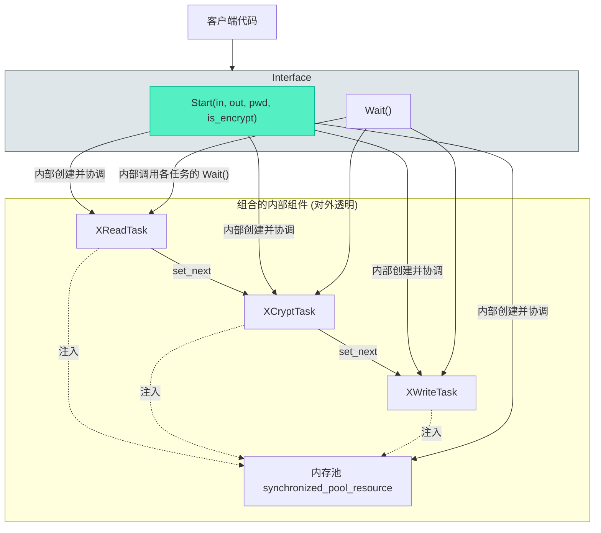

# XFileCrypt：组合模式下的统一加解密接口

> [!abstract] 核心导言
> 历经读取、加密、写入等多个独立线程任务的实现后，项目需要一个简洁、统一的“指挥中心”来协调整个流水线。`XFileCrypt` 类应运而生，它采用**组合模式**，将 `XReadTask`、`XCryptTask`、`XWriteTask` 三个核心组件装配成一个完整的黑盒，对外仅暴露 `Start()` 和 `Wait()` 两个接口。本节将解析这一顶层封装的设计，展示如何通过一个类提供完整的文件加解密服务，极大简化客户端代码的复杂度。

---

## 一、XFileCrypt 类设计：化繁为简的接口

`XFileCrypt` 的核心设计哲学是**封装**与**组合**。它不实现具体业务逻辑，而是作为装配工和调度员。

### 1. 类定义与成员
```cpp
class XFileCrypt {
public:
    bool Start(const std::string& infile, 
               const std::string& outfile, 
               const std::string& password, 
               bool is_encrypt);
    void Wait();
private:
    std::shared_ptr<XReadTask> rt_;
    std::shared_ptr<XCryptTask> ct_;
    std::shared_ptr<XWriteTask> wt_;
    // 可持有内存池，或在Start内部创建
};
```
- **单一职责**：`Start` 方法封装了从创建内存池、初始化任务、建立责任链到启动线程的全部流程。
- **资源管理**：使用 `std::shared_ptr` 管理三个任务对象，生命周期与 `XFileCrypt` 实例绑定。[1](@context-ref?id=1)
- **接口纯净**：用户无需关心内存池、线程同步、责任链等复杂概念，只需提供输入输出路径、密码和操作类型。

### 2. 组合模式的优势
- **高内聚**：将紧密相关的三个任务对象聚合在一个类中，逻辑上形成一个完整的“加解密器”。
- **低耦合**：客户端代码与底层任务实现完全解耦，底层组件的升级或替换不会影响客户端接口。
- **易于使用**：将原本需要十几行代码的初始化流程简化为一个方法调用。



---

## 二、Start方法实现：一站式流水线装配

`Start` 方法是 `XFileCrypt` 的灵魂，它将分散的步骤整合为一个连贯的流程。[1](@context-ref?id=2)[](@image-ref?id=2)

### 1. 实现步骤拆解
```cpp
bool XFileCrypt::Start(const std::string& infile, 
                       const std::string& outfile, 
                       const std::string& password, 
                       bool is_encrypt) {
    // 1. 创建线程安全内存池（整个流水线的内存来源）
    auto mp = std::make_shared<std::pmr::synchronized_pool_resource>();
    
    // 2. 创建三个任务对象
    rt_ = std::make_shared<XReadTask>();
    ct_ = std::make_shared<XCryptTask>();
    wt_ = std::make_shared<XWriteTask>();
    
    // 3. 初始化各任务
    if (!rt_->Init(infile)) return false;   // 设置输入文件
    ct_->Init(password);                    // 设置密钥
    ct_->set_is_encrypt(is_encrypt);        // 设置加解密模式
    if (!wt_->Init(outfile)) return false;  // 设置输出文件
    
    // 4. 为所有任务注入同一个内存池
    rt_->set_mem_pool(mp);
    ct_->set_mem_pool(mp);
    wt_->set_mem_pool(mp);
    
    // 5. 建立责任链：读取 -> 加解密 -> 写入
    rt_->set_next(ct_);
    ct_->set_next(wt_);
    
    // 6. 按顺序启动所有线程
    rt_->Start();
    ct_->Start();
    wt_->Start();
    
    return true;
}
```

### 2. 关键设计决策
- **内存池生命周期**：在 `Start` 内部创建内存池，并由各任务的 `shared_ptr` 成员持有。这确保了内存池的生命周期覆盖整个任务执行期。
- **错误处理**：`Init` 方法返回 `bool`，`Start` 应检查并传播错误，例如文件打开失败时立即返回 `false`。
- **模式设置**：通过 `ct_->set_is_encrypt(is_encrypt)` 让加密任务知晓当前是加密还是解密操作。

---

## 三、Wait方法实现：同步与资源清理

`Wait` 方法负责同步主线程与工作线程，是流程结束的保障。

```cpp
void XFileCrypt::Wait() {
    if (rt_) rt_->Wait();
    if (ct_) ct_->Wait();
    if (wt_) wt_->Wait();
    // 可选：在此处重置智能指针，或由析构函数处理
}
```
- **防御性检查**：检查智能指针是否有效（`if (rt_)`），避免在未调用 `Start` 或 `Start` 失败时调用 `Wait` 导致崩溃。
- **顺序等待**：等待顺序不重要，因为线程间已有数据依赖，但按创建顺序等待是一种好习惯。
- **资源释放**：`Wait` 完成后，各任务线程已结束，其占用的系统资源（如线程句柄）已被回收。内存池等资源随着 `shared_ptr` 引用计数归零而自动释放。

---

## 四、应用案例：完整的加解密测试闭环

使用 `XFileCrypt`，客户端代码变得极其简洁，可以轻松构建测试闭环。

### 1. 测试代码示例
```cpp
#include “xfile_crypt.hpp”
#include <iostream>
int main() {
    std::string password = “12345678”;
    
    // 1. 加密测试
    std::cout << “开始加密...” << std::endl;
    auto encrypter = std::make_shared<XFileCrypt>();
    encrypter->Start(“test.txt”, “test_enc.txt”, password, true);
    encrypter->Wait();
    std::cout << “加密完成。” << std::endl;
    
    // 2. 解密测试
    std::cout << “\n开始解密...” << std::endl;
    auto decrypter = std::make_shared<XFileCrypt>();
    decrypter->Start(“test_enc.txt”, “test_dec.txt”, password, false);
    decrypter->Wait();
    std::cout << “解密完成。” << std::endl;
    
    // 3. 验证：使用二进制比较工具验证 test.txt 与 test_dec.txt 完全一致
    return 0;
}
```

### 2. 批量文件处理潜力
由于每个 `XFileCrypt` 实例独立管理一套流水线，可以轻松扩展为批量处理：
```cpp
std::vector<std::shared_ptr<XFileCrypt>> tasks;
for (const auto& file : file_list) {
    auto task = std::make_shared<XFileCrypt>();
    task->Start(file.input, file.output, password, true);
    tasks.push_back(task);
}
// 等待所有任务完成
for (auto& task : tasks) {
    task->Wait();
}
```

---

## 五、知识全景小结

| 知识维度 | 核心内容 | ⚠️ 工程重点/易错点 | 难度系数 |
| :--- | :--- | :--- | :--- |
| **组合模式应用** | 将三个任务对象组合为单一接口类，提供完整服务 | 类内聚合，而非继承，明确 `has-a` 关系 | ⭐⭐⭐ |
| **接口设计** | 提供 `Start` (含所有参数) 和 `Wait` 两个核心接口 | 接口应尽可能简单稳定，隐藏内部复杂装配过程 | ⭐⭐⭐⭐ |
| **资源生命周期** | 在 `Start` 内创建内存池，由任务智能指针持有 | 确保池的生命周期长于所有任务，避免悬垂指针 | ⭐⭐⭐⭐ |
| **错误处理** | `Start` 返回 `bool`，检查文件打开等初始化步骤 | 将底层任务的失败向上传播，让调用者感知 | ⭐⭐⭐ |
| **线程同步** | `Wait` 内部调用各任务的 `Wait`，实现主线程同步 | 必须调用 `Wait`，否则主线程退出可能导致任务中断 | ⭐⭐⭐ |
| **客户端简化** | 将十几行初始化代码简化为两行 (`Start` + `Wait`) | 这是封装价值的直接体现，提升代码可读性和可维护性 | ⭐⭐ |
| **扩展性** | 每个实例独立，天然支持多文件并行处理 | 为批量处理场景提供了清晰的架构模型 | ⭐⭐⭐ |

> [!quote] 结语
> `XFileCrypt` 类的完成，标志着项目从“一组零件”进化成了“一台整机”。它通过精妙的组合与封装，将底层复杂的内存池、多线程、责任链、加解密算法等技术细节，包装成一个开箱即用的工具。这不仅极大地提升了代码的可用性，更示范了如何通过良好的顶层设计，将技术复杂度转化为用户友好的生产力。至此，一个具备工程实用价值的文件加解密库已全部竣工。[1](@context-ref?id=3)[](@image-ref?id=3)
````