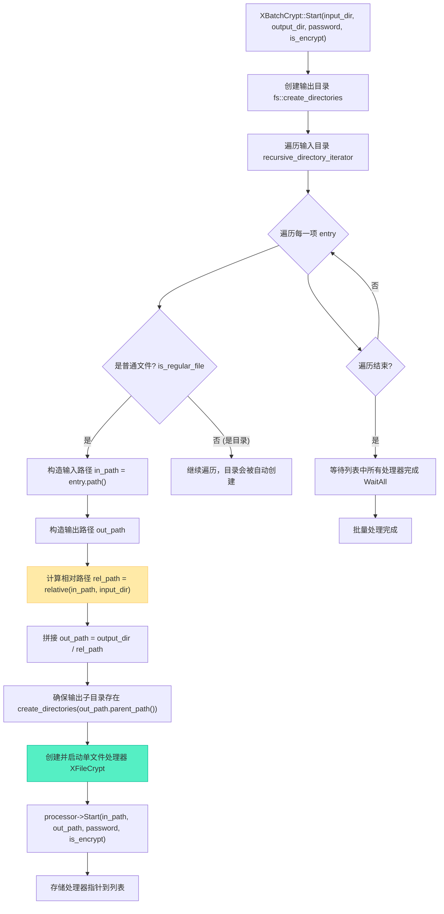

# 批量文件加解密：C++17 Filesystem 目录遍历集成实战

> [!abstract] 核心导言
> 单文件加解密是基础，批量处理才是生产力的体现。C++17 标准引入的 `<filesystem>` 库，为我们提供了强大、可移植的目录与文件操作接口。本节将把 `XFileCrypt` 核心引擎与 `std::filesystem` 相结合，构建一个能够递归遍历目录、智能过滤文件、并调用现有流水线进行批量加解密的强大工具。这将把项目从一个“工具”升级为一个“解决方案”。

---

## 一、C++17 Filesystem 核心接口简介

`<filesystem>` 库（位于 `std::filesystem` 命名空间，常用别名 `fs`）是进行批量文件操作的基石。

### 1. 关键类与函数
- **`fs::path`**：核心类，代表文件系统路径。它自动处理不同操作系统（Windows/Unix）的路径分隔符差异（`\` vs `/`）。
- **`fs::directory_iterator`**：用于遍历指定目录下的直接子项（文件和子目录）。
- **`fs::recursive_directory_iterator`**：用于**递归遍历**指定目录及其所有子目录下的所有项。
- **`fs::is_regular_file()`**：判断一个目录条目是否为普通文件（而非目录、符号链接等）。
- **`fs::file_size()`**：获取文件大小（字节数）。
- **路径拼接**：使用 `fs::path` 的 `/= ` 运算符或 `append()` 方法进行路径拼接，比字符串拼接更安全可靠。

### 2. 基本遍历模式
```cpp
#include <filesystem>
namespace fs = std::filesystem;

void list_files(const fs::path& dir_path) {
    // 递归迭代器
    for (const auto& entry : fs::recursive_directory_iterator(dir_path)) {
        if (fs::is_regular_file(entry.status())) { // 只处理普通文件
            std::cout << “文件: ” << entry.path() << std::endl;
            std::cout << “大小: ” << fs::file_size(entry.path()) << “ bytes” << std::endl;
        }
    }
}
```

---

## 二、批量处理器设计：XBatchCrypt

我们在 `XFileCrypt` 单文件处理器之上，构建一个新的批量处理器 `XBatchCrypt`。

### 1. 类职责与工作流程
`XBatchCrypt` 的核心任务是：给定一个输入目录、一个输出目录和一个密码，它能遍历输入目录中的所有文件，为每个文件启动一个独立的 `XFileCrypt` 流水线进行处理，并保持目录结构。



### 2. 核心实现：路径转换与保持结构
保持目录结构是批量处理的关键用户体验。这通过 `fs::relative()` 和路径拼接实现。
```cpp
void XBatchCrypt::ProcessAllFiles(const fs::path& input_dir, 
                                  const fs::path& output_dir, 
                                  const std::string& pwd, 
                                  bool is_encrypt) {
    // 1. 确保输出根目录存在
    fs::create_directories(output_dir);
    
    // 2. 递归遍历输入目录
    for (const auto& entry : fs::recursive_directory_iterator(input_dir)) {
        if (!fs::is_regular_file(entry.status())) {
            continue; // 跳过目录、链接等
        }
        
        fs::path in_path = entry.path();
        // 3. 计算相对于输入目录的相对路径（这是关键！）
        fs::path rel_path = fs::relative(in_path, input_dir);
        // 4. 在输出目录下构造对应的完整路径
        fs::path out_path = output_dir / rel_path;
        
        // 5. 确保输出文件所在的子目录存在
        fs::create_directories(out_path.parent_path());
        
        // 6. 创建单文件处理器并启动
        auto processor = std::make_shared<XFileCrypt>();
        if (processor->Start(in_path.string(), out_path.string(), pwd, is_encrypt)) {
            _processors.push_back(processor); // 保存以便后续等待
        } else {
            std::cerr << “处理失败: ” << in_path << std::endl;
        }
    }
    
    // 7. 等待所有文件处理完成
    WaitAll();
}
```

---

## 三、工程进阶：文件过滤与性能调优

### 1. 文件过滤策略
在实际应用中，我们可能只需要处理特定类型的文件。
- **扩展名过滤**：检查 `entry.path().extension()`，例如只处理 `.txt` 和 `.png` 文件。
- **大小过滤**：使用 `fs::file_size()`，忽略过小（如<1KB）或过大（如>1GB）的文件。
- **通配符/正则表达式**：使用 `std::regex` 匹配更复杂的文件名模式。

**示例（扩展名过滤）**：
```cpp
std::string ext = entry.path().extension().string();
std::transform(ext.begin(), ext.end(), ext.begin(), ::tolower); // 转为小写
if (ext == “.txt” || ext == “.png”) {
    // 处理该文件
}
```

### 2. 并发控制与性能
- **无限制并发的问题**：如果输入目录下有成千上万个文件，无限制地创建线程和内存池会导致资源耗尽（线程数爆炸、内存池碎片）。
- **解决方案：线程池**：
    1.  使用一个固定大小的线程池（如 `std::thread` 池或第三方库）。
    2.  将每个文件的处理任务（`XFileCrypt::Start` 和 `Wait`）封装成可执行对象，提交给线程池。
    3.  线程池管理全局的、数量可控的内存池实例。
- **简易限流**：在没有线程池的情况下，可以分批处理，例如每批同时处理10个文件，等这批全部完成后再处理下一批。

---

## 四、错误处理与日志增强

批量处理中，个别文件的失败不应导致整个任务中止。

### 1. 健壮的错误处理
- **文件访问错误**：`<filesystem>` 操作可能抛出异常或返回错误码。使用 `try-catch` 块捕获 `fs::filesystem_error`。
- **处理器启动失败**：检查 `XFileCrypt::Start` 的返回值，记录失败文件并跳过。
- **结果汇总**：在批量处理结束后，报告成功、失败和跳过的文件数量及列表。

### 2. 进度反馈
对于大量文件，为用户提供进度反馈至关重要。
- **简单进度**：每处理完N个文件（如100个），打印当前进度。
- **百分比进度**：在遍历开始时用 `std::distance` 估算总文件数（注意：`recursive_directory_iterator` 无法直接获取总数，可能需要两次遍历或估算）。

---

## 五、知识全景小结

| 知识维度 | 核心内容 | ⚠️ 工程重点/易错点 | 难度系数 |
| :--- | :--- | :--- | :--- |
| **C++17 Filesystem** | `fs::path`, `recursive_directory_iterator`, `is_regular_file`, `relative` | 路径拼接使用 `/` 运算符，而非字符串 `+`；注意异常处理 | ⭐⭐⭐ |
| **批量处理器架构** | 遍历目录 → 为每个文件创建 `XFileCrypt` → 保存并等待 | 需管理大量处理器对象的生命周期，避免泄漏 | ⭐⭐⭐⭐ |
| **目录结构保持** | 使用 `fs::relative()` 计算相对路径，在输出目录重建相同结构 | **必须**在写入文件前创建好输出子目录 (`create_directories`) | ⭐⭐⭐⭐ |
| **文件过滤** | 按扩展名、大小、正则表达式过滤，提升处理针对性 | 扩展名比较前建议统一转为小写，避免平台差异 | ⭐⭐⭐ |
| **并发与性能** | 无限制并发会导致资源耗尽，需引入线程池或分批处理 | 线程池是生产环境必备组件，可复用线程和内存池 | ⭐⭐⭐⭐⭐ |
| **错误处理** | 捕获 `filesystem_error`，容忍单个文件失败，汇总报告 | 批量处理中，日志是排查问题的唯一依据，需详细记录 | ⭐⭐⭐⭐ |
| **进度反馈** | 提供处理计数或百分比进度，改善用户体验 | 递归迭代器无法直接获取总数，精确进度需要额外开销 | ⭐⭐⭐ |

> [!quote] 结语
> 集成 `std::filesystem` 完成批量处理，是项目从“实验室原型”走向“实用工具”的关键一跃。它不仅展示了如何将现代C++标准库与自有系统无缝结合，更触及了工程实践中资源管理、错误恢复、用户交互等深层问题。从此，你的加解密引擎具备了处理整个项目文件夹、备份目录乃至小型数据集的能力，真正成为了一款能够解决实际问题的软件。
